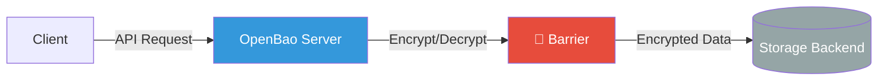
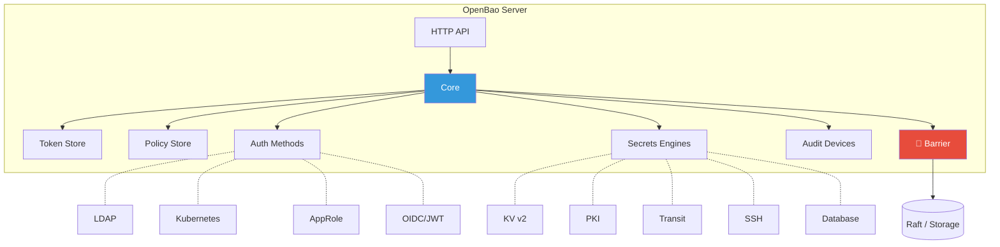
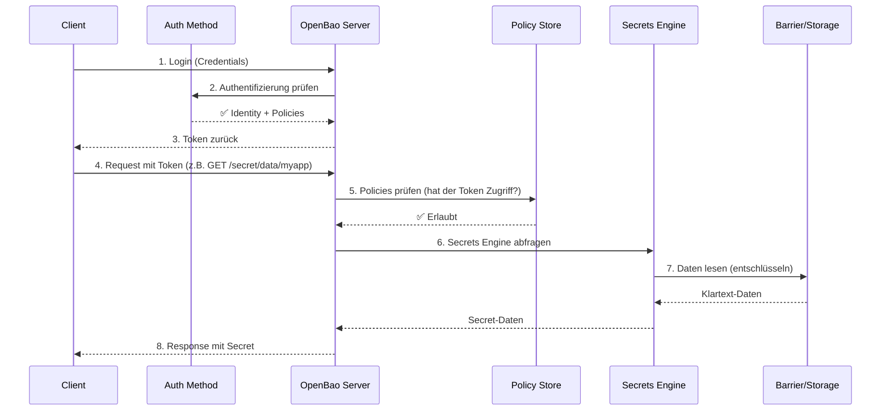
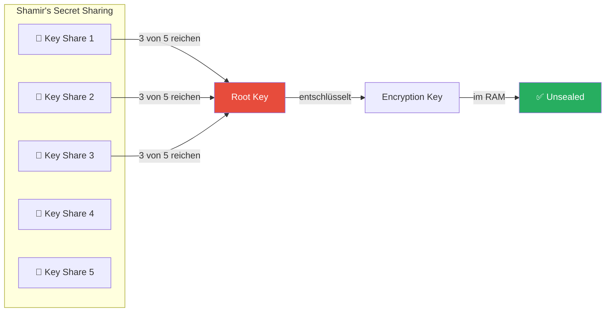
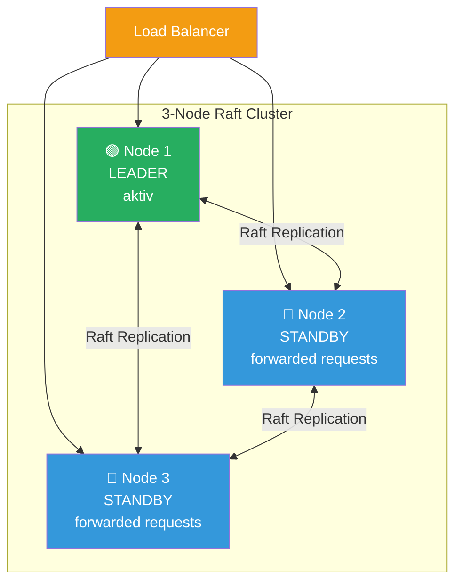
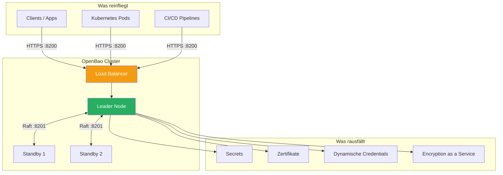

# Kubernetes - Modul Advanced


## Agenda
### Tag 1 - Networking & Security

  1. Vorbereitung
     * [kubectl Verbindung mit namespace einrichten](#kubectl-verbindung-mit-namespace-einrichten)
     * [Das Tool kubectl - Spickzettel](#das-tool-kubectl---spickzettel)

  1. Kubernetes-Networking-Grundlagen
     * [Networking Internal Overview](#networking-internal-overview)
     * [Cluster-CIDR, POD-CIDR und Service-CIDR](#cluster-cidr-pod-cidr-und-service-cidr)
     * [Wann wird die PodIP vergeben?](#wann-wird-die-podip-vergeben)
     * [CNI - Wie funktioniert das unter der Haube](#cni---wie-funktioniert-das-unter-der-haube)
     * [Ueberblick CNI-Provider](#ueberblick-cni-provider)
     * [CNI-Provider calico einrichten](#cni-provider-calico-einrichten)
     * [Weg vom Pod zum Host -> veth / calicoctl get wep](#weg-vom-pod-zum-host-->-veth--calicoctl-get-wep)

  1. MetalLB als Load-Balancer (Bare-Metal)
     * [Kubernetes Load Balancer - metallb](#kubernetes-load-balancer---metallb)
     * [Feste IP beziehen](#feste-ip-beziehen)

  1. Network Policies
     * [Einfache Uebung NetworkPolicy (Standard)](#einfache-uebung-networkpolicy-standard)
     * [Beispiel mit ipBlock](#beispiel-mit-ipblock)
     * [Erweiterte Policies mit Calico - Uebung](#erweiterte-policies-mit-calico---uebung)
     * [Calico - Services schuetzen](#calico---services-schuetzen)

  1. RBAC & Identity
     * [Least Privileges mit RBAC](#least-privileges-mit-rbac)
     * [Wie funktioniert RBAC?](#wie-funktioniert-rbac)
     * [Wo spielt RBAC eine Rolle?](#wo-spielt-rbac-eine-rolle)
     * [kubectl - Berechtigungen pruefen mit can-i](#kubectl---berechtigungen-pruefen-mit-can-i)
     * [ServiceAccounts: kubectl im Pod - default ServiceAccount](#serviceaccounts-kubectl-im-pod---default-serviceaccount)
     * [ServiceAccounts: Automount - ja oder nein?](#serviceaccounts-automount---ja-oder-nein)
     * [Praktische Uebung: User mit Zertifikat anlegen (kubeconfig)](#praktische-uebung-user-mit-zertifikat-anlegen-kubeconfig)
     * [Praktische Uebung RBAC (ab Kubernetes 1.25)](#praktische-uebung-rbac-ab-kubernetes-125)

  1. Secrets Management mit HashiCorp Vault / OpenBao
     * [HashiCorp Vault als Password-Safe (Overview)](#hashicorp-vault-als-password-safe-overview)
     * [Architektur-Ueberblick OpenBao](#architektur-ueberblick-openbao)
     * [Was sind Secret-Engines?](#was-sind-secret-engines)
     * [Server-Installation: Standalone hinter nginx Reverse Proxy](#server-installation-standalone-hinter-nginx-reverse-proxy)
     * [User/Gruppe fuer Passwort-Authentifizierung aufsetzen](#usergruppe-fuer-passwort-authentifizierung-aufsetzen)
     * [Uebung Operator-Variante: MariaDB-Deployment mit Vault Secrets Operator (VSO)](#uebung-operator-variante-mariadb-deployment-mit-vault-secrets-operator-vso)

  1. Workload-Skalierung
     * [Autoscaling Pods/Deployments - Grundlagen](#autoscaling-podsdeployments---grundlagen)
     * [Uebung: Horizontal Pod Autoscaler (HPA)](#uebung-horizontal-pod-autoscaler-hpa)

### Tag 2 - Observability, Service Mesh & GitOps

  1. Monitoring mit Prometheus
     * [Prometheus Monitoring Server (Overview)](#prometheus-monitoring-server-overview)
     * [Prometheus/Grafana-Stack installieren mit helm](#prometheusgrafana-stack-installieren-mit-helm)
     * [Uebung: nginx mit ServiceMonitor und Exporter (Sidecar)](#uebung-nginx-mit-servicemonitor-und-exporter-sidecar)

  1. Logging-Stack: Fluentd -> Elasticsearch
     * [Fluentd - Grundlagen](#fluentd---grundlagen)
     * [Fluentd/Kibana/Elasticsearch - Walkthrough](#fluentdkibanaelasticsearch---walkthrough)

  1. Alternative: Splunk-Integration
     * [Architektur & Konzept: Splunk extern vs. im Cluster](#architektur--konzept-splunk-extern-vs-im-cluster)
     * [Funktionsuebersicht: Splunk-Menuepunkte und Kubernetes-Relevanz](#funktionsuebersicht-splunk-menuepunkte-und-kubernetes-relevanz)
     * [Log-Forwarder an externen Splunk-Server anbinden](#log-forwarder-an-externen-splunk-server-anbinden)
     * [Abstuerzenden Pod ueber Splunk debuggen (CrashLoopBackOff)](#abstuerzenden-pod-ueber-splunk-debuggen-crashloopbackoff)
     * [Optional: Splunk im Cluster betreiben (Splunk Operator)](#optional-splunk-im-cluster-betreiben-splunk-operator)

  1. Troubleshooting
     * [Debugging von Pods (Logs, Events, typische Fehlerbilder)](#debugging-von-pods-logs-events-typische-fehlerbilder)
     * [kubectl debug - Ephemeral Container](#kubectl-debug---ephemeral-container)
     * [Host/Node erforschen mit kubectl debug (z.B. CNI)](#hostnode-erforschen-mit-kubectl-debug-zb-cni)
     * [ClusterIP debuggen](#clusterip-debuggen)

  1. Service Mesh - Istio & Envoy verstehen
     * [Einfuehrung in Istio & Service-Mesh-Architekturen](#einfuehrung-in-istio--service-mesh-architekturen)
     * [Warum ein Service Mesh?](#warum-ein-service-mesh)
     * [Herausforderungen & Vorteile](#herausforderungen--vorteile)
     * [Architektur & Komponenten von Istio](#architektur--komponenten-von-istio)
     * [Istio Proxy-Konzepte (Envoy als Sidecar)](#istio-proxy-konzepte-envoy-als-sidecar)
     * [Vergleich mit Linkerd, Cilium, Consul](#vergleich-mit-linkerd-cilium-consul)

  1. Service Mesh - Praktischer Aufbau im Cluster
     * [Istio-Installation mit istioctl (demo-Profil)](#istio-installation-mit-istioctl-demo-profil)
     * [istioctl Cheatsheet zum Debuggen](#istioctl-cheatsheet-zum-debuggen)
     * [Uebung: Sidecar-Injection](#uebung-sidecar-injection)
     * [Demo-App bookinfo installieren](#demo-app-bookinfo-installieren)
     * [Uebung: Header-basiertes Routing](#uebung-header-basiertes-routing)
     * [Uebung: Traffic-Shifting / Load-Balancing](#uebung-traffic-shifting--load-balancing)
     * [Debugging mit debug/run pod](#debugging-mit-debugrun-pod)

  1. GitOps - kurze Einfuehrung
     * [ArgoCD vs. Flux CD im Ueberblick](#argocd-vs-flux-cd-im-ueberblick)
     * [Was ist ArgoCD?](#was-ist-argocd)
     * [Kleines Hands-on: Deployment mit ArgoCD](#kleines-hands-on-deployment-mit-argocd)

  1. Abschluss
     * Best Practices & Hands-on Labs
     * Fehler vermeiden, Debugging meistern

<div class="page-break"></div>

## Vorbereitung

### kubectl Verbindung mit namespace einrichten


### config einrichten 

```
cd
mkdir -p .kube
cd .kube
cp -a /tmp/config config
ls -la
## das bekommt ihr aus Eurem Cluster Management Tool 
```

```
kubectl cluster-info
```

### Arbeitsbereich konfigurieren 

```
kubectl create ns jochen
kubectl get ns
kubectl config set-context --current --namespace jochen
kubectl get pods 
```

### Das Tool kubectl - Spickzettel


### Allgemein 

```
## Zeige Information über das Cluster 
kubectl cluster-info 

## Welche api-resources gibt es ?
kubectl api-resources 

## Hilfe zu object und eigenschaften bekommen
kubectl explain pod 
kubectl explain pod.metadata
kubectl explain pod.metadata.name 

```

### Arbeiten mit manifesten 

```
kubectl apply -f nginx-replicaset.yml 
## Wie ist aktuell die hinterlegte config im system
kubectl get -o yaml -f nginx-replicaset.yml 

## Änderung in nginx-replicaset.yml z.B. replicas: 4 
## dry-run - was wird geändert 
kubectl diff -f nginx-replicaset.yml 

## anwenden 
kubectl apply -f nginx-replicaset.yml 

## Alle Objekte aus manifest löschen
kubectl delete -f nginx-replicaset.yml 


```

### Ausgabeformate 

```
## Ausgabe kann in verschiedenen Formaten erfolgen 
kubectl get pods -o wide # weitere informationen 
## im json format
kubectl get pods -o json 

## gilt natürluch auch für andere kommandos
kubectl get deploy -o json 
kubectl get deploy -o yaml 

## get a specific value from the complete json - tree 
kubectl get node k8s-nue-jo-ff1p1 -o=jsonpath='{.metadata.labels}'

```


### Zu den Pods 

```
## Start einen pod // BESSER: direkt manifest verwenden
## kubectl run podname image=imagename 
kubectl run nginx image=nginx 

## Pods anzeigen 
kubectl get pods 
kubectl get pod
## Format weitere Information 
kubectl get pod -o wide 
## Zeige labels der Pods
kubectl get pods --show-labels 

## Pods aus allen Namespaces anzeigen
kubectl get pods -A

## Zeige pods mit einem bestimmten label 
kubectl get pods -l app=nginx 

## Status eines Pods anzeigen 
kubectl describe pod nginx 

## Pod löschen 
kubectl delete pod nginx 

## Kommando in pod ausführen 
kubectl exec -it nginx -- bash 
## direkt in den 1. Pod des Deployments wechseln
kubectl exec -it deployment/name-des-deployments -- bash 

```

### Logs ausgeben 

```
kubectl logs podname
## -n = namespace
## | less -> seitenweise Ausgabe
kubectl -n ingress logs nginx-ingress-ingress-nginx-controller-7bc7c7776d-jpj5h | less
```

### Arbeiten mit namespaces 

```
## Welche namespaces auf dem System 
kubectl get ns 
kubectl get namespaces 
## Standardmäßig wird immer der default namespace verwendet 
## wenn man kommandos aufruft 
kubectl get deployments 

## Möchte ich z.B. deployment vom kube-system (installation) aufrufen, 
## kann ich den namespace angeben
kubectl get deployments --namespace=kube-system 
kubectl get deployments -n kube-system 

## wir wollen unseren default namespace ändern 
kubectl config set-context --current --namespace <dein-namespace>
```


### Referenz

  * https://kubernetes.io/de/docs/reference/kubectl/cheatsheet/

## Kubernetes-Networking-Grundlagen

### Networking Internal Overview


### Network Namespace for each pod 

#### Overview 


#### General 

  * Each pod will have its own network namespace
    * with routing, networkdevices 
  * Connection to default namespace to host is done through veth - Link to bridge on host network 
    * similar like on docker to docker0 
  
```
  Each container is connected to the bridge via a veth-pair. This interface pair functions like a virtual point-to-point ethernet connection and connects the network namespaces of the containers with the network namespace of the host
```
  
  * Every container is in the same Network Namespace, so they can communicate through localhost
    * Example with hashicorp/http-echo container 1 and busybox container 2 
 
 
### Pod-To-Pod Communication (across nodes)  
 
#### Prerequisites 
 
  * pods on a single node as well as pods on a topological remote can establish communication at all times
   * Each pod receives a unique IP address, valid anywhere in the cluster. Kubernetes requires this address to not be subject to network address   translation (NAT)
   * Pods on the same node through virtual bridge (see image above)
 
#### General (what needs to be done) - and could be done manually
 
   * local bridge networks of all nodes need to be connected
   * there needs to be an IPAM (IP-Address Managemenet) so addresses are only used once
   * The need to be routes so, that each bridge can communicate with the bridge on the other network
   * Plus: There needs to be a rule for incoming network
   * Also: A tunnel needs to be set up to the outside world.

#### General - Pod-to-Pod Communication (across nodes) - what would need to be done


#### General - Pod-to-Pod Communication (side-note) 

  * This could of cause be done manually, but it is too complex 
  * So Kubernetes has created an Interface, which is well defined 
    * The interface is called CNI (common network interface) 
    * Funtionally is achieved through Network Plugin (which use this interface) 
      * e.g. calico / cilium / weave net / flannel 


#### CNI 

  * CNI only handles network connectivity of container and the cleanup of allocated resources (i.e. IP addresses) after containers have been deleted (garbage collection) and therefore is lightweight and quite easy to implement. 
  * There are some basic libraries within CNI which do some basic stuff.
 
   
    


### Hidden Pause Container 

#### What is for ? 

  * Holds the network - namespace for the pod 
  * Gets started first and falls asleep later 
  * Will still be there, when the other containers die 

```
cd 
mkdir -p manifests 
cd manifests 
mkdir pausetest
cd pausetest
nano 01-nginx.yml
```

```
## vi nginx-static.yml 

apiVersion: v1
kind: Pod
metadata:
  name: nginx-pausetest
  labels:
    webserver: nginx:1.21
spec:
  containers:
  - name: web
    image: nginx
```

```
kubectl apply -f .
## als root auf dem worker node 
ctr -n k8s.io c list | grep pause
```


### References 

  * https://www.inovex.de/de/blog/kubernetes-networking-part-1-en/
  * https://www.inovex.de/de/blog/kubernetes-networking-2-calico-cilium-weavenet/

### Cluster-CIDR, POD-CIDR und Service-CIDR


### Grafik 


### Cluster CIDR - IP-Bereich für das gesamte Kubernetes Cluster 

```
## Netzbereich für mein gesamtes Cluster 
10.244.0.0/16
```

### POD-CIDR - Teilbereich aus der Cluster - CIDR pro Node 

```
## Jede Node bekommt ein Teilnetz
Beispiel cilium

node 1 -> network.cilium.io/ipv4-pod-cidr: 10.244.0.0/25
node 2 -> network.cilium.io/ipv4-pod-cidr: 10.244.0.128/25
node 3 -> network.cilium.io/ipv4-pod-cidr: 10.244.1.128/25
node 4 -> network.cilium.io/ipv4-pod-cidr: 10.244.1.0/25

```

### POD-IP 

  * Wird aus POD-CIDR des jeweiligen Nodes vergeben

```
## pod bekommt aus netzbereich POD-CIDR auf Node eine IP-Adresse zugewiesen
## CILIUM CNI macht das z.B.
POD-CIDR: 10.244.1.128/25
-> POD - IP: 10.244.1.180
```

### Service-CIDR 

```
Netzbereich für IP-Adressen der Services
z.B. 10.109.0.0/16 
```

### Wann wird die PodIP vergeben?


### Example (that does work)

```
## Show the pods that are running 
kubectl get pods 

## Synopsis (most simplistic example 
## kubectl run NAME --image=IMAGE_EG_FROM_DOCKER
## example
kubectl run nginx --image=nginx:1.23

kubectl get pods 
## on which node does it run ? 
kubectl get pods -o wide 
```

### Example (that does not work) 

```
kubectl run foo2 --image=foo2
## ImageErrPull - Image konnte nicht geladen werden 
kubectl get pods 
## Weitere status - info 
kubectl describe pods foo2

## Auch der nicht laufende Pod 
kubectl get pods -o wide 
```

### Ref:

  * https://kubernetes.io/docs/reference/generated/kubectl/kubectl-commands#run

### CNI - Wie funktioniert das unter der Haube


### Referenz:

  * https://isovalent.com/blog/post/demystifying-cni/


### Ablauf 
   * Containerd ruft CNI plugin über subcommandos: ADD, DEL, CHECK, VERSION auf (mehr subcommandos gibt es nicht)
   * Was gemacht werden soll wird über JSON-Objekt übergeben
   * Die Antwort kommt auch wieder als JSON zurück 

### Plugins die Standardmäßig schon da sind 
 
   * https://www.cni.dev/plugins/current/

### CNI-Provider 

   * Ein Kubernetes-Cluster braucht immer ein CNI-Provider, sonst funktioniert die Kommunikation nicht und die Nodes im Cluster stehen auf NotReady 
   * Beispiele: Calico, WeaveNet, Antrea, Cilium, Flannel 

### IPAM - IP Address Management 

   * Ziel ist, dass Adressen nicht mehrmals vergeben werden.
   * Dazu wird ein Pool bereitgestellt.
   * Es gibt 3 CNI IPAM - Module:
     * host-local
     * dhcp
     * static  
```
* IPAM: IP address allocation 
dhcp : Runs a daemon on the host to make DHCP requests on behalf of a container
host-local : Maintains a local database of allocated IPs
static : Allocates static IPv4/IPv6 addresses to containers
```

### Beispiel json für antrea (wird verwendet beim Aufruf von CNI) 


### Ueberblick CNI-Provider


### CNI 

  * Common Network Interface
  * Feste Definition, wie Pod  mit Netzwerk-Bibliotheken kommunizieren

### Docker - Container oder andere 

  * Pod (Pause Container) wird hochgefahren -> über CNI -> zieht Netzwerk - IP  hoch. 
  * Pod (Pause Container) witd runtergahren -> uber CNI -> Netzwerk - IP wird released 

### Welche gibt es ? 

  * Flannel
  * Canal 
  * Calico 
  * Cilium
  * Antrea (vmware)
  * Weave Net 
  
### Flannel

#### Generell

  * Flannel is a CNI which gives a subnet to each host for use with container runtimes.

#### Overlay - Netzwerk 

  * virtuelles Netzwerk was sich oben drüber und eigentlich auf Netzwerkebene nicht existiert
  * VXLAN

#### Vorteile 

  * Guter einfacher Einstieg 
  * reduziert auf eine Binary flanneld 

#### Nachteile 

  * keine Firewall - Policies möglich 
  * keine klassichen Netzwerk-Tools zum Debuggen möglich. 

#### Guter Einstieg in flannel 

  * https://mvallim.github.io/kubernetes-under-the-hood/documentation/kube-flannel.html

### Canal 

#### General 

  * Auch ein Overlay - Netzwerk 
  * Unterstützt auch policies
  * Kombination aus Flannel (Overlay) und den NetworkPolicies aus Calico 

### Calico


#### Komponenten 

##### Calico API server

  * Lets you manage Calico resources directly with kubectl.

##### Felix

```
Main task: Programs routes and ACLs, and anything else required on the host to provide desired connectivity for the endpoints on that host. Runs on each machine that hosts endpoints. Runs as an agent daemon. 
```

##### BIRD

  * Gets routes from Felix and distributes to BGP peers on the network for inter-host routing. Runs on each node that hosts a Felix agent. Open source, internet routing daemon.

#### confd

```
Monitors Calico datastore for changes to BGP configuration and global defaults such as AS number, logging levels, and IPAM information. Open source, lightweight configuration management tool.

Confd dynamically generates BIRD configuration files based on the updates to data in the datastore. When the configuration file changes, confd triggers BIRD to load the new files
```

#### Dikastes

```
Enforces NetworkPolicy for istio service mesh
```

#### CNI plugin

#### Datastore plugin

#### IPAM plugin

#### kube-controllers

```
Main task: Monitors the Kubernetes API and performs actions based on cluster state. kube-controllers.

The tigera/kube-controllers container includes the following controllers:

Policy controller
Namespace controller
Serviceaccount controller
Workloadendpoint controller
Node controller
```

#### Typha

```
Typha maintains a single datastore connection on behalf of all of its clients like Felix and confd. It caches the datastore state and deduplicates events so that they can be fanned out to many listeners.
```

#### calicoctl

  * Wird heute selten gebraucht, da das meiste heute mit kubectl über den Calico API Server realisiert werden kann
  * Früher haben die neuesten NetworkPolicies/v3 nur über calioctl funktioniert 

#### Generell 

  * klassische Netzwerk (BGP) - kein Overlay
  * klassische Netzwerk-Tools können verwendet werden.
  * eBPF ist implementiert, aber muss aktiviert

#### Vorteile gegenüber Flannel 

  * Policy über Kubernetes Object (NetworkPolicies)

#### Vorteile 

  * ISTIO integrierbar (Service Mesh) 
  * Performance etwas besser als Flannel (weil keine Encapsulation)

#### Referenz 
  * https://projectcalico.docs.tigera.io/security/calico-network-policy

### Cilium 


#### Komponenten:

##### Cilium Agent 

  * Läuft auf jeder Node im Cluster
  * Lauscht auf events from Orchestrierer (z.B. container gestoppt und gestartet)
  * Managed die eBPF - Programme, die Linux kernel verwendet um den Netzwerkzugriff aus und in die Container zu kontrollieren

##### Client (CLI)

  * Wird im Agent mit installiert (interagiert mit dem agent auf dem gleichen Node)
  * Kann aber auch auf dem Client installiert werden auf dem kubectl läuft.

##### Cilium Operator

  * Zuständig dafür, dass die Agents auf den einzelnen Nodes ausgerollt werden
  * Es gibt ihn nur 1x im Cluster
  * Ist unkritisch, sobald alles ausgerollt ist.
    * wenn dieser nicht läuft funktioniert das Networking trotzdem

##### cilium CNI - Plugin 

  * Ist ein binary auf dem server (worker)
  * wird durch die Container Runtime ausgeführt.
  * cilium cni plugin interagiert mit der Cilium API auf dem Node 

#### Datastore 

  * Daten werden per Default in CRD (Custom Resource Defintions) gespeichert
  * Diese Resource Objekte werden von Cilium definiert und angelegt.
    * Wenn Sie angelegt sind, sind die Daten dadurch automatisch im etc - Speicher
    * Mit der weiteren Möglichkeit den Status zu speichern.   
  * Alternative: Speichern der Daten direkt in etcd

#### Generell 


  * Quelle: https://www.inovex.de/de/blog/kubernetes-networking-2-calico-cilium-weavenet/

  * Verwendet keine Bridge sondern Hooks im Kernel, die mit eBPF aufgesetzt werden
    * Bessere Performance
  * eBPF wird auch für NetworkPolicies unter der Haube eingesetzt
  * Mit Ciliums Cluster Mesh lassen sich mehrere Cluster miteinander verbinden:

#### Vorteile 

  * Höhere Leistung mit eBPF-Ansatz. (extended Berkely Packet Filter)
    * JIT - Just in time compiled -
    * Bytecode wird zu MaschineCode kompiliert (Miniprogramme im Kernel)
  * Ersatz für iptables (wesentlich schneller und keine Degredation wie iptables ab 5000 Services)
  * Gut geeignet für größere Cluster 

### Weave Net 

  * Ähnlich calico 
  * Verwendet overlay netzwerk
  * Sehr stabil bzgl IPV4/IPV6 (Dual Stack) 
  * Sehr grosses Feature-Set 
  * mit das älteste Plugin 

### CNI-Provider calico einrichten


### Walkthrough 

```
## Step 1 - Install the operator
kubectl create -f https://raw.githubusercontent.com/projectcalico/calico/v3.30.3/manifests/tigera-operator.yaml
## Step 2 - Install the custom resources 
kubectl create -f https://raw.githubusercontent.com/projectcalico/calico/v3.30.3/manifests/custom-resources.yaml
```

### Testing 

```
kubectl -n tigera-operator get pods 
kubectl -n calico-system get pods
kubectl -n calico-apiserver get pods
## Sind die nodes schon ready 
kubectl get nodes

kubectl -n kube-system get pods
kubectl -n kube-system get pods coredns-7c65d6cfc9-f6f56 -o wide
kubectl -n kube-system describe pods coredns-7c65d6cfc9-f6f56
```

### Reference 

  * https://docs.tigera.io/calico/latest/getting-started/kubernetes/quickstart

### Weg vom Pod zum Host -> veth / calicoctl get wep


### Walkthrough  (without calicoctl)

```bash
## Step 1: create pod 
kubectl run nginx-master --image=nginx
## Find out on which node it runs 
kubectl get pods -o wide 
## create a debug container 
kubectl debug -it nginx-master --image=busybox 
```

```
## now within debug pod found out interface 
ip a | grep @
```

```
## Ausgabe 
3: eth0@if22: <BROADCAST,MULTICAST,UP,LOWER_UP,M-DOWN> mtu 1500 qdisc noqueue
```

```
## Log in to worker node  where pod runs and check interfaces
kubectl debug -it node/worker1 --image=busybox
```

```
## on worker node 
## show matched line starting with 22 and then another 4 lines 
ip a | grep -A 5 ^22 
## e.g. 
## 
ip a | grep -A 5 ^22
22: cali42c2aab93f3@if3: <BROADCAST,MULTICAST,UP,LOWER_UP> mtu 1500 qdisc noqueue state UP group default
    link/ether ee:ee:ee:ee:ee:ee brd ff:ff:ff:ff:ff:ff link-netns cni-5adf994b-3a7e-c344-5d82-ef1f7a293d88
    inet6 fe80::ecee:eeff:feee:eeee/64 scope link
       valid_lft forever preferred_lft forever
```

### Get information with calicoctl (installed on client) 

```
## für den namespace defaut bzw. den konfigurierten 
calicoctl get wep
calicoctl get workloadendpoints

## für alle namespaces
calicoctl get wep -A 
```


### Firewall - Regeln 

```
## Now you are able to determine the firewall rules 
## you will find fw and tw rules (fw - from workload and tw - to workload)
iptables-legacy -L -v | grep  cali42c2aab93f3
```

```
## ... That is what you see as an example 
Chain cali-tw-cali42c2aab93f3 (1 references)
 pkts bytes target     prot opt in     out     source               destination 
   10  1384 ACCEPT     all  --  any    any     anywhere             anywhere             /* cali:WKA8EzdUNM0rVty1 */ ctstate RELATED,ESTABLISHED
    0     0 DROP       all  --  any    any     anywhere             anywhere             /* cali:wr_OqGXKIN_LWnX0 */ ctstate INVALID
    0     0 MARK       all  --  any    any     anywhere             anywhere             /* cali:kOUMqNj8np60A3Bi */ MARK and 0xfffeffff
```


## MetalLB als Load-Balancer (Bare-Metal)

### Kubernetes Load Balancer - metallb


### General 

  * Supports bgp and arp 
  * Divided into controller, speaker 

### Installation Ways  

  * helm 
  * manifests 

### Step 1: install metallb

```
## Just to show some basics 
## Page from metallb says that digitalocean is not really supported well 
## So we will not install the speaker .

helm repo add metallb https://metallb.github.io/metallb 
```

```
## Eventually disabling speaker 
## vi values.yml 

```

```
## reset-values, always reset values on upgrade 
helm upgrade --install metallb metallb/metallb --namespace=metallb-system --create-namespace --version 0.15.2 --reset-values
```

### Step 2: addresspool und Propagation-type (config) 

```
cd
mkdir -p manifests
cd manifests
mkdir lb
cd lb
nano 01-addresspool.yml 
```

```
apiVersion: metallb.io/v1beta1
kind: IPAddressPool
metadata:
  name: first-pool
  namespace: metallb-system
spec:
  addresses:
  # we will use our external ip here 
  - 134.209.231.154-134.209.231.154
  # both notations are possible 
  - 157.230.113.124/32
```

```
kubectl apply -f .
```

```
nano 02-advertisement.yml
```

```
apiVersion: metallb.io/v1beta1
kind: L2Advertisement
metadata:
  name: example
  namespace: metallb-system
```

```
kubectl apply -f .
```

### Schritt 4: Test do i get an external ip 

```
nano 03-deploy.yml
```

```
apiVersion: apps/v1
kind: Deployment
metadata:
  name: my-nginx
spec:
  selector:
    matchLabels:
      run: web-nginx
  replicas: 3
  template:
    metadata:
      labels:
        run: web-nginx
    spec:
      containers:
      - name: cont-nginx
        image: nginx
        ports:
        - containerPort: 80

```


```
nano 04-service.yml
```

```
apiVersion: v1
kind: Service
metadata:
  name: svc-nginx
  labels:
    svc: nginx
spec:
  type: LoadBalancer
  ports:
  - port: 80
    protocol: TCP
  selector:
    run: web-nginx
```


```
kubectl apply -f .
kubectl get pods
kubectl get svc
```

```
## auf dem client 
curl http://<ip aus get svc>
```

```
kubectl delete -f 03-deploy.yml 04-service.yml 
```

### Schritt 5: Referenz:

  * https://metallb.io/installation/#installation-with-helm

### Feste IP beziehen


### Beispiel 

```
cd
mkdir -p manifests/lb/
```

```
## Service yaml anpassen
nano 03-service.yaml
```

```
apiVersion: v1
kind: Service
metadata:
  name: svc-nginx
  labels:
    svc: nginx
spec:
  type: LoadBalancer
## eure ip aus dem pool nehmen 
  loadBalancerIP: 167.99.130.85
  ports:
  - port: 80
    protocol: TCP
  selector:
    run: web-nginx
```

```
kubectl apply -f .
## ist es die von oben ? 
kubectl get svc
```

## Network Policies

### Einfache Uebung NetworkPolicy (Standard)


### Schritt 1: Deployment und Service erstellen 

```
KURZ=jm
kubectl create ns policy-demo-$KURZ 
```

```
cd 
mkdir -p manifests
cd manifests
mkdir -p np
cd np
```

```
nano 01-deployment.yml
```

```
apiVersion: apps/v1
kind: Deployment
metadata:
  name: nginx-deployment
spec:
  selector:
    matchLabels:
      app: nginx
  replicas: 1
  template:
    metadata:
      labels:
        app: nginx
    spec:
      containers:
      - name: nginx
        image: nginx:1.23
        ports:
        - containerPort: 80
```

```
kubectl -n policy-demo-$KURZ apply -f . 
```

```
nano 02-service.yml
```

```
apiVersion: v1
kind: Service
metadata:
  name: nginx
spec:
  type: ClusterIP # Default Wert 
  ports:
  - port: 80
    protocol: TCP
  selector:
    app: nginx
```

```
kubectl -n policy-demo-$KURZ apply -f . 
```

### Schritt 2: Zugriff testen ohne Regeln 

```
## lassen einen 2. pod laufen mit dem auf den nginx zugreifen 
kubectl run --namespace=policy-demo-$KURZ access --rm -ti --image busybox
```

```
## innerhalb der shell 
wget -q nginx -O -
```

```
## Optional: Pod anzeigen in 2. ssh-session zu jump-host
kubectl -n policy-demo-$KURZ get pods --show-labels
```

### Schritt 3: Policy festlegen, dass kein Zugriff erlaubt ist. 

```
nano 03-default-deny.yaml 
```

```
## Schritt 2: Policy festlegen, dass kein Ingress-Traffic erlaubt
## in diesem namespace: policy-demo-$KURZ 
kind: NetworkPolicy
apiVersion: networking.k8s.io/v1
metadata:
  name: default-deny
spec:
  podSelector:
    matchLabels: {}
```

```
kubectl -n policy-demo-$KURZ apply -f .
```

### Schritt 3.5: Verbindung mit deny all Regeln testen 

```
kubectl run --namespace=policy-demo-$KURZ access --rm -ti --image busybox
```

```
## innerhalb der shell 
wget -q nginx -O -
```

### Schritt 4: Zugriff erlauben von pods mit dem Label run=access (alle mit run gestarteten pods mit namen access haben dieses label per default)

```
nano 04-access-nginx.yaml 
```

```
apiVersion: networking.k8s.io/v1
kind: NetworkPolicy
metadata:
  name: access-nginx
spec:
  podSelector:
    matchLabels:
      app: nginx
  ingress:
    - from:
      - podSelector:
          matchLabels:
            run: access
```

```
kubectl -n policy-demo-$KURZ apply -f . 
```

### Schritt 5: Testen (zugriff sollte funktionieren)

```
## lassen einen 2. pod laufen mit dem auf den nginx zugreifen 
## pod hat durch run -> access automatisch das label run:access zugewiesen 
kubectl run --namespace=policy-demo-$KURZ access --rm -ti --image busybox
```

```
## innerhalb der shell 
wget -q nginx -O -
```


### Schritt 6: Pod mit label run=no-access - da sollte es nicht gehen 

``` 
kubectl run --namespace=policy-demo-$KURZ no-access --rm -ti --image busybox
```

```
## in der shell  
wget -q nginx -O -
```

### Schritt 7: Aufräumen 

```
kubectl delete ns policy-demo-$KURZ 
```


### Ref:

  * https://projectcalico.docs.tigera.io/security/tutorials/kubernetes-policy-basic

### Beispiel mit ipBlock


```
apiVersion: apps/v1
kind: Deployment
metadata:
  name: nginx-deployment
spec:
  selector:
    matchLabels:
      app: nginx
  replicas: 1
  template:
    metadata:
      labels:
        app: nginx
    spec:
      containers:
      - name: nginx
        image: traefik/whoami
        ports:
        - containerPort: 80
---
## nano 02-service.yaml 
apiVersion: v1
kind: Service
metadata:
  name: nginx
spec:
  type: NodePort # Default Wert
  ports:
  - port: 80
    protocol: TCP
  selector:
    app: nginx
---
## nano 03-default-deny.yaml
## Schritt 2: Policy festlegen, dass kein Ingress-Traffic erlaubt
## in diesem namespace: policy-demo-$KURZ
kind: NetworkPolicy
apiVersion: networking.k8s.io/v1
metadata:
  name: default-deny
spec:
  podSelector:
    matchLabels: {}
---
## nano 05-from-access.yaml
apiVersion: networking.k8s.io/v1
kind: NetworkPolicy
metadata:
  name: access-nginx
spec:
  podSelector:
    matchLabels:
      app: nginx
  ingress:
    - from:
      - ipBlock:
          cidr: 138.197.181.70/32


```

### Erweiterte Policies mit Calico - Uebung


### Step 1:

```
cd
mkdir -p manifests
cd manifests
mkdir calico
cd calico
```

```
nano 01-gnp.yml
```

### Step 2: Set global policy

```
apiVersion: projectcalico.org/v3
kind: GlobalNetworkPolicy
metadata:
  name: default-deny
spec:
  # Auf alle Namespaces außer kube-system und calico-system anwenden
  namespaceSelector: kubernetes.io/metadata.name not in {"kube-system","calico-system"}

  types:
  - Ingress
  - Egress

  # Egress-Ausnahmen (z. B. DNS)
  egress:
  - action: Allow
    protocol: UDP
    destination:
      selector: 'k8s-app == "kube-dns"'
      ports: [53]
  - action: Allow
    protocol: TCP
    destination:
      selector: 'k8s-app == "kube-dns"'
      ports: [53]
```

```
kubectl apply -f .
```

### Step 3: nginx ausrollen aus manifests/04-service und testen

```
nano deploy.yml 
```

```
apiVersion: apps/v1
kind: Deployment
metadata:
  name: web-nginx
spec:
  selector:
    matchLabels:
      web: my-nginx
  replicas: 2
  template:
    metadata:
      labels:
        web: my-nginx
    spec:
      containers:
      - name: cont-nginx
        image: nginx
        ports:
        - containerPort: 80
```

```
nano service.yml
```


```
apiVersion: v1
kind: Service
metadata:
  name: svc-nginx
  labels:
    run: svc-my-nginx
spec:
  type: ClusterIP
  ports:
  - port: 80
    protocol: TCP
  selector:
    web: my-nginx      
        
```        

```
kubectl apply -f . 
```

```
kubectl run -it --rm access --image=busybox 
```

```
## In der Bbusybox 
wget -O - http://svc-nginx 
```

### Step 4: Traffic erlauben egress von busybox 

```
nano 02-egress-allow-busybox.yml  
```

```
## vi 02-egress-allow-busybox.yml
apiVersion: projectcalico.org/v3
kind: NetworkPolicy
metadata:
  name: allow-busybox-egress
spec:
  selector: run == 'access'
  types:
  - Egress
  egress:
  - action: Allow
```

```
kubectl apply -f . 
```

```
kubectl run -it --rm access --image=busybox
```

```
## sollte gehen 
wget -O - http://www.google.de

## sollte nicht funktionieren
wget -O - http://svc-nginx
```

### Step 5: Traffic erlauben für nginx 

```
## 03-allow-ingress-my-nginx.yml 
apiVersion: projectcalico.org/v3
kind: NetworkPolicy
metadata:
  name: allow-nginx-ingress
spec:
  selector: web == 'my-nginx'
  types:
  - Ingress
  ingress:
  - action: Allow
    source:
      selector: run == 'access'
```

```
kubectl apply -f .
```

```
kubectl run -it --rm access --image=busybox 
```

```
## In der Bbusybox 
wget -O - http://svc-nginx 
```

### Calico - Services schuetzen


### Example 

```
apiVersion: projectcalico.org/v3
kind: GlobalNetworkPolicy
metadata:
  name: allow-cluster-ips
spec:
  selector: k8s-role == 'node'
  types:
  - Ingress
  applyOnForward: true
  preDNAT: true
  ingress:
   # Allow 50.60.0.0/16 to access Cluster IP A
  - action: Allow
    source:
      nets:
      - 50.60.0.0/16
    destination:
      nets:
      - 10.20.30.40/32  Cluster IP A
   # Allow 70.80.90.0/24 to access Cluster IP B
  - action: Allow
    source:
      nets:
      - 70.80.90.0/24
    destination:
      nets:
      - 10.20.30.41/32  Cluster IP B
```

### Referenz 

  * https://docs.tigera.io/calico/latest/network-policy/services/services-cluster-ips

## RBAC & Identity

### Least Privileges mit RBAC


### The least privileges principles 

  * Always design your pods, user and components, that they really only have the minimal principles they need
  * RBAC Resources help you to do that (Service Accounts, Roles, ClusterRoles, Rolebinding, Clusterrolebindings, Groups)

### Wie funktioniert RBAC?


  * Let us see in a picture


### Wo spielt RBAC eine Rolle?


### Users -> kube-api-server 

  * User how want to access the kube api server 

### Components -> kube-api-server 

  * e.g. kubelet -> kube-api-server

### Pods / System Pods -> kube-api-server 

  * Pods and System Pods (e.g. kube-proxy a.ka. CoreDNS) how want to access the kube-api-server 

### kubectl - Berechtigungen pruefen mit can-i


### A specific command 

```
kubectl auth can-i get pods 
```

### List all 

```
kubectl auth can-i --list
```

### ServiceAccounts: kubectl im Pod - default ServiceAccount


### Walkthrough 

```
kubectl run -it --rm kubectltester --image=alpine -- sh 
```

```
## in shell
apk add kubectl
## it uses in in-cluster configuration in folder
## /var/run/secrets/kubernetes.io/serviceaccount 
kubectl auth can-i --list 
```


### ServiceAccounts: Automount - ja oder nein?


### Why ?

  * Every attacker tries to get as much information as possible
  * Although there are not severe permissions in here, show as little information as possible
  * For example, use will see, which namespace he is in ;o)

### Disable ?

```
## enabled by default 
kubectl explain pod.spec.automountServiceAccountToken
```

### Praktische Uebung: User mit Zertifikat anlegen (kubeconfig)


### Step 0: create an new rolebinding for the group (we want to use) 

```
kubectl create rolebinding developers --clusterrole=view --group=developers
```

### Step 1: on your client: create private certificate

```
cd
mkdir -p certs
## create your private key 
openssl genrsa -out ~/certs/jochen.key 4096
```

### Step 2: on your client: create csr (certificate signing request)

```
nano ~/certs/jochen.csr.cnf
```

```
[ req ]
default_bits = 2048
prompt = no
default_md = sha256
distinguished_name = dn
[ dn ]
CN = jochen
O = developers
[ v3_ext ]
authorityKeyIdentifier=keyid,issuer:always
basicConstraints=CA:FALSE
keyUsage=keyEncipherment,dataEncipherment
extendedKeyUsage=serverAuth,clientAuth
```

```
## Create Certificate Signing Request
openssl req -config ~/certs/jochen.csr.cnf -new -key ~/certs/jochen.key -nodes -out ~/certs/jochen.csr
openssl req -in certs/jochen.csr --noout -text
```


### Step 3: Send approval request to server 

```
## get csr (base64 decoded)
cat ~/certs/jochen.csr | base64 | tr -d '\n'
```

```
cd certs
nano jochen-csr.yaml
```

```
apiVersion: certificates.k8s.io/v1
kind: CertificateSigningRequest
metadata:
  name: jochen-authentication
spec:
  signerName: kubernetes.io/kube-apiserver-client
  groups:
    - system:authenticated
  request: LS0tLS1CRUdJTiBDRVJUSUZJQ0FURSBSRVFVRVNULS0tLS0KTUlJRWF6Q0NBbE1DQVFBd0pqRVBNQTBHQTFVRUF3d0dhbTlqYUdWdU1STXdFUVlEVlFRS0RBcGtaWFpsYkc5dwpaWEp6TUlJQ0lqQU5CZ2txaGtpRzl3MEJBUUVGQUFPQ0FnOEFNSUlDQ2dLQ0FnRUEwOTlSMkpxMmowUVk4TW4wClRsMCtyMGEyL0JJNVNqU3BXVHlvS045cGlndURSaVZLZzM1NkxaT3NOWkxad2FOODcwak9ibTkramVzNUF4N3kKa2NpUU5XOU5LanA0Yys5a1VNUDZVOFFtZENRRk9GMGdPaXI1Q25FUUo0Z1RtYlFkMkExUkcyN2VnQ1crWjVYcgpXM2pVMDFiMHRhNGFwcEsySFd2MkRaY0JZZE1HSjFSeSs3SFMzWXFFMXJ1amxMcDNqZU93SThHSGtmOU1ZMjZkCnhQYmZBbUJKWUxxWE1ZdEdiMXE1bFlTd0oxdk1BWk8rQTd2T1ZmQ2tRMmtWbE02bGRnbkszaXVBbmRqMGEzbUYKSlJuQ2F2V3o5SHlsWDJMU2IzVGlvdXI5U2VqVklwd21ZcGVPK2FrYkIzN1BaYmdVOUlRcm9nK1dOVkFlQ3BYVwpnc3pzU1R3SmpGRWdlZzQ0YUU3MVViMDlReWcwdE9TNm5nRXJQOXRWR1V3eml5aEFsdDVIdVNxazI2aDlvUjBDCllKL0J5Q29UMHJnODAvUXpWc3ZFNklzZDZjNTFPVThuc0g4K2NFd1hYQndKcGlYMUhLTWt4WHd2NTRTdTA0KzMKcUcyaHpRMWlSZUNKRzJKbmt3Y0t6OGVsMkxVRU4rS2NBRU9YUGg1RjFwRUFhQmphUkcybU5vcC9taTJpM0FKUgorT0NTbkN0RmhueDVZaDJUTGZDUDhOYUhzTkRrZEE5RlBUWWUwN1pKZmZrQ2pva2RmOGM1SVpDSHhBdkx2Yk1OCk9HZVgzcm9aWW9NbkV3VHI4ME9rVGtFbHpOZnN6OFpWa1RKVURYK1AyVnlUNXEyVHNKSldNN1lnVnkvQTk0NmYKSzdld3BldGR5R3JDUnljWDVJc3VPaVNJYllVQ0F3RUFBYUFBTUEwR0NTcUdTSWIzRFFFQkN3VUFBNElDQVFDWgpEYk9yS2RzdVdmY01iKzdHaTNJb240Y3VQN2k1Q2VQa3BQeWpkdkdHclgvUGRWWVRTaThCbTZ6OU5ZbUF5UW9kClUrcEROeDlRNURJMjFCc3Y2UVNtWjlGUE1vZXU4V0NDcEphZFZRWm1WRWV1WlNmSjFrLy9aZEozK2Vib1ZwcUIKbG9ETEU1NTZQcnpEaGJTalB6aDl5U2oxU0k0QUZVaDB3VWwrK0tVZy94OXZSRzVZeFlwMVhCNUEyaUFQTTlxSQpRdnVaM2VTbUc4cVlDTkZYblR3UmpHZkdPeGtZczNDZG1NdjU2Q3hIemF6SjNNWEd2czNIYXcvbzdUcWdDVmQrCjRaRXNkOU4wcm4vU2c4ZUZ4ZGlvTER2RG03TEJLSlRXK2FyZjBOVDVyOHUvMTd3elhBeE9zQnpidk5VUXJPY3IKRUd1MFAyNjFpY0Yzb1VNZUdFeHBXTnZLTmlMOEk4eVl1NE5MRW15cFcwRVRVdnVUbVVIRFBUSXdZWkxBTmJaeApaS3RQS0VPL3RpZjVLQUVkVTdkbzV5bDhlWVlqTmk1ZGErdVJncjYxRkpOTkgxRzdsOWFvQlRhcUJHSWlPd1hSCmpvZzBFbW1Dczc4dnNBMHVDTXVLOUlWRmM4dzRTVkJ2NFVWL3U0NkZSL3JhL2dPUGxEVEd0MzBsK0lSOXYyZEUKRzcvOUV1UXQwTFhGeVpldnlCdFhDMEZ4NWtaQ2RKZ2h2R1RxVHVpVjFNeDVDTkNZUmoxaDhJam5RcVZvdU5XbApUcFl4QWNNclF3MU44Y1BMcnVxekQrTWg2RHU3emUzUUpRQUUvWmdFeUNDSzJXL2g5WFh1ZldSWHRFYW9pbUZHCldOQVJ0eUxCRG5lTzRWZHM0SHpkRjFPRzM4Q2FValdtOXp4aFdIRWp1Zz09Ci0tLS0tRU5EIENFUlRJRklDQVRFIFJFUVVFU1QtLS0tLQo=
  usages:
  - client auth
```

```
kubectl apply -f jochen-csr.yaml
kubectl get -f jochen-csr.yaml
## show me the current state -> pending
kubectl describe -f jochen-csr.yaml
```

### Step 4: approve signing request

```
kubectl certificate approve jochen-authentication
## or:
kubectl certificate approve -f jochen-csr.yaml

## see, that it is approved
kubectl describe -f jochen-csr.yaml 
```

### Step 5: get the approved certificate to be used

```
kubectl get csr jochen-authentication -o jsonpath='{.status.certificate}' | base64 --decode > ~/certs/jochen.crt
```

### Step 6: construct kubeconfig for new user

```
cd
cd certs
```

```
## create new user 
kubectl config set-credentials jochen --client-certificate=jochen.crt --client-key=jochen.key
```

```
## add a new context
kubectl config set-context jochen --user=jochen --cluster=kubernetes 
```

### Step 7: Use and test the new context 

```
kubectl config use-context jochen
kubectl get pods
```

### Ref:

  * https://kb.leaseweb.com/kb/users-roles-and-permissions-on-kubernetes-rbac/kubernetes-users-roles-and-permissions-on-kubernetes-rbac-create-a-certificate-based-kubeconfig/

### Praktische Uebung RBAC (ab Kubernetes 1.25)


### Schritt 1: Nutzer-Account auf Server anlegen und secret anlegen / in Client 

```
cd 
mkdir -p manifests/rbac
cd manifests/rbac
```

####  Mini-Schritt 1: Definition für Nutzer 

```
nano 01-service-account.yml
```

```
apiVersion: v1
kind: ServiceAccount
metadata:
  name: training
  namespace: default
```

```
kubectl apply -f .
```

#### Mini-Schritt 1.5: Secret erstellen 

  * From Kubernetes 1.25 tokens are not created automatically when creating a service account (sa)
  * You have to create them manually with annotation attached 
  * https://kubernetes.io/docs/reference/access-authn-authz/service-accounts-admin/#create-token

```
## vi 02-secret.yml 
apiVersion: v1
kind: Secret
type: kubernetes.io/service-account-token
metadata:
  name: trainingtoken
  namespace: default
  annotations:
    kubernetes.io/service-account.name: training
```

```
kubectl apply -f .
```


#### Mini-Schritt 2: ClusterRolle festlegen - Dies gilt für alle namespaces, muss aber noch zugewiesen werden

```
nano 03-pods-clusterrole.yml
```

```
### Bevor sie zugewiesen ist, funktioniert sie nicht - da sie keinem Nutzer zugewiesen ist 
apiVersion: rbac.authorization.k8s.io/v1
kind: ClusterRole
metadata:
  name: pods-clusterrole
rules:
- apiGroups: [""] # "" indicates the core API group
  resources: ["pods"]
  verbs: ["get", "watch", "list"]
```

```
kubectl apply -f . 
```

#### Mini-Schritt 3: Die ClusterRolle den entsprechenden Nutzern über RoleBinding zu ordnen 
```
## vi 04-rb-training-ns-default-pods.yml
apiVersion: rbac.authorization.k8s.io/v1
kind: RoleBinding
metadata:
  name: rolebinding-ns-default-pods
  namespace: default
roleRef:
  apiGroup: rbac.authorization.k8s.io
  kind: ClusterRole
  name: pods-clusterrole 
subjects:
- kind: ServiceAccount
  name: training
  namespace: default
```

```
kubectl apply -f .
```

#### Mini-Schritt 4: Testen (klappt der Zugang) 

```
kubectl auth can-i get pods -n default --as system:serviceaccount:default:training
## yes 
kubectl auth can-i get deployment -n default --as system:serviceaccount:default:training
## no 
kubectl auth can-i --list --as system:serviceaccount:default:training
```


### Schritt 2: Context anlegen / Credentials auslesen und in kubeconfig hinterlegen (bis Version 1.25.) 

#### Mini-Schritt 1: kubeconfig setzen 

```
kubectl config set-context training-ctx --cluster kubernetes --user training

## extract name of the token from here 

TOKEN=`kubectl get secret trainingtoken -o jsonpath='{.data.token}' | base64 --decode`
echo $TOKEN
kubectl config set-credentials training --token=$TOKEN
kubectl config use-context training-ctx

## Hier reichen die Rechte nicht aus 
kubectl get deploy
## Error from server (Forbidden): pods is forbidden: User "system:serviceaccount:kube-system:training" cannot list # resource "pods" in API group "" in the namespace "default"
```

#### Mini-Schritt 2:
```
kubectl config use-context training-ctx
kubectl get pods 
```

#### Mini-Schritt 3: Zurück zum alten Default-Context 

```
kubectl config get-contexts
```

```
CURRENT   NAME                              CLUSTER            AUTHINFO          NAMESPACE
          kubernetes-admin@kubernetes       kubernetes         kubernetes-admin
*         training-ctx                      kubernetes         training
```

```
kubectl config use-context kubernetes-admin@kubernetes   
```


### Refs:

  * https://docs.oracle.com/en-us/iaas/Content/ContEng/Tasks/contengaddingserviceaccttoken.htm
  * https://microk8s.io/docs/multi-user
  * https://faun.pub/kubernetes-rbac-use-one-role-in-multiple-namespaces-d1d08bb08286

### Ref: Create Service Account Token 

  * https://kubernetes.io/docs/reference/access-authn-authz/service-accounts-admin/#create-token

## Secrets Management mit HashiCorp Vault / OpenBao

### HashiCorp Vault als Password-Safe (Overview)


### Zentrale Externer Server mit 3 Nodes (Produktion) 

### 3-Wege für Kubernetes Daten zu bekommen 

  * VSO (Vault Secrets Operator)
  * SideCar Injection
  * Volumes 

### VSO 

  * Ich bestücke eine neue CRT mit dem Wunsch eines Credentials "Vault Static Secret"

```
apiVersion: secrets.hashicorp.com/v1beta1
kind: VaultStaticSecret
metadata:
  name: webapp-config
  namespace: default
spec:
  # Reference to VaultAuth in another namespace
  vaultAuthRef: vault-secrets-operator-system/default
  
  # Vault mount path (where the secret engine is mounted)
  mount: secret
  
  # Path to the secret within the mount
  path: webapp/config
  
  # Type of secret engine
  type: kv-v2
  
  # Destination Kubernetes secret configuration
  destination:
    create: true
    name: webapp-secret
    type: Opaque
  
  # How often to refresh the secret from Vault
  refreshAfter: 30s
```

#### Nachteil 

  * Das automatisch erstellte Secret wird in etc gespeichert, solange wie das VaultStaticSecret existiert


### Vault Sidecar Injector 

#### Vorteile 

  * Sicherste Variante
  * Es wird kein Secret erstellt, passwort wird direkt im Pod zur Verfügung gestellt (in einer Datei)

#### Nachteile

  * Relativ viele Einträge im Pod über Annotations zu machen, damit das funktioniert
  * Overhead über SideCar (weil jeder Pod ein Sidecar bekommt)
  * Bekommt mit, wenn sich das Passwort ändert 

### Volumes 

### Architektur-Ueberblick OpenBao


OpenBao ist ein Open-Source Fork von HashiCorp Vault (MPL 2.0 Lizenz) zur zentralen Verwaltung von Secrets, Zertifikaten und Verschlüsselungskeys. Hier ein pragmatischer Überblick, wie das Ding unter der Haube funktioniert.

---

### Kernkonzept: Die Barrier

OpenBao verschlüsselt **alles**, bevor es auf die Platte geschrieben wird. Die sogenannte *Barrier* (Verschlüsselungsschicht) trennt die vertrauenswürdige Innenwelt von OpenBao vom untrusted Storage Backend.

> **Faustregel:** Wer Zugriff auf das Storage Backend hat, sieht nur verschlüsselte Blobs – niemals Klartext.



---

### Hauptkomponenten



| Komponente | Was macht das? |
|---|---|
| **Core** | Zentrale Steuerung – nimmt Requests entgegen, prüft Policies, leitet an die richtige Engine weiter |
| **Barrier** | Ver-/Entschlüsselung aller Daten vor dem Schreiben ins Storage |
| **Token Store** | Verwaltet Tokens nach erfolgreicher Authentifizierung (inkl. Policies, TTLs, Renewals) |
| **Policy Store** | Speichert ACL-Policies (deny-by-default, pfadbasiert) |
| **Auth Methods** | Pluggable Authentifizierung – wer bist du? (z.B. Kubernetes, OIDC, AppRole, LDAP) |
| **Secrets Engines** | Pluggable Backends, gemountet auf Pfaden – hier liegen/entstehen die eigentlichen Secrets |
| **Audit Devices** | Logging jedes einzelnen Requests (wer hat wann was gemacht?) |

---

### Request-Lebenszyklus

So läuft ein typischer Request durch OpenBao:



---

### Seal / Unseal Mechanismus

OpenBao startet im **Sealed**-Zustand – es kann nichts lesen oder schreiben. Erst durch das Unseal-Verfahren wird der Encryption Key im RAM verfügbar.



**Zwei Varianten:**

| Variante | Wie funktioniert's? |
|---|---|
| **Shamir Seal** | Root Key wird in N Teile gesplittet, M davon werden zum Unseal benötigt (z.B. 3 von 5) |
| **Auto Unseal** | Root Key wird durch ein externes KMS geschützt (z.B. AWS KMS, Azure Key Vault, Transit-Engine eines anderen OpenBao) – automatisches Unseal beim Start |

---

### HA-Cluster mit Integrated Storage (Raft)

Für Produktion läuft OpenBao als Cluster mit **Integrated Storage (Raft)**. Raft ist ein Konsensus-Protokoll – alle Daten werden automatisch zwischen den Nodes repliziert.



**Wichtige Punkte:**

- **1 Leader** bearbeitet alle Schreiboperationen und repliziert an die Follower
- **Standby-Nodes** leiten Requests per Forwarding an den Leader weiter
- Ein 3-Node-Cluster toleriert den Ausfall von **1 Node** (Quorum: 2 von 3)
- Ein 5-Node-Cluster toleriert den Ausfall von **2 Nodes** (Quorum: 3 von 5)
- Netzwerk-Latenz zwischen Nodes sollte **< 8 ms** sein
- Performance ist primär durch **Disk I/O und Netzwerk-Latenz** begrenzt

---

### Ressourcen-Empfehlung pro Node (3-Node-Cluster)

OpenBao gibt keine eigenen Hardware-Empfehlungen, basiert aber architektonisch auf HashiCorp Vault. Die folgenden Werte orientieren sich an bewährten Praxiswerten:

| Sizing | CPU | RAM | Disk | Anmerkung |
|---|---|---|---|---|
| **Minimum** | 2 vCPUs | 4–8 GB | 20 GB SSD | Nur für Dev/Test oder sehr geringe Last |
| **Empfohlen (Produktion)** | 4 vCPUs | 8–16 GB | 50–100 GB SSD | Standard-Workload, bis zu ein paar hundert RPS |
| **Groß (High-Traffic)** | 8 vCPUs | 32 GB | 100+ GB SSD | Viele dynamische Secrets, Transit-Encryption, hoher Durchsatz |

#### Hinweise

- **SSD ist Pflicht** – Raft mit BoltDB ist für SSDs optimiert. Spinning Disks führen zu massiven Performance-Einbrüchen
- **Burstable Instanzen vermeiden** (z.B. AWS `t2`/`t3`) – unter Dauerlast bricht die Performance ein
- **Audit-Logs** idealerweise auf eine **separate Disk** schreiben
- RAM-Verbrauch steigt mit der Anzahl aktiver Leases, Tokens und gemounteter Engines
- Für einen typischen **3-Node-Cluster in der Cloud**: 3× eine VM mit **4 vCPUs, 8 GB RAM, 50 GB SSD** ist ein solider Start

#### Beispiel Cloud-Instanztypen

| Provider | Instanztyp | Specs |
|---|---|---|
| **AWS** | `m5.xlarge` | 4 vCPU, 16 GB RAM |
| **DigitalOcean** | `s-4vcpu-8gb` | 4 vCPU, 8 GB RAM |
| **Azure** | `Standard_D4s_v3` | 4 vCPU, 16 GB RAM |
| **GCP** | `e2-standard-4` | 4 vCPU, 16 GB RAM |
| **Hetzner** | `CPX31` | 4 vCPU, 8 GB RAM |

---

### Netzwerk-Ports

| Port | Protokoll | Zweck |
|---|---|---|
| `8200` | TCP | API & UI (Client-Zugriff) |
| `8201` | TCP | Cluster-Kommunikation (Raft, Request Forwarding) |

Beide Ports müssen zwischen den Cluster-Nodes erreichbar sein. Port `8200` wird zusätzlich für Clients / Load Balancer geöffnet.

---

### Zusammenfassung



**TL;DR:** OpenBao ist ein verschlüsselter Tresor für Secrets. Alles wird durch eine Barrier verschlüsselt, bevor es gespeichert wird. Authentication und Authorization sind strikt getrennt. Im HA-Modus läuft ein Raft-Cluster mit einem Leader und Standby-Nodes. Für einen produktiven 3-Node-Cluster reichen 3× 4 vCPUs, 8 GB RAM, 50 GB SSD als Startpunkt.

### Was sind Secret-Engines?


### Was sind Pfade ? 

Die Pfade existieren nur **innerhalb von OpenBao** – es ist ein virtueller API-Baum, kein echtes Dateisystem auf der Festplatte.

Jeder Zugriff auf OpenBao geht über die HTTP-API, und der Pfad ist einfach der URL-Teil nach `/v1/`:

```
GET https://bao-server:8200/v1/mydb/creds/readonly
                                 ^^^^^^^^^^^^^^^^^^^^^^
                                 Das ist der Pfad
```

Oder via CLI:

```
bao read mydb/creds/readonly
```

OpenBao schaut sich den ersten Teil des Pfads an (`mydb/`), leitet die Anfrage an die dort gemountete Engine weiter, und die Engine verarbeitet den Rest (`creds/readonly`).

Es ist im Grunde ein **interner Router**: Pfad → Engine → Antwort.


### Was sind secret engines ?

   * Secrets Engines sind in OpenBao nicht nur für "echte" Secrets da – es sind allgemein Backends, die an einem Pfad gemountet sind und auf API-Anfragen antworten.

```
Kurz: "Secrets Engine" ist der architektonische Baustein für alles in OpenBao. Wer am Pfad-Router hängt, ist eine Engine – egal ob sie Passwörter generiert, Zertifikate ausstellt oder Groups verwaltet.
```


### Server-Installation: Standalone hinter nginx Reverse Proxy


### Was bereits vorhanden ist

Der Server wurde automatisch vorbereitet. Folgendes ist bereits eingerichtet:

```
Internet (443/80)
      |
   nginx (systemd)
      |  - Let's Encrypt Zertifikat via certbot
      |  - HTTP -> HTTPS Redirect
      |  - HTTPS: statische Seite "Server bereit"
```

nginx-Konfiguration unter `/etc/nginx/sites-available/openbao`:

```
server {
    listen 80;
    server_name openbao.<DEIN-NAME>.do.t3isp.de;

    location /.well-known/acme-challenge/ {
        root /var/www/html;
    }

    location / {
        return 301 https://$host$request_uri;
    }
}

server {
    listen 443 ssl;
    server_name openbao.<DEIN-NAME>.do.t3isp.de;

    ssl_certificate     /etc/letsencrypt/live/openbao.<DEIN-NAME>.do.t3isp.de/fullchain.pem;
    ssl_certificate_key /etc/letsencrypt/live/openbao.<DEIN-NAME>.do.t3isp.de/privkey.pem;
    ssl_protocols       TLSv1.2 TLSv1.3;
    ssl_ciphers         HIGH:!aNULL:!MD5;

    root /var/www/openbao;
    index index.html;

    location / {
        try_files $uri $uri/ =404;    # <-- wird in Schritt 4 ersetzt
    }
}
```

Ziel nach dieser Uebung:

```
Internet (443/80)
      |
   nginx (TLS-Terminierung)
      |
   OpenBao (127.0.0.1:8200, kein eigenes TLS)
```

---

### Schritt 1: Per SSH einloggen

```
ssh <DEIN-NAME>@openbao.<DEIN-NAME>.do.t3isp.de
```

Aktuellen Zustand pruefen:

```
sudo systemctl status nginx
curl -s https://openbao.<DEIN-NAME>.do.t3isp.de | grep -o '<title>.*</title>'
```

Erwartete Ausgabe: `<title>Server bereit</title>`

---

### Schritt 2: OpenBao installieren

```
## in root wechseln
sudo su
```

```
wget https://github.com/openbao/openbao/releases/download/v2.5.1/openbao_2.5.1_linux_amd64.deb
sudo dpkg -i openbao_2.5.1_linux_amd64.deb
```

Installation pruefen:

```
bao version
```

Erwartete Ausgabe:

```
OpenBao v2.5.1 (...)
```

---

### Schritt 3: OpenBao konfigurieren & Firewall freischalten

OpenBao lauscht nur auf `127.0.0.1` – TLS wird von nginx uebernommen.

```
sudo tee /etc/openbao/openbao.hcl > /dev/null <<'EOF'
ui = true

storage "raft" {
  path    = "/opt/openbao/data"
  node_id = "node1"
}

listener "tcp" {
## IP festlegen, auf dem die API lauschen soll
## Zugriff von aussen erfolgt über nginx
## Hier muss dann bei bao_addr im
## http://openbao.jmetzger.do.t3isp.de (ohne port angegeben werden
## Weil es intern auf 127.0.0.1:8200 weiterleitet, dort läuft auch die gui
  address     = "127.0.0.1:8200"

  cluster_address = "10.135.0.5:8201"
  tls_disable = 1
}

## Kein 8200. Weil Kommunikation über nginx-proxy von aussen
api_addr = "https://openbao.tn<tln-nr>.do.t3isp.de"
## Achtung: Hier Deine private IP eintragen
## Abfrage mit ip a show eth1 (digitalocean)
cluster_addr = "https://10.135.0.5:8201"
EOF
```

> `api_addr` auf die eigene Domain anpassen – sie wird fuer UI-Redirects und CLI-Ausgaben benoetigt.

```
## Achtung: Der Port muss in der Firewall geöffnet werden
ufw allow from 10.135.0.0/24 to 10.135.0.5 port 8201 proto tcp

## Api muss von aussen erreichbar sein (später z.B. für oidc - login notwendig  
sudo ufw allow to 10.135.0.2 port 8200 proto tcp
```


---

### Schritt 4: nginx auf Proxy-Modus umstellen

Der bestehende HTTPS-Block liefert bisher eine statische Seite. Der `location /`-Block
muss durch einen `proxy_pass` zu OpenBao ersetzt werden.

```
DOMAIN="openbao.<DEIN-NAME>.do.t3isp.de"
```

```
sudo tee /etc/nginx/sites-available/openbao > /dev/null <<EOF
server {
    listen 80;
    server_name ${DOMAIN};

    location /.well-known/acme-challenge/ {
        root /var/www/html;
    }

    location / {
        return 301 https://\$host\$request_uri;
    }
}

server {
    listen 443 ssl;
    server_name ${DOMAIN};

    ssl_certificate     /etc/letsencrypt/live/${DOMAIN}/fullchain.pem;
    ssl_certificate_key /etc/letsencrypt/live/${DOMAIN}/privkey.pem;
    ssl_protocols       TLSv1.2 TLSv1.3;
    ssl_ciphers         HIGH:!aNULL:!MD5;

    location / {
        proxy_pass         http://127.0.0.1:8200;
        proxy_set_header   Host              \$host;
        proxy_set_header   X-Real-IP         \$remote_addr;
        proxy_set_header   X-Forwarded-For   \$proxy_add_x_forwarded_for;
        proxy_set_header   X-Forwarded-Proto \$scheme;
    }
}
EOF
```

Konfiguration testen und nginx neu laden:

```
sudo nginx -t
sudo systemctl reload nginx
```

---

### Schritt 5: OpenBao starten

```
sudo systemctl enable openbao
sudo systemctl start openbao
sudo systemctl status openbao
sudo journalctl -u openbao 
```

Erwartete Ausgabe (Auszug):

```
Active: active (running)
...
==> OpenBao server started! ...
```

---

### Schritt 6: Umgebungsvariable setzen

```
export BAO_ADDR='http://127.0.0.1:8200'
```

Dauerhaft speichern:

```
echo 'export BAO_ADDR="http://127.0.0.1:8200"' >> ~/.bashrc
```

Verifizieren

  * Wenn BAO_ADDR nicht richtig gesetzt oder garnicht gesetzt ist kommt ein Fehler oder keine Antwort 

```
## Letztendlich kommuniziert bao status auch über die https:// api 
bao status 
```

---

### Schritt 7: Initialisieren

```
bao operator init -key-shares=5 -key-threshold=3 -format=json | tee ~/openbao-init.json

### das ist das gleiche wie (default) 
bao operator init -format=json | tee ~/openbao-init.json

```


Die Ausgabe enthaelt 5 Unseal Keys und den Root Token – diese jetzt sichern:

```
cat ~/openbao-init.json
```

Ausgabe (Beispiel):

```
{
  "unseal_keys_b64": [
    "KEY-1",
    "KEY-2",
    "KEY-3",
    "KEY-4",
    "KEY-5"
  ],
  "root_token": "hvs.XXXXXX"
}
```

> **SICHERHEITSHINWEIS:**
> Diese Datei enthaelt hochsensible Daten. Unseal Keys und Root Token muessen
> an einem sicheren Ort ausserhalb des Servers gespeichert werden (z.B. Passwortmanager,
> verschluesseltes Laufwerk). Danach die Datei vom Server loeschen:
>
> ```
> cp ~/openbao-init.json /sicherer/ort/   # erst sichern!
> rm ~/openbao-init.json                  # dann loeschen
> ```
>
> Wer Zugriff auf diese Datei hat, hat vollen Zugriff auf OpenBao und alle gespeicherten Secrets.

---

### Schritt 8: Entsiegeln (Unseal)

OpenBao startet immer im Sealed-Zustand. Zum Entsiegeln werden 3 der 5 Keys benoetigt.

```
bao operator unseal   # Key 1 eingeben
bao operator unseal   # Key 2 eingeben
bao operator unseal   # Key 3 eingeben
```

Status pruefen:

```
bao status
```

Erwartete Ausgabe:

```
Sealed          false
Total Shares    5
Threshold       3
Version         2.5.1
```

`Sealed` muss `false` sein.

---

### Schritt 9: Anmelden

```
bao login
```

Root Token aus `~/openbao-init.json` eingeben.

Erfolgreiche Anmeldung:

```
Success! You are now authenticated.
token: hvs.XXXXXX
```

---

### Schritt 10: UI aufrufen

Im Browser oeffnen:

```
https://openbao.<DEIN-NAME>.do.t3isp.de/ui
```

Beim ersten Aufruf erscheint der Unseal-Wizard. Mit dem Root Token anmelden.

---

### Schritt 11: Ergebnis pruefen

```
curl -s https://openbao.<DEIN-NAME>.do.t3isp.de/v1/sys/health | python3 -m json.tool
```

Erwartete Ausgabe:

```
{
    "initialized": true,
    "sealed": false,
    "standby": false,
    "version": "2.5.1",
    ...
}
```

| Feld | Erwarteter Wert |
|---|---|
| `initialized` | `true` |
| `sealed` | `false` |
| `standby` | `false` |

---

### Zusammenfassung

```
Client
  |
  | HTTPS (443)
  v
nginx  <-- TLS-Terminierung mit Let's Encrypt
  |
  | HTTP (127.0.0.1:8200)
  v
OpenBao  <-- kein eigenes TLS, nur localhost
  |
  v
/opt/openbao/data  <-- File Storage
```

| Komponente | Pfad / Adresse |
|---|---|
| nginx Config | `/etc/nginx/sites-available/openbao` |
| OpenBao Config | `/etc/openbao/openbao.hcl` |
| OpenBao Data | `/opt/openbao/data` |
| Init-Output | `~/openbao-init.json` |
| Logs nginx | `journalctl -u nginx -f` |
| Logs OpenBao | `journalctl -u openbao -f` |
| API intern | `http://127.0.0.1:8200` |
| API extern | `https://openbao.<DEIN-NAME>.do.t3isp.de` |

### User/Gruppe fuer Passwort-Authentifizierung aufsetzen


### Grafik 


### 1. Userpass Auth-Methode aktivieren (als Nutzer mit root-token) 

  * in unserem Fall root

```bash
sudo su -
env | grep BAO_ADDR
## Ansonsten setzen
## export BAO_ADDR=http://127.0.0.1:8200

```

```bash
bao auth enable userpass
```


### 2. Prüfen ob gemountet

```bash
bao auth list
```

Erwartete Ausgabe: `userpass/` mit Typ `userpass`.


### 3. Admin-Policy erstellen

```
cd
mkdir -p openbao-hcl
cd openbao-hcl 
nano admin-policy.hcl
```

```hcl
## Day-2-Day - Admins - Teams bis 10 Personen
## Kein unterschiedliche Admin-Rollen 
## Secrets verwalten
path "secret/*" {
  capabilities = ["create", "read", "update", "delete", "list"]
}

## Das ist wichtig, weil wir nach beim token erstellen, hier diesen Pfad brauchen und, wenn wir nicht Schreibrechte hier haben, haben wir nachher nur Leserechte
## Explizit: volle Rechte auf ssh-Pfade (überstimmt ssh-group-readonly)
path "secret/data/ssh/*" {
  capabilities = ["create", "read", "update", "delete", "list"]
}
path "secret/data/ssh-groups/*" {
  capabilities = ["create", "read", "update", "delete", "list"]
}

## Policies verwalten
path "sys/policies/*" {
  capabilities = ["create", "read", "update", "delete", "list"]
}

## Identity (Entities, Gruppen)
path "identity/*" {
  capabilities = ["create", "read", "update", "delete", "list"]
}

## Secrets Engines mounten/verwalten
path "sys/mounts/*" {
  capabilities = ["create", "read", "update", "delete", "list"]
}

## Für top-level abfragen wie: bao auth list 
path "sys/auth" {
  capabilities = ["read", "list" ]
}


## Auth-Methoden mounten/verwalten
## sudo ist hier als admin zwingend erforderlich 
path "sys/auth/*" {
  capabilities = ["create", "read", "update", "delete", "list","sudo"]
}

## System-Status lesen
path "sys/health" {
  capabilities = ["read"]
}

## Audit lesen (nicht ändern)
path "sys/audit" {
  capabilities = ["read"]
}

## Leases verwalten (Secrets widerrufen)
path "sys/leases/*" {
  capabilities = ["create", "read", "update", "delete", "list"]
}

## Auth-Methoden konfigurieren (Rollen, Config, etc.)
path "auth/*" {
  capabilities = ["create", "read", "update", "delete", "list"]
}

```

Policy hochladen:

```bash
bao policy write admin-policy admin-policy.hcl
```

### 4. User mit Zufallspasswort anlegen

```bash
TEMP_PW=$(openssl rand -base64 16)
bao write auth/userpass/users/admin \
    password="$TEMP_PW" \
    token_ttl="1h" \
    token_max_ttl="4h"
echo "Initiales Passwort: $TEMP_PW"
```

### 5. Identity-Gruppe erstellen und Admin-Policy zuweisen

```bash
bao write identity/group \
    name="admins" \
    policies="admin-policy" \
    type="internal"
```

### 6. Auth-Accessor ermitteln

```bash
bao auth list -detailed
```

Den `accessor` Wert von `userpass/` notieren (z.B. `auth_userpass_abc123`).

### 7. Entity für den User anlegen

```bash
bao write identity/entity name="admin"
```

Die `id` aus der Ausgabe notieren.

> **Hinweis:** Alternativ entsteht die Entity automatisch beim ersten Login. Danach die ID mit `bao read identity/entity/name/jochen` abfragen.

### 8. Entity-Alias verknüpfen (Welche Authentifizierungs-Methoden sind für diesen Nutzer)

Verbindet die Entity mit dem Userpass-Account:

```bash
bao write identity/entity-alias \
    name="admin" \
    canonical_id="<ENTITY_ID>" \
    mount_accessor="<USERPASS_ACCESSOR>"
```

### 9. User zur Gruppe hinzufügen

```bash
bao write identity/group \
    name="admins" \
    policies="admin-policy" \
    member_entity_ids="<ENTITY_ID>" # <- aus 7. 
```

Mehrere User kommasepariert: `member_entity_ids="id1,id2,id3"`

### 10. Login testen

```bash
bao login -method=userpass username=admin
```

 * Password aus 4. verwenden 


### 11. Rechte prüfen

```bash
## "test" wäre ein beliebiges Secret, was ich anlegen wollen würde 
bao token capabilities secret/data/test
bao read identity/group/name/admins
```

### Optional: Darf ich Passwörter ändern ? 

```
bao token capabilities auth/userpass/users/*/password
```

  * So ändere ich meine eigenes Passwort

```
bao write auth/userpass/users/jochen/password password="neuesPasswort"
```

  * So teste ich, ob es funktioniert

```
bao login -method=userpass username=jochen
```


### Uebung Operator-Variante: MariaDB-Deployment mit Vault Secrets Operator (VSO)


### Übersicht


### Anleitung 

Schritt-für-Schritt-Anleitung: Ein Secret (`MARIADB_ROOT_PASSWORD`) wird in OpenBao gespeichert und über den External Secrets Operator als natives Kubernetes Secret in den MariaDB-Pod injiziert.

> **Setup:** Alle Teilnehmer nutzen den **gleichen OpenBao-Server** (`https://openbao.jmetzger.do.t3isp.de`), aber jeder arbeitet mit seinem **eigenen Kubernetes-Cluster**. Damit sich die Teilnehmer nicht in die Quere kommen, bekommt jeder seinen eigenen Auth-Mount (`kubernetes-<cluster-name>`), eigenen Secret-Pfad (`secret/<cluster-name>/mariadb`) und eigene Policy (`mariadb-read-<cluster-name>`).

> **Warum ESO statt VSO?** Der HashiCorp Vault Secrets Operator (VSO) steht unter der BSL 1.1 Lizenz, die kommerzielle Nutzung einschränkt. Der External Secrets Operator ist ein CNCF-Projekt unter Apache 2.0 Lizenz, vendor-neutral und wird von OpenBao offiziell empfohlen. ESO unterstützt neben Vault/OpenBao auch AWS Secrets Manager, Azure Key Vault, GCP Secret Manager u.v.m.

---

### Voraussetzungen

- Eigenes Kubernetes-Cluster (z.B. RKE2, k3s, etc.)
- Gemeinsamer OpenBao-Server: `https://openbao.jmetzger.do.t3isp.de`
- `bao` CLI konfiguriert und authentifiziert (jeder TN hat Admin-Rechte)
- Helm v3 installiert
- Der K8s-Cluster muss den OpenBao-Server per HTTPS erreichen können
- **Dein Clustername**: z.B. `cluster-tn1`, `cluster-tn2`, … — wird durchgängig als `<cluster-name>` verwendet

---

### Prep 1: Done by trainer: Install bao executable

```bash
wget https://github.com/openbao/openbao/releases/download/v2.5.1/bao_2.5.1_Linux_x86_64.tar.gz
tar xzf bao_2.5.1_Linux_x86_64.tar.gz
sudo mv bao /usr/local/bin/
```

### Schritt 0: Clusternamen ermitteln und als Variable setzen

Den eigenen Clusternamen als Variable setzen — wird in allen folgenden Schritten verwendet:

```bash
export CLUSTER_NAME=cluster-jmetzger  # ← Anpassen auf deinen Clusternamen!
```

> **Tipp:** Wer den Clusternamen nicht kennt: `kubectl config current-context` zeigt den aktuellen Kontext.

> **Hinweis zu YAML-Dateien:** In Bash-Befehlen wird `$CLUSTER_NAME` automatisch aufgelöst. In YAML-Dateien muss `<cluster-name>` **manuell** durch den Clusternamen ersetzt werden (z.B. `cluster-tn1`).

---

### Schritt 1: KV Secrets Engine aktivieren

```bash
## Kann auch in die ~/.bashrc
export BAO_ADDR=https://openbao.jmetzger.do.t3isp.de
bao login -method=userpass username=admin
bao secrets enable -path=secret kv-v2
```

> Falls bereits aktiviert (z.B. von einem anderen TN), überspringen — die Fehlermeldung `path is already in use` ist harmlos.

---

### Schritt 2: Secret in OpenBao anlegen

Jeder Teilnehmer legt sein Secret unter seinem Clusternamen ab:

```bash
bao kv put secret/$CLUSTER_NAME/mariadb root-password="meinSuperGeheimesPasswort"
```

Kontrolle:

```bash
bao kv get secret/$CLUSTER_NAME/mariadb
```

---

### Schritt 3: Policy erstellen

```bash
cd
mkdir -p openbao-hcl/mariadb
cd openbao-hcl/mariadb
```

```bash
cat > mariadb-read-$CLUSTER_NAME.hcl <<EOF
path "secret/data/$CLUSTER_NAME/mariadb" {
  capabilities = ["read"]
}
EOF
```

Policy schreiben:

```bash
bao policy write mariadb-read-$CLUSTER_NAME mariadb-read-$CLUSTER_NAME.hcl
```

> **Hinweis:** Bei KV-v2 ist der tatsächliche Pfad immer `secret/data/<path>`, auch wenn man mit `bao kv` nur `secret/<path>` angibt.

---

### Schritt 4: External Secrets Operator (ESO) installieren

```bash
helm repo add external-secrets https://charts.external-secrets.io
helm repo update

helm install external-secrets external-secrets/external-secrets \
  -n external-secrets \
  --create-namespace \
  --set installCRDs=true
```

Prüfen, ob der Operator läuft:

```bash
kubectl get pods -n external-secrets
```

> **Hinweis:** ESO erstellt einen eigenen ServiceAccount für den Operator, aber dieser dient nur dem Operator selbst. Er hat **keine** `system:auth-delegator`-Berechtigung und kann nicht für die TokenReview-Validierung durch OpenBao verwendet werden.

---

### Schritt 5: Kubernetes Auth Method aktivieren und konfigurieren

Da OpenBao **außerhalb** des Clusters läuft, muss es den API-Server erreichen und ServiceAccount-Tokens validieren können. Dafür braucht es explizit:

- `kubernetes_host` — API-Server-Adresse (von außen erreichbar)
- `kubernetes_ca_cert` — CA-Zertifikat des Clusters
- `token_reviewer_jwt` — ein langlebiger Token mit `system:auth-delegator`-Berechtigung

> **Warum ein eigener Auth-Mount pro Teilnehmer?** Ein Auth-Mount kann nur **einen** Kubernetes-Cluster bedienen (`kubernetes_host`, `kubernetes_ca_cert`, `token_reviewer_jwt` sind cluster-spezifisch). Da jeder TN sein eigenes Cluster hat, braucht jeder seinen eigenen Auth-Mount.

#### 5a: ServiceAccount und ClusterRoleBinding für Token-Review anlegen (im eigenen Cluster)

```bash
kubectl create serviceaccount vault-auth -n default

kubectl create clusterrolebinding vault-auth-delegator \
  --clusterrole=system:auth-delegator \
  --serviceaccount=default:vault-auth
```

#### 5b: Langlebigen (nicht-ablaufenden) Token erzeugen

```bash
nano vault-auth-token.yaml
```

```yaml
## vault-auth-token.yaml
apiVersion: v1
kind: Secret
metadata:
  name: vault-auth-token
  namespace: default
  annotations:
    kubernetes.io/service-account.name: vault-auth
type: kubernetes.io/service-account-token
```

```bash
kubectl apply -f vault-auth-token.yaml
```

#### 5c: Werte auslesen

```bash
## Token
TOKEN_REVIEWER_JWT=$(kubectl get secret vault-auth-token -o jsonpath='{.data.token}' | base64 -d)

## Kubernetes CA Cert
KUBE_CA_CERT=$(kubectl get secret vault-auth-token -o jsonpath='{.data.ca\.crt}' | base64 -d)

## API Server Adresse
KUBE_HOST=$(kubectl config view --minify -o jsonpath='{.clusters[0].cluster.server}')
```

#### 5d: Auth Method in OpenBao aktivieren (eigener Mount pro TN)

```bash
bao auth enable -path=kubernetes-$CLUSTER_NAME kubernetes
```

#### 5e: OpenBao konfigurieren

```bash
bao write auth/kubernetes-$CLUSTER_NAME/config \
  kubernetes_host="$KUBE_HOST" \
  kubernetes_ca_cert="$KUBE_CA_CERT" \
  token_reviewer_jwt="$TOKEN_REVIEWER_JWT"
```

> **Wichtig:** `kubernetes_host` muss die **externe** Adresse des API-Servers sein, die vom OpenBao-Server aus erreichbar ist — nicht `https://kubernetes.default.svc:443`.

#### 5f: Rolle anlegen

```bash
bao write auth/kubernetes-$CLUSTER_NAME/role/mariadb \
  bound_service_account_names=mariadb-sa \
  bound_service_account_namespaces=default \
  policies=mariadb-read-$CLUSTER_NAME \
  ttl=1h
```

---

### Schritt 6: ServiceAccount für MariaDB anlegen

```bash
nano mariadb-sa.yaml
```

```yaml
## mariadb-sa.yaml
apiVersion: v1
kind: ServiceAccount
metadata:
  name: mariadb-sa
  namespace: default
```

```bash
kubectl apply -f mariadb-sa.yaml
```

---

### Schritt 7: SecretStore erstellen

Der SecretStore teilt ESO mit, wie es sich mit OpenBao verbinden und authentifizieren soll.

```
cat <<EOF > secret-store.yaml
apiVersion: external-secrets.io/v1
kind: SecretStore
metadata:
  name: openbao-backend
  namespace: default
spec:
  provider:
    vault:
      server: "https://openbao.jmetzger.do.t3isp.de"
      path: "secret"
      version: "v2"
      auth:
        kubernetes:
          mountPath: "kubernetes-${CLUSTER_NAME}"
          role: "mariadb"
          serviceAccountRef:
            name: "mariadb-sa"
EOF
```

> Falls OpenBao ein selbstsigniertes Zertifikat nutzt, muss `spec.provider.vault.caProvider` konfiguriert werden (z.B. via ConfigMap oder Secret mit dem CA-Cert).

```bash
kubectl apply -f secret-store.yaml
```

Prüfen, ob der SecretStore valid ist:

```bash
kubectl get secretstore openbao-backend
```

Der STATUS sollte `Valid` zeigen. Falls nicht:

```bash
kubectl describe secretstore openbao-backend
```


#### Achtung: Fehlerteufel 

```
* Wenn der mountPath falsch ist, dann sucht er an der falschen Stelle, z.B. an einer Stelle die nicht konfiguriert ist.
* Dann kommt ein ProviderConfigFehler -> er kann also den Provider nicht finden
* z.B. mountPath: kubernetes-tln2 statt korrekt mountPath: kubernetes-cluster-tln2
```


```
## Weitere Auskünfte liefer kubectl describe
## Es kommt ein permission denied, weil es ein Pfad ist, der nicht konfiguriert ist. (kubernetes-tln2 statt korrekt kubernetes-cluster-tln2)
```


```
bao auth list
```


---

### Schritt 8: ExternalSecret erstellen

Das ExternalSecret definiert, welches Secret aus OpenBao geholt und wie das resultierende Kubernetes Secret aussehen soll.

```bash
cat <<EOF > external-secret.yaml
apiVersion: external-secrets.io/v1
kind: ExternalSecret
metadata:
  name: mariadb-secret
  namespace: default
spec:
  refreshInterval: "60s"
  secretStoreRef:
    name: openbao-backend
    kind: SecretStore
  target:
    name: mariadb-k8s-secret
    creationPolicy: Owner
  data:
    - secretKey: root-password
      remoteRef:
        key: ${CLUSTER_NAME}/mariadb
        property: root-password
EOF
```

```
kubectl apply -f external-secret.yaml
```

Prüfen, ob das Kubernetes Secret erstellt wurde:

```bash
kubectl get externalsecret mariadb-secret
kubectl get secret mariadb-k8s-secret -o yaml
```

> **Vergleich zu VSO:** Statt `VaultConnection` + `VaultAuth` + `VaultStaticSecret` (3 CRDs) braucht ESO nur `SecretStore` + `ExternalSecret` (2 CRDs). Die Authentifizierung ist direkt im SecretStore konfiguriert.

---

### Schritt 9: MariaDB Deployment ausrollen

```bash
nano mariadb-deployment.yaml
```

```yaml
## mariadb-deployment.yaml
apiVersion: apps/v1
kind: Deployment
metadata:
  name: mariadb
  namespace: default
spec:
  replicas: 1
  selector:
    matchLabels:
      app: mariadb
  template:
    metadata:
      labels:
        app: mariadb
    spec:
      serviceAccountName: mariadb-sa
      containers:
        - name: mariadb
          image: mariadb:11
          ports:
            - containerPort: 3306
          env:
            - name: MARIADB_ROOT_PASSWORD
              valueFrom:
                secretKeyRef:
                  name: mariadb-k8s-secret
                  key: root-password
```

```bash
kubectl apply -f mariadb-deployment.yaml
```

---

### Schritt 10: Verifizieren

#### Pod-Status prüfen

```bash
kubectl get pods -l app=mariadb
```

#### Env-Variable im Pod prüfen

```bash
kubectl exec deploy/mariadb -- env | grep MARIADB_ROOT_PASSWORD
```

#### MariaDB-Login testen

```bash
kubectl exec -it deploy/mariadb -- mariadb -uroot -p
```

---

### Überblick: ServiceAccounts in diesem Setup

| ServiceAccount | Namespace | Zweck |
|---|---|---|
| `vault-auth` | default | TokenReview – damit OpenBao von außen K8s-Tokens validieren kann |
| ESO-eigener SA | external-secrets | Operator-Betrieb – CRDs watchen, K8s Secrets anlegen |
| `mariadb-sa` | default | Pod-Identität + SecretStore-Auth – der SA authentifiziert sich bei OpenBao |

---

### Überblick: TN-spezifische Ressourcen auf dem gemeinsamen OpenBao-Server

| Ressource | Namensschema | Beispiel |
|---|---|---|
| Auth-Mount | `kubernetes-<cluster-name>` | `kubernetes-cluster-tn3` |
| Secret-Pfad | `secret/<cluster-name>/mariadb` | `secret/cluster-tn3/mariadb` |
| Policy | `mariadb-read-<cluster-name>` | `mariadb-read-cluster-tn3` |
| Rolle | `auth/kubernetes-<cluster-name>/role/mariadb` | `auth/kubernetes-cluster-tn3/role/mariadb` |

---

### Vergleich: ESO vs. VSO

| Aspekt | ESO (External Secrets Operator) | VSO (Vault Secrets Operator) |
|---|---|---|
| **Lizenz** | Apache 2.0 (CNCF-Projekt) | BSL 1.1 (HashiCorp) |
| **Provider** | Multi-Provider (Vault, AWS, Azure, GCP, …) | Nur Vault/OpenBao |
| **CRDs für diesen Use-Case** | 2 (SecretStore + ExternalSecret) | 3 (VaultConnection + VaultAuth + VaultStaticSecret) |
| **Helm Repo** | `external-secrets/external-secrets` | `hashicorp/vault-secrets-operator` |
| **Empfehlung OpenBao** | Ja, offiziell empfohlen | Funktioniert, aber BSL-Lizenz |

---

### Zusammenfassung: Datenfluss

```
Gemeinsamer OpenBao-Server (openbao.jmetzger.do.t3isp.de)
  └── secret/<cluster-name>/mariadb
        │
        ▼  (HTTPS + K8s Auth via kubernetes-<cluster-name>)
   ESO im eigenen Cluster synct alle 60s
        │
        ▼
K8s Secret (mariadb-k8s-secret)
        │
        ▼
Pod env: MARIADB_ROOT_PASSWORD (via secretKeyRef)
```

---

### Troubleshooting

| Problem | Lösung |
|---------|--------|
| `path is already in use` bei `secrets enable` | Harmlos — ein anderer TN hat `secret/` bereits aktiviert |
| `path is already in use` bei `auth enable` | Prüfen ob du den richtigen Clusternamen verwendest: `-path=kubernetes-<cluster-name>` |
| SecretStore zeigt nicht `Valid` | `kubectl describe secretstore openbao-backend` → Events prüfen |
| ExternalSecret zeigt `SyncError` | `kubectl describe externalsecret mariadb-secret` → Fehlermeldung lesen |
| Auth schlägt fehl | ServiceAccount-Name und Namespace müssen exakt mit der OpenBao-Rolle übereinstimmen |
| `permission denied` | Policy-Pfad prüfen: `secret/data/<cluster-name>/mariadb` (nicht `secret/<cluster-name>/mariadb`) |
| TLS-Fehler zum OpenBao-Server | CA-Cert im SecretStore via `caProvider` hinterlegen |
| Token-Review schlägt fehl | Prüfen ob `vault-auth` SA + ClusterRoleBinding existieren und `token_reviewer_jwt` aktuell ist |
| ESO Pods nicht ready | `kubectl logs -n external-secrets deploy/external-secrets` |

---

### Aufräumen

#### Im eigenen Cluster

```bash
kubectl delete -f mariadb-deployment.yaml
kubectl delete -f external-secret.yaml
kubectl delete -f secret-store.yaml
kubectl delete -f mariadb-sa.yaml
kubectl delete secret mariadb-k8s-secret 2>/dev/null
kubectl delete -f vault-auth-token.yaml
kubectl delete clusterrolebinding vault-auth-delegator
kubectl delete serviceaccount vault-auth -n default
helm uninstall external-secrets -n external-secrets
kubectl delete namespace external-secrets
```

#### Auf dem OpenBao-Server

```bash
bao auth disable kubernetes-$CLUSTER_NAME
bao policy delete mariadb-read-$CLUSTER_NAME
bao kv delete secret/$CLUSTER_NAME/mariadb
```

## Workload-Skalierung

### Autoscaling Pods/Deployments - Grundlagen


### Example: newest version with autoscaling/v2 used to be hpa/v1

```
---
apiVersion: apps/v1
kind: Deployment
metadata:
  name: hello
spec:
  replicas: 3
  selector:
    matchLabels:
      app: hello
  template:
    metadata:
      labels:
        app: hello
    spec:
      containers:
      - name: hello
        image: k8s.gcr.io/hpa-example
        resources:
          requests:
            cpu: 100m
---
kind: Service
apiVersion: v1
metadata:
  name: hello
spec:
  selector:
    app: hello
  ports:
    - port: 80
      targetPort: 80
---
apiVersion: autoscaling/v2
kind: HorizontalPodAutoscaler
metadata:
  name: hello
spec:
  scaleTargetRef:
    apiVersion: apps/v1
    kind: Deployment
    name: hello
  minReplicas: 2
  maxReplicas: 20
  metrics:
  - type: Resource
    resource:
      name: cpu
      target:
        type: Utilization
        averageUtilization: 80
```

  * https://docs.digitalocean.com/tutorials/cluster-autoscaling-ca-hpa/

### Reference 

  * https://kubernetes.io/docs/tasks/run-application/horizontal-pod-autoscale-walkthrough/#autoscaling-on-more-specific-metrics
  * https://medium.com/expedia-group-tech/autoscaling-in-kubernetes-why-doesnt-the-horizontal-pod-autoscaler-work-for-me-5f0094694054

### Uebung: Horizontal Pod Autoscaler (HPA)


### Aufbau 

```
## Aufbau des Containers 
ROM php:5-apache
COPY index.php /var/www/html/index.php
RUN chmod a+rx index.php
This code defines a simple index.php page that performs some CPU intensive computations, in order to simulate load in your cluster.

<?php
  $x = 0.0001;
  for ($i = 0; $i <= 1000000; $i++) {
    $x += sqrt($x);
  }
  echo "OK!";
?>
```

### Walkthrough 

```
## vi 01-php-apache-deploy.yml 
apiVersion: apps/v1
kind: Deployment
metadata:
  name: php-apache
spec:
  selector:
    matchLabels:
      run: php-apache
  replicas: 1
  template:
    metadata:
      labels:
        run: php-apache
    spec:
      containers:
      - name: php-apache
        image: k8s.gcr.io/hpa-example
        ports:
        - containerPort: 80
        resources:
          limits:
            cpu: 500m
          requests:
            cpu: 200m
---
apiVersion: v1
kind: Service
metadata:
  name: php-apache
  labels:
    run: php-apache
spec:
  ports:
  - port: 80
  selector:
    run: php-apache


```


```
kubectl apply -f 01-php-apache-deploy.yml 
```


```
## autoscaler erstellen
kubectl autoscale deployment php-apache --cpu-percent=50 --min=1 --max=10
kubectl get hpa 
kubectl get hpa -o yaml 

## Output
###NAME         REFERENCE                     TARGET    MINPODS   MAXPODS   REPLICAS   AGE
### php-apache   Deployment/php-apache/scale   0% / 50%  1         10        1  

```

```
## Last erhöhen 
## Run this in a separate terminal
## so that the load generation continues and you can carry on with the rest of the steps
kubectl run -i --tty load-generator --rm --image=busybox:1.28 --restart=Never -- /bin/sh -c "while sleep 0.01; do wget -q -O- http://php-apache; done"

## type Ctrl+C to end the watch when you're ready
kubectl get hpa php-apache --watch
## Nach ca. 1 Minute geht die Last hoch 

## NAME         REFERENCE                     TARGET      MINPODS   MAXPODS   REPLICAS   AGE
## php-apache   Deployment/php-apache/scale   305% / 50%  1         10        1          3m

## Und etwas später noch mehr 

## NAME         REFERENCE                     TARGET      MINPODS   MAXPODS   REPLICAS   AGE
## php-apache   Deployment/php-apache/scale   305% / 50%  1         10        7  

```

```
## Wie sieht es aus ?
kubectl get deployment php-apache
## You should see the replica count matching the figure from the HorizontalPodAutoscaler

NAME         READY   UP-TO-DATE   AVAILABLE   AGE
php-apache   7/7      7           7           19m
```

### Ref:

  * https://kubernetes.io/docs/tasks/run-application/horizontal-pod-autoscale-walkthrough/ 

## Monitoring mit Prometheus

### Prometheus Monitoring Server (Overview)


### What does it do ?

  * It monitors your system by collecting data
  * Data is pulled from your system by defined endpoints (http) from your cluster 
  * To provide data on your system, a lot of exporters are available, that
    * collect the data and provide it in Prometheus

### Technical 

  * Prometheus has a TDB (Time Series Database) and is good as storing time series with data
  * Prometheus includes a local on-disk time series database, but also optionally integrates with remote storage systems.
  * Prometheus's local time series database stores data in a custom, highly efficient format on local storage.
  * Ref: https://prometheus.io/docs/prometheus/latest/storage/

### What are time series ? 

  * A time series is a sequence of data points that occur in successive order over some period of time. 
  * Beispiel: 
    * Du willst die täglichen Schlusspreise für eine Aktie für ein Jahr dokumentieren
    * Damit willst Du weitere Analysen machen 
    * Du würdest das Paar Datum/Preis dann in der Datumsreihenfolge sortieren und so ausgeben
    * Dies wäre eine "time series" 

### Kompenenten von Prometheus 


Quelle: https://www.devopsschool.com/

#### Prometheus Server 

1. Retrieval (Sammeln) 
   * Data Retrieval Worker 
     * pull metrics data
1. Storage 
   * Time Series Database (TDB)
     * stores metrics data
1. HTTP Server 
   * Accepts PromQL - Queries (e.g. from Grafana)
     * accept queries 
  
### Grafana ? 

  * Grafana wird meist verwendet um die grafische Auswertung zu machen.
  * Mit Grafana kann ich einfach Dashboards verwenden 
  * Ich kann sehr leicht festlegen (Durch Data Sources), wo meine Daten herkommen

### Prometheus/Grafana-Stack installieren mit helm


  * using the kube-prometheus-stack (recommended !: includes important metrics)

### Attention: Upgrades and uninstall can be a bit tricky 

  * CRD's need to deleted manually after uninstall
  * Before Upgrade update the CRD's
  * https://github.com/prometheus-community/helm-charts/blob/main/charts/kube-prometheus-stack/UPGRADE.md

### What do we want to do ? 

  * We want to protect prometheus with basic-auth
  * We want to protect alertmanager with basic-auth 
  * We want to use letsencrypt 

### Prerequisites 

```
## 1. With have setup ingress-controller Service type:LoadBalancer -> external
## 2. We have a subdomain 
## 3. Already done for you 
sudo apt install apache2-utils
```

### Step 1: Create our project - folder (just to be organized) 

```
cd
mkdir -p manifests 
cd manifests 
mkdir -p monitoring 
cd monitoring 
```

### Step 2: Create basic-auth  

```
kubectl create ns monitoring 
htpasswd -c auth admin  # Enter your desired password
kubectl create secret generic prometheus-basic-auth --from-file=auth -n monitoring
```

### Step 3: Install cert-manager  

```
helm repo add jetstack https://charts.jetstack.io
```

```
nano cert-manager-values.yml 
```

```
crds:
  enabled: true
```

```
helm upgrade --install cert-manager jetstack/cert-manager \
  --namespace cert-manager --create-namespace --version 1.17.2 -f cert-manager-values.yml 
```

### Step 4: Create ClusterIssuer 

```
nano clusterissuer.yaml
```

```
apiVersion: cert-manager.io/v1
kind: ClusterIssuer
metadata:
  name: letsencrypt-prod
spec:
  acme:
    email: training.tn1@t3company.de
    server: https://acme-v02.api.letsencrypt.org/directory
    privateKeySecretRef:
      name: letsencrypt-prod
    solvers:
      - http01:
          ingress:
            class: nginx
```

```
kubectl apply -f clusterissuer.yaml 
```

### Step 5: Prepare Monitoring Stack (values - file) 

```
nano monitoring-values.yaml
```

```
grafana:
  fullnameOverride: grafana
  enabled: true
  adminUser: admin
  adminPassword: "yourStrongPassword"
  ingress:
    enabled: true
    annotations:
      kubernetes.io/ingress.class: nginx
      cert-manager.io/cluster-issuer: letsencrypt-prod
    hosts:
      - grafana.<du>.do.t3isp.de
    path: /
    pathType: Prefix
    tls:
      - hosts:
          - grafana.<du>.do.t3isp.de
        secretName: grafana-tls

prometheus:
  fullnameOverride: prometheus 
  ingress:
    enabled: true
    annotations:
      kubernetes.io/ingress.class: nginx
      nginx.ingress.kubernetes.io/auth-type: basic
      nginx.ingress.kubernetes.io/auth-secret: prometheus-basic-auth
      nginx.ingress.kubernetes.io/auth-realm: "Authentication Required"
      cert-manager.io/cluster-issuer: letsencrypt-prod
    hosts:
      - prometheus.<du>.do.t3isp.de
    paths:
      - /
    pathType: Prefix
    tls:
      - hosts:
          - prometheus.<du>.do.t3isp.de
        secretName: prometheus-tls

## Optional: Persist data
prometheusOperator:
  admissionWebhooks:
    enabled: true

alertmanager:
  fullnameOverride: alertmanager
  ingress:
    enabled: true
    annotations:
      kubernetes.io/ingress.class: nginx
      nginx.ingress.kubernetes.io/auth-type: basic
      nginx.ingress.kubernetes.io/auth-secret: prometheus-basic-auth
      nginx.ingress.kubernetes.io/auth-realm: "Authentication Required"
      cert-manager.io/cluster-issuer: letsencrypt-prod
    hosts:
      - alertmanager.<du>.do.t3isp.de
    paths:
      - /
    pathType: Prefix
    tls:
      - hosts:
          - alertmanager.<du>.do.t3isp.de
        secretName: alertmanager-tls


kube-state-metrics:
  fullnameOverride: kube-state-metrics

prometheus-node-exporter:
  fullnameOverride: node-exporter
```

### Step 6: Install with helm 

```
helm repo add prometheus-community https://prometheus-community.github.io/helm-charts
helm upgrade --install prometheus prometheus-community/kube-prometheus-stack -f monitoring-values.yaml --namespace monitoring --create-namespace --version 72.3.0
```

### Step 6.5 Check, if everything works 

```
kubectl -n monitoring get pods
kubectl -n cert-manager get pods
```

```
## ein neue Ressource cert-manager
## True ? 
kubectl get clusterissuer
kubectl -n monitoring get certicaterequests
## Alertmanager has a problem
kubectl -n monitoring describe certificaterequests alertmanager-tls-1 


kubectl -n monitoring get certificates
kubectl -n monitoring describe cert alertmanager-tls 

```


### Step 7: Connect to prometheus from the outside world 

```
https://prometheus.<du>.do.t3isp.de
```

### Step 8: Connect to the grafana from the outside world 

```
https://grafana.<du>.do.t3isp.de
```

```
## ändern in euer port + teilnehmer
## d.h. z.B. 3000 + tln1 = 3001 statt 3010 
kubectl -n monitoring port-forward deploy/grafana 3010:3000 & 
## if on remote - system do a ssh-tunnel 
## ssh -L 3010:127.0.0.1:3010 user@remote-ip 

```


### Step 9: Connect to alertmanager from the outside world 

```
https://alertmanager.<du>.do.t3isp.de
```

### Attention: No persistent storage 

  * In this chart prometheus by default uses EmptyDir, only exists as long as pod runs
  * Retention time: is 10d currenty, so this long will data be there 

```
  prometheus-prometheus-kube-prometheus-prometheus-db:
    Type:       EmptyDir (a temporary directory that shares a pod's lifetime)
    Medium:
    SizeLimit:  <unset>
```

#### Set to storageclass 

```
nano monitoring-values.yaml
```

```
grafana:
  fullnameOverride: grafana
  enabled: true
  adminUser: admin
  adminPassword: "yourStrongPassword"
  ingress:
    enabled: true
    annotations:
      kubernetes.io/ingress.class: nginx
      cert-manager.io/cluster-issuer: letsencrypt-prod
    hosts:
      - grafana.<du>.do.t3isp.de
    path: /
    pathType: Prefix
    tls:
      - hosts:
          - grafana.<du>.do.t3isp.de
        secretName: grafana-tls

prometheus:
  fullnameOverride: prometheus 
### That is the storageclass part
  prometheusSpec:
    storageSpec:
      volumeClaimTemplate:
        spec:
          accessModes: ["ReadWriteOnce"]
          resources:
            requests:
              storage: 20Gi
          storageClassName: "standard"
#######
  ingress:
    enabled: true
    annotations:
      kubernetes.io/ingress.class: nginx
      nginx.ingress.kubernetes.io/auth-type: basic
      nginx.ingress.kubernetes.io/auth-secret: prometheus-basic-auth
      nginx.ingress.kubernetes.io/auth-realm: "Authentication Required"
      cert-manager.io/cluster-issuer: letsencrypt-prod
    hosts:
      - prometheus.<du>.do.t3isp.de
    paths:
      - /
    pathType: Prefix
    tls:
      - hosts:
          - prometheus.<du>.do.t3isp.de
        secretName: prometheus-tls

## Optional: Persist data
prometheusOperator:
  admissionWebhooks:
    enabled: true

alertmanager:
  fullnameOverride: alertmanager
  ingress:
    enabled: true
    annotations:
      kubernetes.io/ingress.class: nginx
      nginx.ingress.kubernetes.io/auth-type: basic
      nginx.ingress.kubernetes.io/auth-secret: prometheus-basic-auth
      nginx.ingress.kubernetes.io/auth-realm: "Authentication Required"
      cert-manager.io/cluster-issuer: letsencrypt-prod
    hosts:
      - alertmanager.<du>.do.t3isp.de
    paths:
      - /
    pathType: Prefix
    tls:
      - hosts:
          - alertmanager.<du>.t3isp.de
        secretName: alertmanager-tls


kube-state-metrics:
  fullnameOverride: kube-state-metrics

prometheus-node-exporter:
  fullnameOverride: node-exporter
```

```
## ausrollen
helm upgrade --install prometheus prometheus-community/kube-prometheus-stack -f monitoring-values.yaml --namespace monitoring --create-namespace --version 72.3.0
```

### References:

  * https://github.com/prometheus-community/helm-charts/blob/main/charts/kube-prometheus-stack/README.md
  * https://artifacthub.io/packages/helm/prometheus-community/prometheus

  

### Uebung: nginx mit ServiceMonitor und Exporter (Sidecar)


### Voraussetzung:

  * kube-prometheus-stack muss installiert sein -> [Kube-Prometheus-Stack installieren](#prometheusgrafana-stack-installieren-mit-helm)


### 🔧 Vorbereitung: Verzeichnisstruktur anlegen

```bash
cd ~
mkdir -p manifests
cd manifests
mkdir svcm-nginx
cd svcm-nginx
```

> 🔎 Alle YAML-Dateien werden in diesem Verzeichnis erstellt und mit `kubectl apply -f .` angewendet.

---

### 1. Namespace

```bash
nano 01-namespace.yaml
```

```yaml
apiVersion: v1
kind: Namespace
metadata:
  name: web-demo
```

```bash
kubectl apply -f .
```

---

### 2. ConfigMap: Stub Status aktivieren

```bash
nano 02-nginx-stubstatus-configmap.yaml
```

```yaml
apiVersion: v1
kind: ConfigMap
metadata:
  name: nginx-stubstatus
  namespace: web-demo
data:
  default.conf: |
    server {
      listen 80;
      location / {
        root /usr/share/nginx/html;
        index index.html index.htm;
      }

      location /stub_status {
        stub_status;
        allow 127.0.0.1;
        deny all;
      }
    }
```

```bash
kubectl apply -f .
```

---

### 3. Deployment mit Sidecar (Exporter)

```bash
nano 03-nginx-deployment-metrics.yaml
```

```yaml
apiVersion: apps/v1
kind: Deployment
metadata:
  name: nginx
  namespace: web-demo
spec:
  replicas: 3
  selector:
    matchLabels:
      app: nginx
  template:
    metadata:
      labels:
        app: nginx
    spec:
      containers:
      - name: nginx
        image: nginx:stable
        ports:
        - containerPort: 80
        volumeMounts:
        - name: nginx-conf
          mountPath: /etc/nginx/conf.d/default.conf
          subPath: default.conf
      - name: exporter
        image: nginx/nginx-prometheus-exporter:latest
        args:
        - "-nginx.scrape-uri=http://localhost:80/stub_status"
        ports:
        - containerPort: 9113
      volumes:
      - name: nginx-conf
        configMap:
          name: nginx-stubstatus
```

```bash
kubectl apply -f .
```

---

### 4. Service mit zusätzlichem Metrics-Port

```bash
nano 04-nginx-service-with-metrics.yaml
```

```yaml
apiVersion: v1
kind: Service
metadata:
  name: nginx
  namespace: web-demo
  labels:
    app: nginx
spec:
  selector:
    app: nginx
  ports:
  - name: http
    port: 80
    targetPort: 80
  - name: metrics
    port: 9113
    targetPort: 9113
```

```bash
kubectl apply -f .
```

### 5. Verbindung testen

```
kubectl run -it --rm podtest --image=busybox
```

```
## in der bash
wget -O - http://nginx.web-demo:9113/metrics 
exit
```

### 6. Ingress (Optional)

```bash
nano 06-nginx-ingress.yaml
```

```yaml
apiVersion: networking.k8s.io/v1
kind: Ingress
metadata:
  name: nginx
  namespace: web-demo
  annotations:
    nginx.ingress.kubernetes.io/rewrite-target: /
spec:
  ingressClassName: nginx
  rules:
  - host: app.tln1.do.t3isp.de
    http:
      paths:
      - path: /
        pathType: Prefix
        backend:
          service:
            name: nginx
            port:
              number: 80
```

```bash
kubectl apply -f .
```


### 7. ServiceMonitor

```bash
nano 05-nginx-servicemonitor.yaml
```

```yaml
apiVersion: monitoring.coreos.com/v1
kind: ServiceMonitor
metadata:
  name: nginx
  namespace: web-demo
  labels:
    release: prometheus  # muss zu Helm-Werten passen!
spec:
  selector:
    matchLabels:
      app: nginx
  namespaceSelector:
    matchNames:
    - web-demo
  endpoints:
  - port: metrics
    path: /metrics
    interval: 15s
```

```bash
kubectl apply -f .
```

```
## Welches Label prometheus hat, könnt ihr prüfen
kubectl -n monitoring get pods -l release=prometheus
```

```
## Ist der ServiceMonitor konfiguriert ?
kubectl -n web-demo get servicemonitor nginx
kubectl -n web-demo get smon nginx
kubectl -n web-demo describe smon nginx 
```

### 8. Targets finden (in web gui) 

```
## im Browser öffnen und nach web-demn suchen 
https://prometheus.<du>.do.t3isp.de/targets

## Dann menü links oben ausklappen, ganz runter scrollen
## serviceMonitor/web-demo/nginx/0 
## oder
https://prometheus.tln10.do.t3isp.de/targets?pool=serviceMonitor%2Fweb-demo%2Fnginx%2F0
```

#### 9. mit promql abfragen

```
1. Zunächst finden wir heraus, welche labels diese pods haben (siehe Punkt 8)
das sieht nach job="nginx" aus

Jeder ServiceMonitor (z.B. unser, der nginx heisst), wird beim Scrapen als job="<serviceMonitorName>"
automatisch von Kubernetes abgefragt.
```

```
d.h. wir können Fragen

## (gilt dann für alle pods) 
up
## gilt für alle pods in einen für bestimmten job  
up {job="nginx"}
## gilt für alle pods in einem bestimmten namespace
up {namespace="web-demo"}
## and combining all endpoints with job=nginx in the namespace web-demo
up {job="nginx",namespace="web-demo"}
```

```
## Regular Expressions also work:
up{namespace="web-demo", pod=~"nginx-.*"}
```

```
##Pratical - on: https://prometheus1.tln1.do.t3isp.de/query
+ enter:
up {job="nginx"} + Press "Execute"
```


```
You can not also click on Graph
```

### 10. In Grafana ein Dashboard erstellen 

#### Step 1: New Dashboard 

```
Oben rechts auf neues Dashboard erstellen klicken
-->
```


#### Step 2: Add Visualization 


#### Step 3: Datasource -> Prometheus (Default) auswählen / Visualisation + Query definieren

  * DataSource Prometheus is bereits vorkonfiguriert


  * Choose Visualisation ( Stat, Gauge, or Bar Gauge )
  * Set the query: up | job | nginx
  * run query


  * Damit immer der pod angezeigt wird, trage dies als custom label unter der query ein


#### Step 4: Save Dashboard (Button oben rechts) 


## Logging-Stack: Fluentd -> Elasticsearch

### Fluentd - Grundlagen


### Components of the ELK Stack 
 
  * E : Elasticsearch (Suchmaschine) 
  * F : Fluentd (Datensammler)
  * K : Kibana (Grafische Frontend für die Datenauswertung) 

### What is fluentd ? 

  * fluentd aggregates different data like (app logs, systems logs a.s.o) - see References 

### Walkthrough 

```
###  1. On ubuntu server 22.04. (4 GB)  

snap install --classic microk8s 
microk8s status

## in microk8s 1.24 you need to activate the community repo firstly
microk8s enable common 

## With microk8s you can enable this stack. 
microk8s enable fluentd 
```

```
### 2. on windows client 


## Activate wsl ubuntu subsystem on windows 
## and start ubuntu 
## in cmd.exe or powershell
wsl --install


## in ubuntu shell (open from icon ubuntu in windows) 
## change to root 
sudo su -
cd
curl -LO "https://dl.k8s.io/release/$(curl -L -s https://dl.k8s.io/release/stable.txt)/bin/linux/amd64/kubectl"
chmod u+x kubectl 
mv ./kubectl /usr/local/bin 

## now setup config for kubectl 
cd 
mkdir .kube
cd .kube
## on microk8s get config 
## microk8s config 
## and copy it to config
vi config 

## should work now
kubectl cluster-info 

## Tschakka ! 
## Now open a port-forwarding directly to your client
kubectl port-forward -n kube-system service/kibana-logging 8181:5601

## Bamm ! You can now open kibana in your local browser
## e.g. Chrome / Edge 
http://127.0.0.1:8181

```

```
## In interface 

## Click on left menu discover
## Create an index 
## it will already be available in the list 
## logstash-* 
## On page Step 2
## choose filter -> @timestamp (from dropdown)

## See also 
## scroll a bit to the screenshots !!
##https://www.digitalocean.com/community/tutorials/how-to-set-up-an-elasticsearch-fluentd-and-kibana-efk-logging-stack-on-kubernetes#step-4-creating-the-fluentd-# daemonset


## After that click on discover again !! 
## Left menu
Discover

```


### References:

  *
  * https://www.fluentd.org/architecture

### Alternatives (set it up step by step) 

  * https://www.digitalocean.com/community/tutorials/how-to-set-up-an-elasticsearch-fluentd-and-kibana-efk-logging-stack-on-kubernetes
 
### Injection (sidecar for sending data of containers

  * https://github.com/h3poteto/fluentd-sidecar-injector

### Fluentd/Kibana/Elasticsearch - Walkthrough


### Installieren 

```
microk8s enable fluentd

## Zum anzeigen von kibana 
kubectl port-forward -n kube-system service/kibana-logging 8181:5601
## in anderer Session Verbindung aufbauen mit ssh und port forwarding 
ssh -L 8181:127.0.0.1:8181 11trainingdo@167.172.184.80

## Im browser 
http://localhost:8181 aufrufen 
```

### Konfigurieren 

```
Discover:
Innerhalb von kibana -> index erstellen 
auch nochmal in Grafiken beschreiben (screenshots von kibana) 
https://www.digitalocean.com/community/tutorials/how-to-set-up-an-elasticsearch-fluentd-and-kibana-efk-logging-stack-on-kubernetes

```

## Alternative: Splunk-Integration

### Architektur & Konzept: Splunk extern vs. im Cluster


Architekturüberblick: was eine Splunk-Instanz braucht, um Daten aus einem
Kubernetes-Cluster zu bekommen. Im Mittelpunkt steht hier die Anbindung an einen
**externen** Splunk-Server — das ist der in der Praxis übliche Weg. Der Betrieb von Splunk
**innerhalb** des Clusters wird am Ende als optionale Variante beschrieben.

### Was ist Splunk

Eine Plattform zum Einsammeln, Durchsuchen und Korrelieren von Maschinendaten — Logs,
Metriken, Events. Schema-on-read: Rohdaten werden zuerst indexiert, die Struktur wird erst
bei der Suche extrahiert.

| | |
|---|---|
| **Gegründet** | 2003, San Francisco — der Name kommt von „spelunking“, dem Erforschen von Höhlen |
| **Lizenz** | Proprietär. Trial 60 Tage, danach automatisch Free License (500 MB/Tag, Single-User) |
| **Typische Daten** | App-Logs, Syslog, Security-Events, Kubernetes-Events, Metriken via HEC |
| **Abfragesprache** | SPL (Search Processing Language) — mächtiger als reine Volltextsuche |

### Was „Standalone“ bedeutet

Splunk lässt sich als verteiltes System betreiben — separate Indexer-Cluster,
Search-Head-Cluster, Lizenz-Manager, jeweils eigene Instanzen. Für eine Teststellung reicht
das nicht nur nicht, es würde den Bogen überspannen: **Standalone** heißt, eine einzige
Instanz übernimmt alle drei Rollen gleichzeitig:

- **Indexer** — nimmt Daten per HEC entgegen, schreibt sie in den Index
- **Search Head** — wertet SPL-Suchen gegen den lokalen Index aus
- **Web-UI** — Login, Suche, Dashboards, alles auf Port 8000

### Die Anbindung: Splunk extern, Kubernetes liefert nur zu

Der Kernpunkt dieser Anbindung: Splunk läuft **außerhalb** des Kubernetes-Clusters, auf
eigener Infrastruktur (dediziertem Server oder, wie hier zum Üben, einer einzelnen VM). Der
Cluster selbst enthält nur einen leichten Log-Forwarder (DaemonSet), der Container-Logs und
Kubernetes-Events einsammelt und per HEC (HTTP Event Collector, Port 8088) an die externe
Splunk-Instanz überträgt.


Das hat drei praktische Vorteile gegenüber Splunk im Cluster:

- **Skaliert auf mehrere Cluster** — eine externe Splunk-Instanz kann Daten aus beliebig
  vielen Clustern gleichzeitig einsammeln, statt 1:1 an einen Cluster gebunden zu sein
- **Entkoppelter Lifecycle** — Node-Upgrades, Drains oder ein kompletter Cluster-Ausfall
  betreffen die bereits gesendeten Logs nicht, sie liegen sicher außerhalb
- **Kein Operator, keine PVCs im Cluster** — der Cluster selbst bleibt schlank, die
  Splunk-spezifische Komplexität (Storage, Lifecycle, Lizenz) liegt vollständig auf der
  externen Seite

Die technischen Bausteine der externen Anbindung im Detail:

- **HEC aktiviert + Token** — HTTP Event Collector auf Port `8088`, Token wird bei der
  externen VM selbst gewählt (per Terraform-Variable), nicht von Splunk generiert
- **Log-Forwarder als DaemonSet** — Splunk OpenTelemetry Collector, 1 Pod pro Node, liest
  `/var/log/pods/*/*.log` und schickt sie über HEC nach außen
- **Netzwerkpfad Forwarder → HEC** — Firewall/VPC-Routing der externen VM muss den
  Pod-Traffic aus dem Cluster durchlassen; Pod-Traffic wird beim Verlassen des Clusters auf
  die Node-IP maskiert, das VPC-CIDR muss das beruecksichtigen
- **Reverse-Proxy + TLS-Zertifikat** — Web-UI selbst bleibt intern (Port 8000 gesperrt),
  nginx terminiert HTTPS mit Let's-Encrypt-Zertifikat auf 80/443
- **Eigene Server-Infrastruktur** — VM per Terraform/Cloud-Init, natives
  Splunk-Enterprise-Paket (.deb), kein Docker, kein Kubernetes-Operator nötig

### Hands-on: externe Anbindung

Schritt-für-Schritt-Übungen zur externen Variante:

1. [Zugang zum bestehenden Cluster](uebungen/01-cluster-zugang.md)
2. [Externe Splunk-VM per Terraform aufsetzen](uebungen/02-externe-splunk-vm.md)
3. [Log-Forwarder an die externe Splunk-VM anbinden](uebungen/03-forwarder-an-externe-splunk.md)
4. [Log-Suche und CrashLoopBackOff-Debugging](uebungen/04-log-suche-crashloop-debugging.md)
5. [Aufräumen](uebungen/05-aufraeumen.md)

### Optional: Splunk im Cluster betreiben

Splunk lässt sich alternativ auch **im Cluster** selbst betreiben, über den offiziellen
Splunk Operator und eigene Custom Resources. Das ist der seltenere Weg (an einen Cluster
gebunden, zusätzlicher Operator- und Storage-Overhead), aber lehrreich, weil sichtbar wird,
was der Operator im Hintergrund automatisiert. Der Log-Forwarder ist in beiden Varianten
identisch — der einzige strukturelle Unterschied ist, ob der HEC-Aufruf die Cluster-Grenze
verlässt oder nicht.


| Aspekt | 🟠 Extern (Hauptpfad) | 🔵 Im Cluster (optional) |
|---|---|---|
| Splunk läuft auf | eigenem Server / VM, unabhängig vom Cluster | Pod im selben Cluster wie die Workloads |
| Zusätzlich nötig | eigene Infrastruktur (VM, Terraform, Reverse-Proxy für TLS) | Splunk-Operator, CRDs, PVCs (Block-Storage) |
| Skaliert auf mehrere Cluster | ja — mehrere Cluster, ein Sammelbecken | nein — 1:1 an den Cluster gebunden |
| Lifecycle-Kopplung | entkoppelt — Cluster-Wartung stört Splunk nicht | Node-Upgrades/Drains im Cluster betreffen auch Splunk |
| Typisch für | Produktions-Logging, mehrere Teams/Cluster | Test-/Dev-Umgebungen, Kubernetes-native Teams |

Zusätzlich für die In-Cluster-Variante nötig:

- [ ] Splunk-Operator-CRDs — per `kubectl apply --server-side`, zu groß für Helm (>1 MB)
- [ ] Splunk Operator + Standalone-Chart — Helm-Repo `splunk.github.io/splunk-operator`, Lizenz per `SPLUNK_GENERAL_TERMS` akzeptieren
- [ ] Persistenter Storage — StorageClass mit Block-Storage, Standalone braucht getrennte Volumes für `/etc` und `/var`

Hands-on zur optionalen In-Cluster-Variante: [uebungen/10](uebungen/10-optional-splunk-operator-installieren.md)
bis [uebungen/14](uebungen/14-optional-aufraeumen-in-cluster.md).

Infrastruktur-Aufbau und Kosten: siehe [README](README.md).

Welche Splunk-Menuepunkte davon in der Uebung tatsaechlich vorkommen (und welche bewusst
aussen vor bleiben, weil sie den Betrieb von Splunk selbst statt die Kubernetes-Anbindung
betreffen): [menues-und-ihre-funktion.md](menues-und-ihre-funktion.md).

### Funktionsuebersicht: Splunk-Menuepunkte und Kubernetes-Relevanz


Was Splunk Enterprise alles kann, zugeordnet zu den echten Menuepunkten der Web-UI - und
die Einschaetzung, ob das jeweilige Feature fuer *dieses* Kubernetes-Training gebraucht wird.

Verifiziert an der laufenden externen Instanz aus [UEBERSICHT.md](UEBERSICHT.md) /
[uebungen/02-externe-splunk-vm.md](uebungen/02-externe-splunk-vm.md):
`https://splunk-external.do.t3isp.de`, Splunk 10.4.2, Stand 31.08.2026. Grundlagen (was
Splunk ist, Standalone-Rolle, externe vs. In-Cluster-Anbindung) stehen in
[UEBERSICHT.md](UEBERSICHT.md) - hier geht es nur um die Menuestruktur.

### App-Auswahl (linke Seitenleiste)

| App | Was sie tut | Fuer K8s-Training gebraucht? |
|---|---|---|
| Search & Reporting | Kernanwendung: Suche, Dashboards, Alerts, Reports | Ja - das ist die App, in der die ganze Uebung 4 stattfindet |
| Audit Trail | Protokolliert Zugriffe/Aenderungen auf die Splunk-Instanz selbst | Nein - Audit der Splunk-Administration, nicht des Clusters |
| Data Management | Verwaltung von Splunk-Cloud-/Edge-Processor-Pipelines | Nein - zielt auf Splunk-eigene Cloud-Infrastruktur, nicht relevant fuer eine einzelne Standalone-VM |
| Discover Splunk Observability Cloud | Bewirbt das separate SaaS-Produkt Splunk Observability Cloud (APM/Infra-Monitoring) | Nein - anderes, kostenpflichtiges Produkt, kein Teil dieser Uebung |
| Splunk Secure Gateway | Koppelt die Splunk-Mobile-App per QR-Code an die Instanz | Nein - Mobile-Zugriff ist fuer eine Trainingsumgebung ohne Mehrwert |
| Upgrade Readiness App | Prueft Apps/Konfiguration vor einem Splunk-Versions-Upgrade | Nein - Instanz wird nach der Uebung wieder abgebaut, kein Upgrade-Pfad noetig |

### Search & Reporting App (linke Symbolleiste in der App)

| Menuepunkt | Was er tut | Fuer K8s-Training gebraucht? |
|---|---|---|
| Search | SPL-Suche gegen den Index, Kern-Feature | Ja - zentral in [Uebung 4](uebungen/04-log-suche-crashloop-debugging.md), Schritte 3+4 |
| Analytics Workspace | Klick-basierte Alternative zu SPL (Pivot-Nachfolger) fuer Nutzer ohne SPL-Kenntnisse | Nein - Trainingsziel ist SPL selbst zu ueben, nicht der Klick-Weg drumherum |
| Datasets | Verwaltung von Data Models/Table Datasets als wiederverwendbare Datenbasis fuer Pivot | Nein - Aufbauthema, ueberschneidet sich mit Analytics Workspace, nicht im Scope |
| Reports | Gespeicherte Suchen mit Zeitplan, Ergebnis-Export | Nein direkt - waere ein sinnvoller naechster Schritt nach Uebung 4, aber kein eigener Uebungsinhalt |
| Alerts | Bedingte Benachrichtigung aus einer Suche heraus (E-Mail, Webhook, Skript) | Ja - explizit in [Uebung 4, Schritt 5](uebungen/04-log-suche-crashloop-debugging.md) als optionaler Schritt angelegt (BackOff-Alert) |
| Dashboards | Visualisierungen/Panels aus gespeicherten Suchen | Optional - "Visualize your data" wird auf der Startseite beworben, ist aber keine eigene Uebung; waere naheliegende Erweiterung fuer ein Kubernetes-Log-Dashboard |
| Modules | SPL2-Suchmodule (mehrere Suchen kombinieren, neueres API-Konzept) | Nein - SPL2 ist ein Splunk-internes Nachfolgekonzept zu SPL, kein Kubernetes-Bezug |

**Was ist SPL2:** die von Splunk geplante Nachfolgesprache zu SPL - naeher an SQL/Pipe-Syntax
aus einem Guss, gedacht um Suchbausteine als wiederverwendbare "Module" zu buendeln und
gleichermassen in Splunk Cloud, Splunk Enterprise und Data-Pipeline-Produkten (z.B. Edge
Processor) einsetzbar zu sein. Fuer dieses Training ohne Bedeutung: die Uebungen nutzen
durchgehend klassisches SPL, siehe [Uebung 4](uebungen/04-log-suche-crashloop-debugging.md).

#### Screenshots: jeder Menuepunkt einzeln

Jeder Punkt der linken Symbolleiste angeklickt, mit rotem Rahmen um das jeweilige Icon
markiert (Screenshots aus der laufenden Instanz, Stand 31.08.2026):

**Search**

SPL-Eingabefeld plus Suchhistorie - der Standard-Einstiegspunkt der App. Sinnvoll fuer die
Kubernetes-Anbindung: ja, das ist der zentrale Arbeitsplatz aus [Uebung 4](uebungen/04-log-suche-crashloop-debugging.md).

**Analytics Workspace**

Klick-basiertes Analyse-Interface (Metriken/Datasets per Drag-and-Drop statt SPL zu tippen).
Sinnvoll fuer die Kubernetes-Anbindung: nein - das Training vermittelt bewusst SPL direkt,
dieser Weg drumherum ist kein Uebungsinhalt.

**Datasets**

Verwaltung wiederverwendbarer, strukturierter Datensichten (Basis fuer Analytics
Workspace/Pivot). Sinnvoll fuer die Kubernetes-Anbindung: nein - Aufbauthema ohne eigenen
Uebungsschritt.

**Reports**

Liste gespeicherter Suchen mit Zeitplan (hier bereits 8 vorinstallierte Splunk-Standardreports
zu sehen, z.B. "Errors in the last 24 hours" - keiner davon Kubernetes-spezifisch). Sinnvoll
fuer die Kubernetes-Anbindung: nein direkt - waere aber der naheliegende naechste Schritt, um
die BackOff-Suche aus Uebung 4 dauerhaft zu speichern.

**Alerts**

Liste aller konfigurierten Alerts (Bedingung -> Aktion). Sinnvoll fuer die
Kubernetes-Anbindung: ja - hier taucht der optionale BackOff-Alert aus
[Uebung 4, Schritt 5](uebungen/04-log-suche-crashloop-debugging.md) auf, falls angelegt.

**Dashboards**

Uebersicht/Neuanlage von Dashboards (Dashboard Studio oder Classic/Simple-XML). Sinnvoll fuer
die Kubernetes-Anbindung: optional - kein Pflichtschritt der Uebung, aber naheliegende
Erweiterung fuer ein CrashLoopBackOff-Uebersichts-Dashboard.

**Modules**

SPL2-Suchmodule. Auf dieser Instanz tatsaechlich nicht nutzbar - Splunk meldet "Unable to
access SPL2 modules because the required 'data orchestrator' component is not available."
Sinnvoll fuer die Kubernetes-Anbindung: nein - SPL2 ist ein separates, neueres
Splunk-Suchkonzept ohne Kubernetes-Bezug, und auf dieser Standalone-Instanz fehlt ohnehin die
dafuer noetige Zusatzkomponente.

### Activity-Menue (oben, Symbol neben der Suchlupe)

| Menuepunkt | Was er tut | Fuer K8s-Training gebraucht? |
|---|---|---|
| Jobs | Laufende/abgeschlossene Suchjobs verwalten (abbrechen, Ergebnisse nachladen) | Nein direkt - nuetzlich falls eine Suche in Uebung 4 haengt, aber kein eigener Uebungsinhalt |
| Triggered Alerts | Historie ausgeloester Alerts | Nein direkt - haengt am optionalen Alert aus Uebung 4, Schritt 5 |

### Fazit

Fuer dieses Training zaehlen im Kern nur wenige Menuepunkte wirklich: **Search** und
**Alerts** aus der Search & Reporting App - das deckt den Weg "Log/Event trifft in Splunk
ein -> wird per SPL gefunden -> loest optional einen Alert aus" ab, der
[Uebung 4](uebungen/04-log-suche-crashloop-debugging.md) traegt. Analytics Workspace,
Datasets, Reports und Modules sind Aufbau- bzw. Alternativkonzepte ohne eigenen
Uebungsschritt, Dashboards eine naheliegende, aber optionale Erweiterung. Das
Settings-Menue (Administration der Splunk-Instanz selbst: Server, Lizenz, Indizes,
Forwarding, Clustering, Nutzer/Rollen) ist bewusst nicht Teil dieser Uebersicht - es
betrifft den Betrieb von Splunk als Produkt, nicht die Bedienung durch einen
Kubernetes-Nutzer, und wird stattdessen ueber die IaC-Schritte in
[Uebung 2](uebungen/02-externe-splunk-vm.md) und
[Uebung 3](uebungen/03-forwarder-an-externe-splunk.md) automatisiert statt per Klick
konfiguriert.

### Log-Forwarder an externen Splunk-Server anbinden


### Hintergrund

Container-Logs landen standardmaessig nur temporaer auf dem Node (stdout/stderr, von
containerd rotiert). Nach einem Pod-Neustart oder Node-Wechsel sind sie weg. Ein Forwarder
liest sie laufend ein und schickt sie ueber HEC (HTTP Event Collector) an Splunk, bevor sie
verloren gehen. Diese Uebung installiert den **Splunk OpenTelemetry Collector** als
DaemonSet und richtet ihn auf den HEC-Endpoint der externen VM aus Uebung 2 aus.

Da der HEC-Token in Uebung 2 selbst gewaehlt wurde (nicht von Splunk generiert), muss er
hier nicht erst aus einem Kubernetes-Secret extrahiert werden - er steht bereits in der
eigenen `.env`.

### Schritt 1: Token in eine Secret-Values-Datei eintragen

Den Token **nicht** per `--set` auf der Kommandozeile uebergeben (landet sonst in der
Bash-History und ggf. in `helm history`), sondern in eine eigene, kleine YAML-Datei
schreiben. Diese Datei bleibt nur lokal auf dem Bastion, wird nicht committed und ist die
einzige Stelle, an der der Token im Klartext steht:

```
nano /tmp/hec-token-values.yml
```

Inhalt:

```
splunkPlatform:
  token: <TF_VAR_splunk_hec_token aus deiner .env, Uebung 2 Schritt 1>
```

### Schritt 2: Helm-Repo hinzufuegen

```
helm repo add splunk-otel https://signalfx.github.io/splunk-otel-collector-chart
helm repo update
```

### Schritt 3: Forwarder installieren

```
kubectl create namespace splunk-forwarder
helm install splunk-log-forwarder \
  -f splunk-manifests/04-splunk-otel-collector-external-values.yml \
  -f /tmp/hec-token-values.yml \
  splunk-otel/splunk-otel-collector \
  -n splunk-forwarder
```

Der Cluster enthaelt damit **nur** den Forwarder - kein Splunk-Operator, keine
Splunk-Instanz. Der HEC-Endpoint in
`splunk-manifests/04-splunk-otel-collector-external-values.yml` zeigt auf die IP/den
Hostnamen der externen VM aus Uebung 2.

### Schritt 4: Status pruefen

```
kubectl get pods -n splunk-forwarder
kubectl logs -n splunk-forwarder -l app=splunk-otel-collector --tail=20
```

Erwartete Ausgabe: DaemonSet-Pods `Running`, keine `Exporting failed`-Meldungen. Falls doch:

- Endpoint in `splunk-manifests/04-splunk-otel-collector-external-values.yml` gegen
  `terraform -chdir=terraform-external-splunk output` pruefen
- HEC (Port 8088) verlangt HTTPS, auch wenn andere Ports auf der VM ggf. nur HTTP sprechen
- `401`/`403` deutet auf einen falschen Token hin (Schritt 1 gegen die `.env` gegenpruefen)

### Schritt 5: Aufraeumen der Secret-Datei (optional, aber empfohlen)

Sobald der Forwarder laeuft, kann die lokale Token-Datei geloescht werden - der Token steckt
danach nur noch im Kubernetes-Secret, das der Helm-Release selbst angelegt hat:

```
rm /tmp/hec-token-values.yml
```

Fuer eine spaetere Aenderung (`helm upgrade`) einfach Schritt 1 wiederholen.

Weiter mit [Uebung 4: Log-Suche und CrashLoopBackOff-Debugging](04-log-suche-crashloop-debugging.md),
um den Forwarder mit echten Daten zu fuellen und in der Splunk-Web-UI zu suchen.

### Abstuerzenden Pod ueber Splunk debuggen (CrashLoopBackOff)


### Hintergrund

Wenn ein Pod wiederholt abstuerzt und neu gestartet wird (`CrashLoopBackOff`), sind seine
Logs mit reinem `kubectl` schwer nachzuvollziehen: `kubectl logs` zeigt nur den aktuellen und
den letzten Container-Versuch, alle aelteren Restarts sind verloren. Mit dem zentralen
Log-Forwarder aus Uebung 3 landet dagegen **jeder** Neustart dauerhaft auf der externen
Splunk-Instanz - inklusive der Kubernetes-Events, die den Grund fuer den Neustart
dokumentieren. Faellt der Cluster spaeter komplett aus, bleiben die bereits gesendeten Logs
dort erhalten - genau das Sammelbecken-Prinzip aus der [Architektur-Uebersicht](../UEBERSICHT.md).

Szenario: ein Service `payment-service` kann seine Datenbank nicht erreichen und beendet sich
deshalb beim Start immer wieder selbst.

### Schritt 1: Demo-Deployment ausrollen

```
kubectl create namespace crashloop-demo
kubectl apply -f splunk-manifests/02-crashloop-demo.yml -n crashloop-demo
```

### Schritt 2: CrashLoopBackOff beobachten

```
kubectl get pods -n crashloop-demo -w
```

Erwartete Ausgabe nach ca. 30-60 Sekunden:

```
NAME                                READY   STATUS             RESTARTS   AGE
payment-service-f94fcbf65-d8gpz    0/1     CrashLoopBackOff   2 (17s ago)   26s
```

```
kubectl get events -n crashloop-demo --sort-by=.lastTimestamp | tail -5
```

Zeigt u.a. `Warning BackOff ... Back-off restarting failed container payment-service`.

### Schritt 3: In der Splunk-Web-UI nach den Kubernetes-Events suchen

Login wie in [Uebung 2, Schritt 5](02-externe-splunk-vm.md) beschrieben:
`https://splunk-external.do.t3isp.de`.

Suche in Splunk Web (Suche > Neue Suche):

```
index=main k8s.container.name="payment-service"
```


Das Event `Back-off restarting failed container payment-service in pod ...` ist der
`kube:events`-Sourcetype - stammt direkt von der Kubernetes-API, nicht aus den
Container-Logs selbst. Das allein sagt aber noch nicht, *warum* der Container abstuerzt.

### Schritt 4: Die eigentliche Fehlerursache in den Container-Logs finden

Breitere Suche (auch aeltere, laengst rotierte Container-Log-Dateien sind hier noch
vorhanden, weil sie zentral in Splunk liegen statt nur auf dem Node):

```
index=main payment
```


Sourcetype `kube:container:payment-service` zeigt die eigentlichen stdout-Zeilen:

```
INFO  payment-service startet...
INFO  Verbinde zu Datenbank db-payments.internal:5432 ...
ERROR Verbindung zu db-payments.internal:5432 fehlgeschlagen: Connection refused
ERROR payment-service kann ohne Datenbankverbindung nicht starten, beende Prozess
```

Damit ist die Ursache klar, ganz ohne dass `kubectl logs` nach dem naechsten Neustart noch
Zugriff auf genau diese Zeilen haette - in Splunk bleiben sie durchsuchbar, auch Tage spaeter
und ueber beliebig viele Neustarts hinweg. Und: der Cluster selbst muss dafuer nicht einmal
mehr laufen, da die Daten schon auf der externen VM liegen.

**Praxis-Hinweis:** Ein sehr kurzlebiger Container (hier: stirbt nach ~2 Sekunden) kann in der
Splunk-Suche kurzzeitig fehlen, wenn der Log-Forwarder die neue Log-Datei noch nicht entdeckt
hat (Poll-Intervall). Bei Bedarf 1-2 Neustarts abwarten und die Suche wiederholen.

### Schritt 5: Alert bauen (optional)

Aus der Event-Suche aus Schritt 3 liesse sich ein Alert bauen, der bei mehr als 3 BackOff-
Events pro Pod in 10 Minuten eine Benachrichtigung ausloest - in Splunk Web ueber
"Speichern als > Benachrichtigung" direkt aus dem Suchergebnis heraus.

### Aufraeumen des Demo-Namespace

```
kubectl delete namespace crashloop-demo
```

Fuer den vollstaendigen Abbau der Uebung (Forwarder, externe VM, Cluster) siehe
[Uebung 5: Aufraeumen](05-aufraeumen.md).

### Optional: Splunk im Cluster betreiben (Splunk Operator)


> **Optionaler Anhang.** Diese Uebung und die folgenden (10-14) betreiben Splunk selbst
> **im Cluster**, als Alternative zur externen VM aus Uebung 2. Fuer den Praxisbetrieb ist
> das der seltenere Weg (siehe [UEBERSICHT.md](../UEBERSICHT.md)) - hier aber lehrreich, weil
> sichtbar wird, was der Splunk Operator im Hintergrund automatisiert.

### Hintergrund

Splunk wird nicht direkt als Deployment betrieben, sondern ueber den offiziellen
[Splunk Operator](https://splunk.github.io/splunk-operator/) verwaltet. Der Operator bringt
eigene Custom Resources mit (z.B. `Standalone`, `IndexerCluster`, `SearchHeadCluster`) und
kuemmert sich um Lifecycle, Storage und Konfiguration von Splunk Enterprise im Cluster.

### Schritt 1: Custom Resource Definitions installieren

Die CRDs sind groesser als 1 MB, deshalb liefert Helm sie nicht mit aus. Sie muessen separat
per `kubectl apply --server-side` installiert werden.

```
kubectl apply --server-side -f https://github.com/splunk/splunk-operator/releases/download/3.1.0/splunk-operator-crds.yaml
kubectl get crd | grep splunk
```

Erwartete Ausgabe: mehrere CRDs mit `splunk.com` im Namen (z.B. `standalones.enterprise.splunk.com`).

### Schritt 2: Helm-Repo hinzufuegen

```
helm repo add splunk https://splunk.github.io/splunk-operator/
helm repo update
```

### Schritt 3: Namespace anlegen und Operator installieren

Der Operator akzeptiert beim Start die Splunk General Terms (SGT) - ohne das bleibt spaeter
jede Splunk-Instanz im Status `Error: license not accepted` haengen.

```
kubectl create namespace splunk-operator
helm install splunk-operator-test splunk/splunk-operator -n splunk-operator \
  --set splunkOperator.splunkGeneralTerms="--accept-sgt-current-at-splunk-com"
```

### Schritt 4: Operator-Status pruefen

```
kubectl get pods -n splunk-operator
kubectl logs -n splunk-operator -l app.kubernetes.io/name=splunk-operator --tail=30
```

Erwartete Ausgabe: ein Pod `splunk-operator-controller-manager-...` im Status `Running`, `1/1`.

Weiter mit [Uebung 11: Splunk Standalone deployen](11-optional-standalone-splunk-deployen.md).

## Troubleshooting

### Debugging von Pods (Logs, Events, typische Fehlerbilder)


### How ?

  1. Which pod is in charge 
  1. Problems when starting: kubectl describe po mypod 
  1. Problems while running: kubectl logs mypod 

### kubectl debug - Ephemeral Container


###  Walkthrough  Debug Container 

```
kubectl run ephemeral-demo --image=registry.k8s.io/pause:3.1 --restart=Never
kubectl exec -it ephemeral-demo -- sh

kubectl debug -it ephemeral-demo --image=busybox 
```

### Example with nginx

```
kubectl run --image=nginx nginx
### debug this container
kubectl debug -it nginx --image=busybox
```


### Walkthrough Debug Node 

```
kubectl get nodes 
kubectl debug node/mynode -it --image=ubuntu
```


### Reference 

  * https://kubernetes.io/docs/tasks/debug/debug-application/debug-running-pod/#ephemeral-container

### Host/Node erforschen mit kubectl debug (z.B. CNI)


```
kubectl debug node/worker1 -it --image=ubuntu 
## in der bash 
cd /host/etc/cni/net.d
ls -la
apt update 
apt install jq # im container 
cat 10-calico.conflist | jq
```

### ClusterIP debuggen


### Situation 

  * Kein Zugriff auf die Nodes, zum Testen von Verbindungen zu Pods und Services über die PodIP/ClusterIP 

### Lösung 

```
## Wir starten eine Busybox und fragen per wget und port ab
## busytester ist der name 
## long version 
kubectl run -it --rm --image=busybox busytester 
## wget <pod-ip-des-ziels> 
## exit 


## quick and dirty 
kubectl run -it --rm --image=busybox busytester -- wget <pod-ip-des-ziels>  

```

## Service Mesh - Istio & Envoy verstehen

### Einfuehrung in Istio & Service-Mesh-Architekturen


**Was ist ein Service Mesh?**
- Dedizierte Infrastrukturschicht für Service-zu-Service-Kommunikation
- Transparente Zwischenschicht ohne Code-Änderungen
- Zentrale Steuerung von Retry, Timeout, Verschlüsselung, Monitoring

**Istio im Überblick:**
- Open-Source Service Mesh (Google, IBM, Lyft)
- Nutzt Envoy-Proxies als Sidecars
- Fängt gesamten Netzwerkverkehr ab

### Vorher: Ohne Service-Mesh 


### Nachher: Mit Service-Mesh 


### Mermaid-Quelltexte 

```
graph TB
    subgraph "Ohne Service Mesh"
    direction LR
    A1[Service A] -.direkter Traffic.-> B1[Service B]
    A1 -.-> C1[Service C]
    B1 -.-> C1
    end
```
```
graph TB
    subgraph "Mit Service Mesh - Sidecar Pattern"
    direction TB
    
    subgraph Pod1["Pod A"]
    direction LR
    SA[Service A] --> EA[EnvoySidecar]
    end
    
    subgraph Pod2["Pod B"]
    direction LR
    SB[Service B] --> EB[EnvoySidecar]
    end
    
    subgraph Pod3["Pod C"]
    direction LR
    SC[Service C] --> EC[EnvoySidecar]
    end

    EA -->|mTLS| EB
    EA -->|mTLS| EC
    EB -->|mTLS| EC
    end
    
    style EA fill:#4285f4
    style EB fill:#4285f4
    style EC fill:#4285f4
    style Pod1 fill:#e8f4f8
    style Pod2 fill:#e8f4f8
    style Pod3 fill:#e8f4f8
```


### Warum ein Service Mesh?


**Probleme in Microservices:**
- Dutzende/Hunderte Services → komplexe Kommunikation
- Jeder Service muss selbst implementieren:
  - Circuit Breaking
  - Load Balancing
  - mTLS-Verschlüsselung
  - Distributed Tracing
  - Retry-Logik
- Inkonsistente Implementierung über Sprachen hinweg
- Hoher Wartungsaufwand

**Lösung:**
- Komplexität aus Anwendungscode → Infrastruktur
- Platform-Teams: zentrale Policies
- Entwickler: Fokus auf Business-Logik

### Vorher: Ohne ServiceMesh 


### Nachher: Mit ServiceMesh


```
graph TD
    subgraph "Problem: Jeder Service implementiert selbst"
    SJ[Service Java] --> |implementiert| LJ[Load Balancing<br/>Retry<br/>mTLS<br/>Tracing]
    SG[Service Go] --> |implementiert| LG[Load Balancing<br/>Retry<br/>mTLS<br/>Tracing]
    SP[Service Python] --> |implementiert| LP[Load Balancing<br/>Retry<br/>mTLS<br/>Tracing]
    end
    
    subgraph "Lösung: Service Mesh übernimmt"
    S1[Service Java] --> SM[Service Mesh]
    S2[Service Go] --> SM
    S3[Service Python] --> SM
    SM --> |zentral| F[Load Balancing<br/>Retry<br/>mTLS<br/>Tracing<br/>Security<br/>Observability]
    end
    
    style LJ fill:#ff6b6b
    style LG fill:#ff6b6b
    style LP fill:#ff6b6b
    style SM fill:#51cf66
    style F fill:#51cf66
```

### Herausforderungen & Vorteile


**✅ Vorteile:**
- Automatische mTLS zwischen allen Services
- Traffic-Steuerung: Canary, Blue-Green, A/B-Testing
- Einheitliches Observability (Metrics, Traces, Logs)
- Zentrale Security-Policies
- Keine Code-Änderungen nötig

**⚠️ Herausforderungen:**
- Ressourcen-Overhead: CPU/RAM pro Sidecar
- Zusätzliche Latenz (Proxy-Hops)
- Steile Lernkurve
- Komplexeres Debugging

**Wann lohnt es sich?**
- Ab ~20-30 Services
- Hohe Security/Compliance-Anforderungen
- Multi-Team-Umgebungen


```
graph LR
    START{Service Mesh einsetzen?}
    
    START --> Q1{Wie viele Services?}
    Q1 -->|< 10| NEIN[❌ Overhead zu hoch]
    Q1 -->|10-20| Q2{Security wichtig?}
    Q1 -->|> 20| JA[✅ Empfohlen]
    
    Q2 -->|Ja| JA
    Q2 -->|Nein| MAYBE[⚠️ Abwägen]
    
    JA --> CHECK{Ressourcen verfügbar?}
    CHECK -->|Ja| GO[✅ Service Mesh nutzen]
    CHECK -->|Nein| PLAN[📋 Ressourcen planen]
    
    style NEIN fill:#ff6b6b
    style JA fill:#51cf66
    style GO fill:#51cf66
    style MAYBE fill:#ffd93d
```

### Architektur & Komponenten von Istio


**Data Plane:**
- Envoy-Proxies als Sidecars
- Fangen Traffic ab
- Setzen Policies durch

**Control Plane (istiod):**
- Konfigurationsverteilung
- Service Discovery
- Certificate Management
- Telemetrie-Sammlung

**Zusammenspiel:**
1. High-level Config (VirtualService, DestinationRule)
2. istiod übersetzt → Envoy-Config
3. Push an alle Proxies
4. Proxies setzen um

### Grafik (Komponenten) 


### Grafik (Ablauf) 


**Komponenten**

```
graph TB
    subgraph "Control Plane"
    ISTIOD[istiod]
    ISTIOD --> |1. Service Discovery| SD[Service Registry]
    ISTIOD --> |2. Config Management| CM[VirtualService<br/>DestinationRule<br/>Gateway]
    ISTIOD --> |3. Certificate Authority| CA[mTLS Certificates]
    ISTIOD --> |4. Telemetry| TEL[Metrics Collection]
    end
    
    subgraph "Data Plane - Pod 1"
    E1[Envoy Proxy] --> S1[Service A]
    end
    
    subgraph "Data Plane - Pod 2"
    E2[Envoy Proxy] --> S2[Service B]
    end
    
    subgraph "Data Plane - Pod 3"
    E3[Envoy Proxy] --> S3[Service C]
    end
    
    ISTIOD -->|Config Push| E1
    ISTIOD -->|Config Push| E2
    ISTIOD -->|Config Push| E3
    
    E1 <-->|mTLS| E2
    E2 <-->|mTLS| E3
    E1 <-->|mTLS| E3
    
    E1 -.->|Telemetry| ISTIOD
    E2 -.->|Telemetry| ISTIOD
    E3 -.->|Telemetry| ISTIOD
    
    style ISTIOD fill:#4285f4
    style E1 fill:#34a853
    style E2 fill:#34a853
    style E3 fill:#34a853
```

**Traffic Flow:**
```
sequenceDiagram
    participant Admin as Admin/DevOps
    participant Istiod as Control Plane (istiod)
    participant E1 as Envoy Proxy (Service A)
    participant E2 as Envoy Proxy (Service B)
    participant S1 as Service A
    participant S2 as Service B
    
    Admin->>Istiod: kubectl apply VirtualService
    Istiod->>Istiod: Validiert Config
    Istiod->>E1: Push Envoy Config
    Istiod->>E2: Push Envoy Config
    
    S1->>E1: Outbound Request zu Service B
    E1->>E1: Load Balancing, Retry Logic
    E1->>E2: mTLS verschlüsselter Traffic
    E2->>E2: Policy Check, Rate Limiting
    E2->>S2: Weiterleitung
    S2->>E2: Response
    E2->>E1: Response
    E1->>S1: Response
    
    E1-->>Istiod: Metrics & Traces
    E2-->>Istiod: Metrics & Traces
```

### Istio Proxy-Konzepte (Envoy als Sidecar)


### 1. Was ist Envoy?

Envoy ist ein High-Performance L4/L7 Proxy, entwickelt von Lyft und heute ein CNCF-Graduated-Projekt. Er ist in C++ geschrieben und wurde von Anfang an für dynamische, Cloud-native Umgebungen konzipiert.

Istio nutzt Envoy als **Data Plane** — jeder Proxy im Mesh ist eine Envoy-Instanz. Istio erweitert Envoy über eigene Filter (z.B. für mTLS, Telemetrie) und steuert ihn zentral über istiod (Control Plane).

### 2. Wo sitzt der Proxy?

Der Envoy Proxy läuft als **Native Sidecar** im gleichen Pod wie die Applikation.

Ab Kubernetes 1.28+ wird `istio-proxy` als Init-Container mit `restartPolicy: Always` definiert (Native Sidecar Feature). Das bedeutet:

- Er erscheint unter `spec.initContainers`, läuft aber für die gesamte Pod-Laufzeit
- Er startet **vor** der App und stoppt **nach** der App
- `kubectl get pods` zeigt ihn trotzdem als laufenden Container (z.B. `2/2 Ready`)

Da er sich das **Network Namespace** mit dem App-Container teilt, sieht er sämtlichen ein- und ausgehenden Traffic des Pods.

```
Pod
├── initContainers
│   ├── istio-init        ← setzt iptables-Regeln (entfällt mit CNI Plugin)
│   └── istio-proxy       ← Native Sidecar (Envoy), läuft dauerhaft
└── containers
    └── app               ← Applikations-Container
```

### 3. Wie kommt der Traffic zum Proxy?

Der Traffic wird **transparent** zum Envoy umgeleitet — die Applikation bemerkt nichts davon. Dafür werden iptables-Regeln gesetzt, die allen ein- und ausgehenden Traffic über den Envoy-Proxy routen.

#### Variante A: `istio-init` Init-Container (Standard)

- Läuft einmalig vor dem App-Start
- Setzt iptables-Regeln im Network Namespace des Pods
- Benötigt `NET_ADMIN` und `NET_RAW` Capabilities

#### Variante B: Istio CNI Plugin (empfohlen)

- Arbeitet als Chained CNI Plugin auf Node-Ebene
- Setzt die gleichen iptables-Regeln, aber **bevor** irgendein Container startet
- `istio-init` Init-Container entfällt komplett

**Vorteile CNI Plugin:**

- Keine `NET_ADMIN`/`NET_RAW` Capabilities im Pod → kompatibel mit `restricted` Pod Security Standard
- Keine Race Conditions → kein Traffic geht am Proxy vorbei, auch wenn andere Init-Container Netzwerk-Requests machen
- Sicherheitsaspekt: Ohne CNI Plugin können Init-Container, die vor `istio-init` laufen, unverschlüsselt und ohne Policy kommunizieren (kein mTLS, keine AuthorizationPolicy)
- Im Ambient Mode zwingend erforderlich

**Hinweis:** Das CNI Plugin setzt die identischen iptables-Regeln wie `istio-init` — es gibt keinen Runtime-Performance-Unterschied.

### 4. Was macht der Proxy?

Envoy übernimmt als Sidecar eine Vielzahl von Aufgaben, ohne dass die Applikation angepasst werden muss:

| Bereich | Funktion |
|---------|----------|
| **Security** | mTLS (automatische Verschlüsselung zwischen Services), Zertifikatsrotation |
| **Traffic Management** | Routing, Retries, Timeouts, Fault Injection, Traffic Shifting (Canary, Blue/Green) |
| **Resilienz** | Circuit Breaking, Outlier Detection, Rate Limiting |
| **Load Balancing** | Round Robin, Least Connections, Random, Consistent Hashing |
| **Observability** | Metrics (RED: Rate, Errors, Duration), Distributed Traces, Access Logs |

All das wird **nicht in der App konfiguriert**, sondern über Istio-Ressourcen (siehe nächster Abschnitt).

### 5. Wie wird der Proxy konfiguriert?

Envoy wird **nie direkt konfiguriert**. Stattdessen:

1. Der Anwender erstellt Istio CRDs (z.B. VirtualService, DestinationRule, AuthorizationPolicy)
2. **istiod** (Control Plane) übersetzt diese in Envoy-native Konfiguration
3. istiod pusht die Konfiguration über die **xDS API** (gRPC-Stream) an die Envoy-Proxies

#### xDS API — Hot Reload ohne Neustart

Envoy öffnet eine langlebige gRPC-Verbindung zu istiod (Watch/Subscribe-Pattern). Bei Änderungen pusht istiod die neue Konfiguration über den bestehenden Stream.

**Wichtig:** Envoy wendet Änderungen **in-memory** an — kein Schreiben auf die Platte, kein Prozess-Reload. Bestehende Connections werden nicht unterbrochen. Das unterscheidet Envoy fundamental von klassischen Proxies wie Nginx oder HAProxy, die ein Config-File und einen Reload benötigen.

Die einzige Datei-basierte Config ist die **Bootstrap-Konfiguration** beim ersten Start. Sie enthält im Wesentlichen nur die Verbindungsdaten zu istiod (Port 15012). Alles Weitere kommt dynamisch über xDS.

### 6. Sidecar Injection

Der Envoy Sidecar wird über einen **Mutating Admission Webhook** in den Pod injiziert. Es gibt zwei Varianten:

#### Automatic Injection (empfohlen)

Namespace mit Label versehen:

```bash
kubectl label namespace <NAMESPACE> istio-injection=enabled
```

Alle neuen Pods in diesem Namespace erhalten automatisch den Sidecar.

#### Manual Injection

```bash
istioctl kube-inject -f deployment.yaml | kubectl apply -f -
```

Nützlich für einzelne Workloads oder zum Debugging (um die generierte Pod-Spec zu inspizieren).

### 7. Memory-Overhead

Envoy bekommt per Default die Konfiguration für **alle erreichbaren Services** im Mesh — nicht nur die, die der Pod tatsächlich anspricht. In großen Meshes führt das zu erheblichem Speicherverbrauch:

| Mesh-Größe | Typischer RAM pro Sidecar |
|------------|---------------------------|
| Klein (< 20 Services) | 50–80 MB |
| Mittel (50–100 Services) | 100–200 MB |
| Groß (100+ Services) | 200–300+ MB |

#### Gegenmaßnahme: Sidecar CRD

Mit der Istio Sidecar CRD kann die Sichtbarkeit eines Envoy-Proxies eingeschränkt werden:

```yaml
apiVersion: networking.istio.io/v1
kind: Sidecar
metadata:
  name: frontend-sidecar
  namespace: frontend
spec:
  egress:
  - hosts:
    - "./backend.backend.svc.cluster.local"
    - "istio-system/*"
```

Der Envoy kennt dann nur noch die explizit genannten Services → deutlich weniger Memory.

**Vorsicht:** Falsch konfiguriert bricht die Kommunikation, weil der Envoy den Ziel-Service nicht kennt. Service-Abhängigkeiten müssen explizit gepflegt werden.

#### Alternative: Ambient Mode

Im Ambient Mode entfällt der Envoy-Sidecar pro Pod komplett. Stattdessen:

- **ztunnel** (pro Node) für L4 (mTLS, TCP-Routing)
- **Waypoint Proxies** (optional, pro Namespace/Service) für L7 (HTTP-Routing, Retries etc.)

Der Memory-Overhead reduziert sich erheblich, da nicht mehr jeder Pod seinen eigenen Envoy betreibt.

### 8. Jobs und CronJobs im Mesh

#### Problem (vor Native Sidecars)

Ein Job führt seinen Task aus → App-Container beendet sich → `istio-proxy` Sidecar läuft weiter → Pod bleibt `Running` statt `Completed` → Job wird nie als fertig erkannt.

Folgen:

- CronJobs häufen sich, weil der vorherige nie abschließt
- `activeDeadlineSeconds` / `backoffLimit` greifen → Job wird als **Failed** markiert
- Ressourcen bleiben durch Zombie-Envoys belegt

#### Workarounds (vor K8s 1.28)

```bash
## Envoy manuell herunterfahren am Ende des Job-Scripts
curl -X POST http://localhost:15000/quitquitquit
```

#### Lösung: Native Sidecars (K8s 1.28+)

Mit Native Sidecars weiß Kubernetes, dass `istio-proxy` ein Sidecar ist und beendet ihn automatisch, sobald alle regulären Container fertig sind. Keine Workarounds mehr nötig.

### 9. Zusammenfassung

```
┌─────────────────────────────────────────────────┐
│                    istiod                        │
│              (Control Plane)                     │
│   Übersetzt CRDs → Envoy-Config via xDS API     │
└──────────────────┬──────────────────────────────┘
                   │ gRPC (xDS Push)
                   ▼
┌─────────────────────────────────────────────────┐
│                    Pod                           │
│  ┌─────────────────────────────────────────┐    │
│  │ istio-proxy (Native Sidecar / Envoy)    │    │
│  │ • mTLS, Routing, Retries, Telemetrie    │    │
│  │ • Config in-memory, hot reload          │    │
│  └────────────────┬────────────────────────┘    │
│         iptables  │  (via istio-init oder CNI)  │
│  ┌────────────────▼────────────────────────┐    │
│  │ App-Container                           │    │
│  │ (sieht nichts vom Proxy)                │    │
│  └─────────────────────────────────────────┘    │
└─────────────────────────────────────────────────┘
```

### Vergleich mit Linkerd, Cilium, Consul


| Feature | Istio | Linkerd | Cilium | Consul |
|---------|-------|---------|--------|--------|
| **Proxy** | Envoy (C++) | Rust-Proxy | eBPF (Kernel) | Envoy |
| **Komplexität** | Hoch | Niedrig | Mittel | Mittel |
| **Overhead** | Hoch | Niedrig | Sehr niedrig | Mittel |
| **Features** | Maximal | Basis | Netzwerk-fokus | Multi-Platform |
| **K8s-Native** | Ja | Ja | Ja | Teilweise |
| **Use Case** | Enterprise, viele Features | Einfachheit | Performance | VM + K8s |

**Kernunterschiede:**
- **Linkerd:** Einfach, schnell, weniger Features
- **Cilium:** eBPF = keine Sidecars, extrem performant
- **Consul:** Multi-Plattform (VMs, Bare Metal)
- **Istio:** Feature-Champion, größte Community


## Service Mesh - Praktischer Aufbau im Cluster

### Istio-Installation mit istioctl (demo-Profil)


  * Most simplistic way
  * Doing the right setup is done with profiles
  * Interestingly it uses an compile-in helm chart  (see also: Show what a profile does)

### Hint for production 

  * Best option (in most cases) is default 

### in our case: Including demo (tracing is activated) 

  * Not suitable for production !!

### Show what a profile does 

```
istioctl manifest generate > istio-manifest.yaml
## If not profile is mentioned, it uses the default profile
## it does not use an operator 
cat istio-manifest.yaml | grep -i -A20 "^Kind" | less
## If you want you can apply it like so:
## kubectl apply -f istio-manifest.yaml 

```

### Installation including Demo 

> [!CAUTION]
> This profile (demo) enables high levels of tracing and access logging so it is not suitable for performance tests.

#### Schritt 1: istio runterladen und installieren 

```
cd 
## current version of istio is 1.28.0
curl -L https://istio.io/downloadIstio | sh -
ln -s ~/istio-1.28.0 ~/istio
echo "export PATH=~/istio-1.28.0/bin:$PATH" >> ~/.bashrc
source ~/.bashrc 
```

#### Schritt 2: bash completion integrieren 

```
cp ~/istio/tools/istioctl.bash ~/istioctl.bash
echo "source ~/istioctl.bash" >> ~/.bashrc
source ~/istioctl.bash
```

#### Schritt 2.5. See what it would install 

```
## dry-run 
istioctl install -f ~/istio/samples/bookinfo/demo-profile-no-gateways.yaml -y --dry-run
```

#### Schritt 3: Installation with demo (by using operator)

```
## cat ~/istio/samples/bookinfo/demo-profile-no-gateways.yaml
## Wird vom ControlPlane ausgewertet
## Hier wird das ingressgateway abgeschaltet,
## Weil wir das nicht benötigen, wenn wir
## die Kubernetes Gateway API verwenden 
apiVersion: install.istio.io/v1alpha1
kind: IstioOperator
spec:
  profile: demo
  components:
    ingressGateways:
    - name: istio-ingressgateway
      enabled: false
    egressGateways:
    - name: istio-egressgateway
      enabled: false
```


```
## Der Trend geht Richtung Kubernetees Gateway API
istioctl install -f ~/istio/samples/bookinfo/demo-profile-no-gateways.yaml -y
```

#### Schritt 4: Gateway API's CRD's installieren 

```
kubectl get crd gateways.gateway.networking.k8s.io &> /dev/null || \
{ kubectl kustomize "github.com/kubernetes-sigs/gateway-api/config/crd?ref=v1.4.0" | kubectl apply -f -; }
```

### Reference: Get started 

  * https://istio.io/latest/docs/setup/getting-started/

### istioctl Cheatsheet zum Debuggen


> Ohne Install-/Uninstall-/Manifest-/Profile-Kommandos. Alle Kommandos verifiziert gegen die offizielle Istio v1.29 Referenz.

---

### Version & Preflight

```bash
## Client- und Control-Plane-Version anzeigen
istioctl version
```

---

### Proxy Status (ps)

Zeigt den Sync-Status aller Envoy-Proxies mit Istiod.

```bash
## Alle Proxies im Mesh
istioctl proxy-status
istioctl ps                    # Kurzform

## Nach Namespace filtern
istioctl ps --namespace bookinfo

## Diff zwischen Envoy-Config und Istiod für einen bestimmten Proxy
istioctl ps <pod-name>.<namespace>
```

---

### Proxy Config (pc)

Envoy-Konfiguration eines Pods inspizieren.

```bash
## Listeners
istioctl proxy-config listeners <pod>.<ns>
istioctl pc l <pod>.<ns>

## Routes
istioctl pc routes <pod>.<ns>
istioctl pc r <pod>.<ns>

## Clusters (Upstream-Services)
istioctl pc clusters <pod>.<ns>
istioctl pc c <pod>.<ns>

## Endpoints
istioctl pc endpoints <pod>.<ns>
istioctl pc ep <pod>.<ns>

## Bootstrap-Konfiguration
istioctl pc bootstrap <pod>.<ns>
istioctl pc b <pod>.<ns>

## ECDS (Extension Config Discovery)
istioctl pc ecds <pod>.<ns>

## Alles auf einmal (JSON-Dump)
istioctl pc all <pod>.<ns> -o json

## Envoy Log-Level abfragen (einzelner Pod)
istioctl pc log <pod>.<ns>

## Envoy Log-Level setzen (einzelner Pod)
istioctl pc log <pod>.<ns> --level debug
istioctl pc log <pod>.<ns> --level info    # zurücksetzen

## Einzelne Envoy-Logger gezielt setzen
istioctl pc log <pod>.<ns> --level connection:debug,router:debug
istioctl pc log <pod>.<ns> --level rbac:debug,conn_handler:warning

## Per Deployment — iteriert über ALLE Pods im Deployment
istioctl pc log deploy/productpage-v1 -n bookinfo              # abfragen
istioctl pc log deploy/productpage-v1 -n bookinfo --level debug # setzen
istioctl pc log deploy/productpage-v1 -n bookinfo --level rbac:debug,conn_handler:warning

## Funktioniert analog auch mit svc/ und rs/ (ReplicaSet)
istioctl pc log svc/productpage -n bookinfo --level debug
istioctl pc log rs/productpage-v1-abc123 -n bookinfo --level debug

## Andere pc-Subcommands akzeptieren ebenfalls deploy/svc/rs
istioctl pc l deploy/productpage-v1 -n bookinfo
```

---

### Analyze

Konfiguration auf Fehler und Warnungen prüfen.

```bash
## Aktuellen Namespace analysieren
istioctl analyze

## Bestimmten Namespace
istioctl analyze -n bookinfo

## Alle Namespaces
istioctl analyze --all-namespaces

## Lokale YAML-Dateien prüfen (ohne Cluster)
istioctl analyze my-virtualservice.yaml --use-kube=false

## Bestimmte Meldungen unterdrücken
istioctl analyze -n default --suppress "IST0102=Namespace default"

## Mehrere Meldungen unterdrücken + Wildcards
istioctl analyze --all-namespaces \
  --suppress "IST0102=Namespace frod" \
  --suppress "IST0107=Pod *.baz"
```

---

### Validate

YAML-Dateien gegen das Istio-Schema validieren.

```bash
istioctl validate -f my-resource.yaml

## Kurzform
istioctl v -f my-resource.yaml

## Ganzes Verzeichnis
istioctl validate -f samples/bookinfo/networking/

## Aus stdin
kubectl get vs -o yaml | istioctl validate -f -
```

---

### Dashboard (dash / d)

Dashboards per Port-Forward öffnen.

```bash
istioctl dashboard kiali
istioctl dashboard grafana
istioctl dashboard jaeger
istioctl dashboard zipkin

## Envoy Admin UI eines Pods
istioctl dashboard envoy <pod>.<ns>
istioctl dash envoy deploy/productpage-v1

## Proxy Dashboard (auch für ztunnel/waypoint)
istioctl dashboard proxy <pod>.<ns>

## ControlZ UI (Istiod)
istioctl dashboard controlz deploy/istiod.istio-system
```

---

### Kube-Inject

Sidecar manuell in ein Deployment injizieren.

```bash
## On-the-fly beim Apply
kubectl apply -f <(istioctl kube-inject -f deployment.yaml)

## In eine Datei schreiben
istioctl kube-inject -f deployment.yaml -o deployment-injected.yaml

## Bestimmte Revision verwenden
istioctl kube-inject -f deployment.yaml --revision canary
```

---

### Admin Log

Istiod-Logging-Level abrufen und ändern.

```bash
## Aktuelle Log-Level von Istiod
istioctl admin log

## Bestimmten Istiod-Pod abfragen
istioctl admin log <istiod-pod>

## Log-Level ändern
istioctl admin log --level ads:debug,authorization:debug

## Alle zurücksetzen
istioctl admin log --log-reset
```

---

### Bug Report

Diagnose-Bundle für Support erstellen.

```bash
## Vollständiger Bug-Report
istioctl bug-report

## Auf bestimmte Namespaces beschränken
istioctl bug-report --include default,bookinfo

## Zeitraum begrenzen
istioctl bug-report --duration 30m
```

---

### Tag (Revision Tags)

Revision-Tags für Canary-Upgrades verwalten.

```bash
## Alle Tags auflisten
istioctl tag list

## Tag erstellen/setzen
istioctl tag set prod --revision 1-22-0

## Tag entfernen
istioctl tag remove prod
```

---

### Waypoint (Ambient Mode)

Waypoint-Proxies für Ambient Mode verwalten.

```bash
## Waypoint deployen
istioctl waypoint apply -n default
istioctl waypoint apply -n default --name my-waypoint

## Für Workloads statt Services
istioctl waypoint apply -n default --name wp --for workload

## YAML generieren (ohne Apply)
istioctl waypoint generate -n default --for service

## Alle Waypoints auflisten
istioctl waypoint list -n default
istioctl waypoint list -A                # clusterweilt

## Status prüfen
istioctl waypoint status -n default

## Waypoint löschen
istioctl waypoint delete my-waypoint -n default
istioctl waypoint delete --all -n default
```

---

### Ztunnel Config (Ambient Mode)

Ztunnel-Konfiguration inspizieren.

```bash
## Workloads
istioctl ztunnel-config workload
istioctl ztunnel-config workload <ztunnel-pod>.<ns> --node <node-name>

## Services
istioctl ztunnel-config service

## Zertifikate
istioctl ztunnel-config certificates --node <node-name>

## Policies
istioctl ztunnel-config policies

## Logging
istioctl ztunnel-config log <ztunnel-pod>.<ns>
istioctl ztunnel-config log <ztunnel-pod>.<ns> --level debug

## Alles (JSON-Dump)
istioctl ztunnel-config all <ztunnel-pod>.<ns> -o json
```

---

### Experimental (x) Kommandos

```bash
## AuthorizationPolicy eines Pods prüfen
istioctl x authz check <pod>.<ns>

## Pod beschreiben (mTLS-Status, Policies, Traffic)
istioctl x describe pod <pod> -n <ns>

## Sidecar-Injection-Status prüfen
istioctl x check-inject <pod>.<ns>
istioctl x check-inject deploy/<name> -n <ns>

## Envoy-Stats abrufen
istioctl x envoy-stats <pod>.<ns>
istioctl x envoy-stats deploy/<name> --type clusters

## Service-Metriken (benötigt Prometheus)
istioctl x metrics productpage-v1.default

## Root-CA vergleichen (Multi-Cluster)
istioctl x rootca-compare <pod1>.<ns1> <pod2>.<ns2>

## Internal Debug (Istiod xDS)
istioctl x internal-debug syncz

## VM-Workload konfigurieren
istioctl x workload entry configure -f workloadgroup.yaml -o config
istioctl x workload group create --name foo --namespace bar
```

---

### Globale Flags

| Flag | Beschreibung |
|------|-------------|
| `-n, --namespace` | Kubernetes Namespace |
| `-c, --kubeconfig` | Kubeconfig-Datei |
| `--context` | Kubernetes Context |
| `--istioNamespace` | Istio Control Plane Namespace (default: `istio-system`) |
| `--revision` | Istio Revision auswählen |
| `-o, --output` | Ausgabeformat: `json`, `yaml`, `short` |

---

### Aliase & Kurzformen

| Langform | Kurzform |
|----------|----------|
| `proxy-status` | `ps` |
| `proxy-config` | `pc` |
| `proxy-config listeners` | `pc l` |
| `proxy-config routes` | `pc r` |
| `proxy-config clusters` | `pc c` |
| `proxy-config endpoints` | `pc ep` |
| `proxy-config bootstrap` | `pc b` |
| `dashboard` | `dash` / `d` |
| `experimental` | `x` |
| `validate` | `v` |

---

### Debugging-Workflow (Kurzreferenz)

```
1. istioctl ps                              # Proxies synced?
2. istioctl analyze -n <ns>                 # Config-Fehler?
3. istioctl x describe pod <pod> -n <ns>    # Pod-Details
4. istioctl pc l <pod>.<ns> --port <port>   # Listener OK?
5. istioctl pc r <pod>.<ns> --name <port>   # Routes OK?
6. istioctl pc c <pod>.<ns> --fqdn <svc>    # Cluster/Upstream OK?
7. istioctl pc ep <pod>.<ns> --cluster <c>  # Endpoints OK?
```

---

*Quelle: [istio.io/latest/docs/reference/commands/istioctl](https://istio.io/latest/docs/reference/commands/istioctl/) — Stand: Istio v1.29*

### Uebung: Sidecar-Injection


### 1. Verzeichnis anlegen
```bash
cd
mkdir -p ~/manifests/nginx
````

### 2. Nginx-Deployment erstellen

```bash
cat <<'EOF' > ~/manifests/nginx/nginx.yaml
apiVersion: v1
kind: Namespace
metadata:
  name: nginx-istio
---
apiVersion: apps/v1
kind: Deployment
metadata:
  name: nginx
  namespace: nginx-istio
  labels:
    app: nginx
spec:
  replicas: 1
  selector:
    matchLabels:
      app: nginx
  template:
    metadata:
      labels:
        app: nginx
    spec:
      containers:
      - name: nginx
        image: nginx:1.25
        ports:
        - containerPort: 80
---
apiVersion: v1
kind: Service
metadata:
  name: nginx
  namespace: nginx-istio
spec:
  selector:
    app: nginx
  ports:
  - port: 80
    targetPort: 80
EOF
```

### 3. Sidecar injizieren und anwenden

```bash
kubectl apply -f <(istioctl kube-inject -f ~/manifests/nginx/nginx.yaml)
```

### 4. Injection prüfen

```bash
kubectl get pods -n nginx-istio
```

Erwartetes Ergebnis: `READY 2/2`


### Demo-App bookinfo installieren


### Überblick 


### Vorbereitung

#### Gateway API - CRD's installieren (Stand 2026-03-12)

   * falls nicht bereits vorher geschehen

```
kubectl apply -f https://github.com/kubernetes-sigs/gateway-api/releases/download/v1.4.0/standard-install.yaml
```


```
kubectl create ns bookinfo
kubectl label namespace bookinfo istio-injection=enabled
```

### bookdemo app ausrollen 


```
kubectl -n bookinfo apply -f  ~/istio/samples/bookinfo/platform/kube/bookinfo.yaml
kubectl -n bookinfo get all 
```

### testen ob die app funktioniert 

```
kubectl -n bookinfo exec "$(kubectl -n bookinfo get pod -l app=ratings -o jsonpath='{.items[0].metadata.name}')" -c ratings -- curl -sS productpage:9080/productpage | grep -o "<title>.*</title>"
```

### App mit gateway api nach aussen öffnen 

```
## That's what we do ....
cat  ~/istio/samples/bookinfo/gateway-api/bookinfo-gateway.yaml
```

```
kubectl -n bookinfo apply -f ~/istio/samples/bookinfo/gateway-api/bookinfo-gateway.yaml
kubectl -n bookinfo get gateways
kubectl -n bookinfo get httproutes -o yaml 
```

```
## note the external-ip from this output
## gateway automatically creates a service 
kubectl -n bookinfo get svc bookinfo-gateway-istio
```

```
http://<external-ip>/productpage 
## or in your browser
```


### Uebung: Header-basiertes Routing


### Prerequisites

  * Bookinfo - Projekt aufgesetzt.

### Schritt 1: Vorbereitung: Status review-pods 

  * Status: alle Pods sind unter einem Service erreichbar

```
## Es gibt 3 verschieden review-pods (v1, v2, v3) 
kubectl -n bookinfo get pods --show-labels | grep review
```

```
## Ein Service zeigt auf alle pods (Alle versionen der Review - Pods)
kubectl -n bookinfo get svc | grep reviews  
```

### Schritt 2: Vorher (ohne request routing) 

  * Es werden alle Pods angezeigt, die das Label: app:reviews haben
  * D.h. jedesmal wenn ich die Seite öffne, wird eine andere Version angegezeigt (v1, v2 oder v3) - * d.h. es werden ganz normal die Services von Kubernetes verwendet **
  * Service (selector: app:reviews)

```
kubectl -n bookinfo get svc reviews -o yaml
kubectl -n bookinfo get pods -l app=reviews --show-labels
```

```
## Gateway wurde in der Übung vorher angelegt
## du findest so die IP des gateways raus 
kubectl -n bookinfo get gateway
```

```
GATEWAY_URL=<ip-aus-der-vorigen-Ausgabe-eintragen>
```

```
## Im Browser mehrmals ausführen
## Im Block mit den Reviews wechselt die Version 
$GATEWAY_URL/productpage
```


### Schritt 3: Übung (jetzt request - routing) 

**Voraussetzung:**

- Bookinfo-App läuft bereits im Namespace `bookinfo`
- Service Reviews existiert 
- Es gibt 3 verschieden Pods an Reviews (v1, v2 und v3)
- Ingress/Gateway + `GATEWAY_URL` (IP: http://164.90.237.35/productpage aus der vorherigen Übung vorhanden

#### 0. Vorbereitung

```bash
mkdir -p ~/manifests/requests
cd ~/manifests/requests

## Die Service-Versionen anlegen
cp -a ~/istio/samples/bookinfo/platform/kube/bookinfo-versions.yaml bookinfo-versions.yaml
kubectl -n bookinfo apply -f .
```

---

#### 1. HTTPRoute: Alle Requests → `reviews-v1`

```bash
cat <<EOF > ~/manifests/requests/httproute-reviews-v1.yaml
apiVersion: gateway.networking.k8s.io/v1
kind: HTTPRoute
metadata:
  name: reviews
  namespace: bookinfo
spec:
  parentRefs:
  - group: ""
    kind: Service
    name: reviews
    port: 9080
  rules:
  - backendRefs:
    - name: reviews-v1
      port: 9080
EOF

kubectl apply -f httproute-reviews-v1.yaml
kubectl -n bookinfo get httproute reviews -n bookinfo
```

```
## Vergleich mit allen httproutes
kubectl -n bookinfo get httproute
## booking for north - south traffik
```

```
## Anzeige im Browser - es ist immer die v1
http://164.90.237.35/productpage
```


---

#### 2. HTTPRoute anpassen: User `jason` → `reviews-v2`, Rest → `reviews-v1`

```bash
cat <<EOF > ~/manifests/requests/httproute-reviews-jason-v2.yaml
apiVersion: gateway.networking.k8s.io/v1
kind: HTTPRoute
metadata:
  name: reviews
  namespace: bookinfo
spec:
  parentRefs:
  - group: ""
    kind: Service
    name: reviews
    port: 9080
  rules:
  - matches:
    - headers:
      - name: end-user
        value: jason
    backendRefs:
    - name: reviews-v2
      port: 9080
  - backendRefs:
    - name: reviews-v1
      port: 9080
EOF

kubectl apply -f httproute-reviews-jason-v2.yaml
kubectl -n bookinfo get httproute reviews -n bookinfo -o yaml
```

---

### 3. Testen im Browser

```bash
echo "$GATEWAY_URL"
## Beispiel: http://<IP>:<PORT>

## 1. Im Browser: $GATEWAY_URL/productpage aufrufen (nicht eingeloggt oder anderer User)
##    → Reviews ohne Sterne (v1)

## 2. Im Browser: als User "jason" einloggen
##    → Reviews mit Sternen (v2)
```

---

### 4. Aufräumen

```bash
kubectl delete -f httproute-reviews-v1.yaml --ignore-not-found
kubectl delete -f httproute-reviews-jason-v2.yaml --ignore-not-found
```

### Reference: 

  * https://istio.io/latest/docs/examples/bookinfo/#define-the-service-versions

### Uebung: Traffic-Shifting / Load-Balancing


  * Schrittweise Umleitung von Netzwerk-Traffic zwischen zwei Service-Versionen


#### 0. Vorbereitung

```bash
mkdir -p ~/manifests/traffic-shifting
cd ~/manifests/traffic-shifting 

## Die Service-Versionen anlegen
cp -a ~/istio/samples/bookinfo/platform/kube/bookinfo-versions.yaml bookinfo-versions.yaml
kubectl -n bookinfo apply -f .
```
#### 1. 100% Traffic -> reviews.v1 

```
cat <<'EOF' > ~/manifests/traffic-shifting/route-reviews-v1.yaml
apiVersion: gateway.networking.k8s.io/v1
kind: HTTPRoute
metadata:
  name: reviews
  namespace: bookinfo
spec:
  parentRefs:
  - group: ""
    kind: Service
    name: reviews
    port: 9080
  rules:
  - backendRefs:
    - name: reviews-v1
      port: 9080
EOF
```

```
kubectl apply -n bookinfo -f route-reviews-v1.yaml
kubectl get httproute -n bookinfo reviews -o yaml | less
```

```
## Status ist interessant !
```


#### 2. Testen 

```
## Seite öffnen
http://<deine-ip>/productpage

## Egal wie oft du die Seite lädst, es bleibt immer v1
```

#### 3. 50% (v1) /50% (v3) Traffic

```
cat <<'EOF' > ~/manifests/traffic-shifting/route-reviews-50-50.yaml
apiVersion: gateway.networking.k8s.io/v1
kind: HTTPRoute
metadata:
  name: reviews
  namespace: bookinfo
spec:
  parentRefs:
  - group: ""
    kind: Service
    name: reviews
    port: 9080
  rules:
  - backendRefs:
    - name: reviews-v1
      port: 9080
      weight: 50
    - name: reviews-v3
      port: 9080
      weight: 50
EOF
```

```bash
kubectl apply -n bookinfo -f route-reviews-50-50.yaml
kubectl get httproute -n bookinfo reviews -o yaml | head -n 40
```

### 4. Testen 


```
## Seite öffnen
http://<deine-ip>/productpage

## Abwechselnd bei mehrmals laden v1 (keine Sterne) und v3 (sterne)
```

### 5. 100% auf v3 

```
cat <<'EOF' > ~/manifests/traffic-shifting/route-reviews-v3.yaml
apiVersion: gateway.networking.k8s.io/v1
kind: HTTPRoute
metadata:
  name: reviews
  namespace: bookinfo
spec:
  parentRefs:
  - group: ""
    kind: Service
    name: reviews
    port: 9080
  rules:
  - backendRefs:
    - name: reviews-v3
      port: 9080
EOF
```

```
kubectl apply -n bookinfo -f route-reviews-v3.yaml
kubectl get httproute -n bookinfo reviews -o yaml | head -n 50
```


```
## Seite öffnen
http://<deine-ip>/productpage

## bei mehrmals laden immer v3
```

#### 6. Aufräumen 

```
kubectl delete -n bookinfo httproute reviews --ignore-not-found
```

### Reference:

 * https://istio.io/latest/docs/tasks/traffic-management/traffic-shifting/

### Debugging mit debug/run pod


### Why like this ?

 * We need a way that a service is mounted into the pod (service-account is used) 
 * Same serviceAccount that would be used by productpage - pod itself 

### Variante 1: Debug-Container zum Debuggen 

  * Debug Container in productpage - pod starten, um Verbindung zu pod -> Review zu debuggen 

```
kubectl -n bookinfo get pods | grep productpage
## diesen entsprechend hier verwenden 
kubectl -n bookinfo debug productpage-v1-54bb874995-rr7cv -it --image=busybox
```

```
## in der bash 
wget -O - http://reviews:9080/reviews/1
```

```
exit
```

### V2 - Eigener Pod - Podtester  

```
kubectl -n bookinfo run --rm -it podtester --image=busybox --overrides='{ "spec": { "serviceAccount": "bookinfo-productpage" }  }'
```

## GitOps - kurze Einfuehrung

### ArgoCD vs. Flux CD im Ueberblick


### Hintergrund

GitOps bedeutet: Der gewuenschte Zustand des Clusters liegt versioniert in Git.
Ein Controller im Cluster vergleicht laufend Soll (Git) und Ist (Cluster) und
gleicht Abweichungen automatisch ab (Reconciliation).

```
Git-Repo (Soll)  <---- pull ----  GitOps-Controller im Cluster  ----> Cluster (Ist)
```

Vorteile:

  * Nachvollziehbarkeit: Jede Aenderung ist ein Commit (Audit-Trail)
  * Rollback = git revert
  * Kein kubectl apply von Entwickler-Rechnern noetig (Pull- statt Push-Prinzip)
  * Drift-Erkennung: manuelle Aenderungen im Cluster werden erkannt (und je nach Konfiguration zurueckgesetzt)

### Die beiden grossen Player

| Kriterium | ArgoCD | Flux CD |
|-----------|--------|---------|
| Projekt-Status | CNCF Graduated | CNCF Graduated |
| Web-UI | Ja, sehr ausgereift (Sync-Status, Diff, Rollback per Klick) | Nein (nur CLI; UIs von Drittanbietern, z.B. Weave GitOps) |
| CLI | argocd | flux |
| Kern-Konzept | Application (CRD) zeigt auf Repo/Pfad | GitRepository + Kustomization / HelmRelease (CRDs) |
| Helm-Support | Ja (rendert Charts zu Manifests) | Ja (HelmRelease mit echtem helm install/upgrade) |
| Multi-Cluster | Ja, zentrale Instanz kann viele Cluster bedienen | Ja, ueblicherweise 1 Flux pro Cluster |
| Multi-Tenancy | Projects, RBAC, SSO in der UI | ueber Kubernetes-RBAC und Namespaces |
| Image-Update-Automation | Separates Projekt (argocd-image-updater) | Eingebaut (Image Automation Controller) |
| Bootstrapping | Manuell oder argocd-autopilot | flux bootstrap (legt Repo-Struktur an) |
| Typische Zielgruppe | Teams, die eine UI fuer Devs/Ops wollen | Plattform-Teams, die alles deklarativ/headless wollen |

### Wann was?

  * **ArgoCD**: Wenn eine grafische Oberflaeche fuer Sync-Status, Diffs und
    Rollbacks gewuenscht ist und mehrere Teams/Cluster zentral bedient werden
    sollen. Einstieg ist visuell und schnell verstaendlich.
  * **Flux CD**: Wenn alles rein deklarativ ohne UI laufen soll, Helm-Releases
    "richtig" (mit Helm-Lifecycle) verwaltet werden sollen oder automatische
    Image-Updates gewuenscht sind.

Beide loesen dasselbe Grundproblem - die Wahl ist meist eine Frage von
UI-Bedarf, Team-Struktur und vorhandener Toolchain.

### Weiter geht es praktisch

  * [Was ist ArgoCD?](#was-ist-argocd)
  * [Hands-on: Deployment mit ArgoCD](#kleines-hands-on-deployment-mit-argocd)

### Was ist ArgoCD?


### Was ist ArgoCD?

ArgoCD ist ein deklarativer GitOps-Controller für Kubernetes. Er überwacht Git-Repositories und synchronisiert den dort definierten Soll-Zustand automatisch mit dem Cluster. Abweichungen (Drift) werden erkannt, gemeldet und optional selbstständig korrigiert.

Kernprinzip: **Git ist die Single Source of Truth** – kein `kubectl apply` oder `helm install` mehr von Hand.

### Architektur-Übersicht


### Warum ArgoCD für Istio?

Istio bringt eine Vielzahl an Custom Resources mit (VirtualService, DestinationRule, AuthorizationPolicy, Gateway, PeerAuthentication, EnvoyFilter, WasmPlugin …). Diese manuell über mehrere Cluster oder Namespaces konsistent zu halten, ist fehleranfällig. ArgoCD löst genau dieses Problem.

#### Konkrete Einsatzszenarien

| Szenario | Ohne ArgoCD | Mit ArgoCD |
|---|---|---|
| **Istio-Installation & Upgrades** | `istioctl install` oder Helm manuell ausführen, Version im Cluster unklar | Istio Helm Charts im Git versioniert, Upgrade = Commit + PR |
| **Traffic Management** | VirtualServices per `kubectl apply` deployen, kein Review-Prozess | Canary Releases, Traffic Shifting als PR reviewbar und auditierbar |
| **Security Policies** | AuthorizationPolicy/PeerAuthentication ad hoc anwenden, Drift möglich | Zero-Trust-Policies versioniert, Drift wird erkannt und korrigiert |
| **Multi-Cluster / Multi-Env** | Copy-Paste von Manifests zwischen Staging und Prod | Kustomize-Overlays pro Umgebung, ein Git-Repo als Quelle |
| **Observability-Stack** | Kiali, Prometheus, Grafana manuell installieren | Gesamter Observability-Stack deklarativ verwaltet |

### Vorteile im Überblick

- **Auditierbarkeit** – Jede Änderung an Istio-Konfiguration ist ein Git-Commit mit Autor, Timestamp und Diff.
- **Rollback in Sekunden** – Git revert → ArgoCD synchronisiert den vorherigen Zustand.
- **Drift Detection** – Manuelle Änderungen im Cluster (`kubectl edit`) werden erkannt und gemeldet.
- **Self-Healing** – Optional: ArgoCD stellt den Git-Zustand automatisch wieder her.
- **PR-basierte Workflows** – Istio-Konfigurationsänderungen durchlaufen Code Review, bevor sie live gehen.
- **Multi-Cluster-Fähigkeit** – Ein ArgoCD verwaltet Istio-Konfiguration über mehrere Cluster hinweg.
- **Helm & Kustomize nativ** – Istio Helm Charts und Kustomize-Overlays werden direkt unterstützt.

### ArgoCD vs. Flux CD

| Kriterium | ArgoCD | Flux CD |
|---|---|---|
| UI | Vollständiges Web-UI mit Ressourcen-Baum | Kein eigenes UI (Weave GitOps als Add-on) |
| Architektur | Zentraler Server + Application CRD | Dezentrale Controller (source, kustomize, helm) |
| Multi-Tenancy | App Projects mit RBAC | Namespace-basierte Isolation |
| Sync-Modell | Pull + manueller/automatischer Sync | Reiner Pull-basierter Reconciliation-Loop |
| Istio-Kompatibilität | Volle CRD-Unterstützung, Resource Hooks für Reihenfolge | Volle CRD-Unterstützung, Depends-on für Reihenfolge |

Beide Tools sind für Istio gleich gut geeignet. ArgoCD punktet durch das UI (hilfreich für Trainings und Troubleshooting), Flux CD durch geringere Komplexität und bessere Composability.

### Typische Repo-Struktur für Istio + ArgoCD

```
gitops-repo/
├── base/
│   ├── istio/
│   │   ├── istio-base/          # Helm values für istio/base
│   │   ├── istiod/              # Helm values für istiod
│   │   └── gateway/             # Helm values für Istio Gateway
│   ├── bookinfo/
│   │   ├── deployment.yaml
│   │   ├── virtualservice.yaml
│   │   └── destinationrule.yaml
│   └── policies/
│       ├── authz-deny-all.yaml
│       └── peer-authn-strict.yaml
├── overlays/
│   ├── staging/
│   │   └── kustomization.yaml
│   └── production/
│       └── kustomization.yaml
└── argocd/
    ├── app-istio.yaml           # ArgoCD Application für Istio
    ├── app-bookinfo.yaml
    └── app-policies.yaml
```

### Fazit

ArgoCD ist kein Muss für Istio, aber ein starker Enabler: Es macht Istio-Konfiguration nachvollziehbar, reviewbar und reproduzierbar. Gerade bei komplexeren Setups (Multi-Cluster, viele Policies, häufige Traffic-Shifts) reduziert es Fehler und erhöht die Geschwindigkeit.

### Kleines Hands-on: Deployment mit ArgoCD


### 1. Architektur-Überblick

#### Istio Ambient Mode – Komponenten

Im Gegensatz zum Sidecar-Modus gibt es bei Ambient Mode **kein Envoy-Sidecar** pro Pod.
Stattdessen wird die Mesh-Funktionalität in zwei Schichten aufgeteilt:

```
┌─────────────────────────────────────────────────────────────────────┐
│                        Kubernetes Cluster                           │
│                                                                     │
│  ┌───────────────────────────────────────────────────────────────┐  │
│  │                    Control Plane (istio-system)               │  │
│  │                                                               │  │
│  │   ┌─────────┐     ┌──────────────┐     ┌──────────────────┐  │  │
│  │   │ istiod  │     │  istio-cni   │     │   Gateway API    │  │  │
│  │   │ (xDS)   │     │  (DaemonSet) │     │     CRDs         │  │  │
│  │   └────┬────┘     └──────────────┘     └──────────────────┘  │  │
│  │        │  xDS-Config                                          │  │
│  └────────┼──────────────────────────────────────────────────────┘  │
│           │                                                         │
│  ┌────────┼──────────────────────────────────────────────────────┐  │
│  │  L4    │   Data Plane – ztunnel (DaemonSet, pro Node)        │  │
│  │        ▼                                                      │  │
│  │   ┌─────────┐          ┌─────────┐          ┌─────────┐     │  │
│  │   │ ztunnel │          │ ztunnel │          │ ztunnel │     │  │
│  │   │ Node 1  │◄─HBONE──►│ Node 2  │◄─HBONE──►│ Node 3  │     │  │
│  │   └────┬────┘          └────┬────┘          └────┬────┘     │  │
│  │        │                    │                    │           │  │
│  └────────┼────────────────────┼────────────────────┼───────────┘  │
│           │                    │                    │               │
│  ┌────────┼────────────────────┼────────────────────┼───────────┐  │
│  │  L7    │   Optional: Waypoint Proxies (Envoy, pro Namespace) │  │
│  │        ▼                    ▼                                 │  │
│  │   ┌──────────┐        ┌──────────┐                           │  │
│  │   │ Waypoint │        │ Waypoint │   ← Nur bei L7-Bedarf    │  │
│  │   │ ns: app  │        │ ns: web  │     (AuthzPolicy, Retry) │  │
│  │   └──────────┘        └──────────┘                           │  │
│  └──────────────────────────────────────────────────────────────┘  │
│                                                                     │
│  ┌──────────────────────────────────────────────────────────────┐   │
│  │  Application Pods (KEIN Sidecar!)                            │   │
│  │   ┌─────┐  ┌─────┐  ┌─────┐  ┌─────┐  ┌─────┐             │   │
│  │   │App A│  │App B│  │App C│  │App D│  │App E│             │   │
│  │   └─────┘  └─────┘  └─────┘  └─────┘  └─────┘             │   │
│  └──────────────────────────────────────────────────────────────┘   │
└─────────────────────────────────────────────────────────────────────┘
```

**Zusammenfassung der Komponenten:**

| Helm Chart   | Funktion                                  | Typ        |
|-------------|-------------------------------------------|------------|
| `istio/base`  | CRDs (VirtualService, DestinationRule...) | Cluster    |
| `istio/istiod`| Control Plane (xDS, Cert-Mgmt)           | Cluster    |
| `istio/cni`   | CNI Plugin, Traffic-Redirect zu ztunnel  | DaemonSet  |
| `istio/ztunnel`| L4-Proxy, mTLS, HBONE-Tunnel            | DaemonSet  |
| Gateway API   | CRDs für Waypoint/Ingress-Konfiguration  | Cluster    |


---

### 2. Wie ArgoCD mit Istio Ambient zusammenspielt

#### GitOps-Workflow

```
┌──────────────┐    Push     ┌──────────────┐    Sync     ┌──────────────┐
│              │────────────►│              │────────────►│              │
│   Developer  │             │   Git Repo   │             │   ArgoCD     │
│              │◄────────────│              │◄────────────│   Controller │
│              │    PR/Review│  (Source of   │   Diff/     │              │
└──────────────┘             │   Truth)     │   Status    └──────┬───────┘
                             └──────────────┘                    │
                                                                 │ Helm
                                                                 │ Template
                                                                 │ + Apply
                                                                 ▼
                             ┌────────────────────────────────────────────┐
                             │          Kubernetes Cluster                │
                             │                                            │
                             │  ┌─────────┐ ┌────────┐ ┌───────────┐    │
                             │  │istio-   │ │istiod  │ │ztunnel    │    │
                             │  │base     │ │        │ │+ istio-cni│    │
                             │  │(CRDs)   │ │(CP)    │ │(DP)       │    │
                             │  └─────────┘ └────────┘ └───────────┘    │
                             │                                            │
                             │  ┌──────────────────────────────────┐     │
                             │  │  App-Namespace (ambient labeled) │     │
                             │  │  ┌──────┐ ┌──────┐ ┌──────────┐ │     │
                             │  │  │App A │ │App B │ │Waypoint  │ │     │
                             │  │  └──────┘ └──────┘ └──────────┘ │     │
                             │  └──────────────────────────────────┘     │
                             └────────────────────────────────────────────┘
```

#### Install-Reihenfolge (kritisch!)

ArgoCD deployed Helm Charts. Bei Istio Ambient gibt es **Abhängigkeiten**:

```
  Sync Wave 0        Sync Wave 1       Sync Wave 2        Sync Wave 3
┌──────────────┐  ┌──────────────┐  ┌──────────────┐  ┌──────────────┐
│  Gateway API │  │  istio-base  │  │   istiod     │  │  istio-cni   │
│  CRDs        │──►│  (CRDs)      │──►│  (profile:   │──►│  (profile:   │
│              │  │              │  │   ambient)   │  │   ambient)   │
└──────────────┘  └──────────────┘  └──────┬───────┘  └──────┬───────┘
                                           │                  │
                                           │                  ▼
                                           │          ┌──────────────┐
                                           └─────────►│   ztunnel    │
                                                      │              │
                                                      └──────────────┘
                                                              │
                                                              ▼
                                                      ┌──────────────┐
                                                      │  Apps +      │
                                                      │  Namespace   │
                                                      │  Labeling    │
                                                      └──────────────┘
```

**Reihenfolge:** Gateway API CRDs → istio-base → istiod → cni → ztunnel → Apps

---

### 3. Gotchas & Fallstricke

#### NetworkPolicy + HBONE Port 15008

Das ist der häufigste Fehler! Ambient Mode nutzt HBONE (HTTP/2 + mTLS) über **Port 15008**.
Bestehende NetworkPolicies blockieren diesen Port oft.

```
  PROBLEM:                                  LÖSUNG:
┌───────────────┐                        ┌───────────────┐
│  NetworkPolicy│                        │  NetworkPolicy│
│               │                        │               │
│  ingress:     │                        │  ingress:     │
│  - port: 8080 │  ← blockiert 15008!   │  - port: 8080 │
│               │                        │  - port: 15008│  ← HBONE erlauben!
└───────────────┘                        └───────────────┘
```

#### ArgoCD HA + Ambient Mode

ArgoCD HA nutzt Redis-HA mit Sentinel. Wenn der ArgoCD-Namespace ins Ambient Mesh
eingebunden wird, muss Port 15008 in **allen** ArgoCD-NetworkPolicies erlaubt werden.

**Empfehlung:** ArgoCD-Namespace **NICHT** ins Ambient Mesh einbinden – ArgoCD ist die Management-Ebene für Istio und muss unabhängig davon funktionieren.
ArgoCD verwaltet Istio – es muss nicht selbst im Mesh sein.


### 4. Initiales Ausrollen – Schritt für Schritt

```
Was Du tust (manuell)              Was ArgoCD tut (automatisch)
─────────────────────              ────────────────────────────

Schritt 1: Cluster + ArgoCD
  bereitstellen
         │
         ▼
Schritt 2: Git-Repo anlegen
  mit allen Application-YAMLs
         │
         ▼
Schritt 3: root-app.yaml
  kubectl apply (1× manuell!)
         │                         ArgoCD liest apps/ aus Git
         └────────────────────────►      │
                                         ├─► erstellt gateway-api-crds App
                                         ├─► erstellt istio-base App
                                         ├─► erstellt istiod App
                                         ├─► erstellt istio-cni App
                                         ├─► erstellt ztunnel App
                                         └─► erstellt bookinfo App
                                                     │
                                              Sync Waves steuern
                                              die Reihenfolge
                                                     │
                                                     ▼
                                              Istio Ambient läuft!

Ab jetzt: Änderungen NUR noch über Git-Commits.
```

#### Schritt 1: Voraussetzungen prüfen

```bash
## Kubernetes >= 1.28
kubectl version

## Helm >= 3.6 (nur zum Prüfen, ArgoCD nutzt Helm intern)
helm version
```

#### Schritt 2: ArgoCD installieren

```bash
## Falls noch kein ArgoCD im Cluster:
kubectl create namespace argocd
kubectl apply -n argocd -f \
  https://raw.githubusercontent.com/argoproj/argo-cd/stable/manifests/install.yaml

## Warten bis alles läuft:
kubectl wait --for=condition=available deployment/argocd-server \
  -n argocd --timeout=120s

## Admin-Passwort holen:
kubectl -n argocd get secret argocd-initial-admin-secret \
  -o jsonpath='{.data.password}' | base64 -d; echo

## Optional: Port-Forward für UI
kubectl port-forward svc/argocd-server -n argocd 8080:443
## → https://localhost:8080  (User: admin)
```

#### Schritt 3: Git-Repo anlegen und befüllen

```bash
## Neues Repo erstellen (z.B. auf GitHub/GitLab)
mkdir istio-ambient-gitops && cd istio-ambient-gitops
git init

## Verzeichnisstruktur anlegen
mkdir -p apps/istio/values apps/bookinfo
```

Jetzt alle Application-YAMLs und Values-Dateien erstellen
(siehe Abschnitt 4.5 für den Inhalt jeder Datei):

```bash
## Dateien erstellen:
touch apps/istio/gateway-api-crds.yaml
touch apps/istio/istio-base-app.yaml
touch apps/istio/istiod-app.yaml
touch apps/istio/istio-cni-app.yaml
touch apps/istio/ztunnel-app.yaml
touch apps/istio/values/istiod-values.yaml
touch apps/bookinfo/bookinfo-app.yaml

## Alles committen und pushen:
git add -A
git commit -m "Initial Istio Ambient + ArgoCD setup"
git remote add origin https://github.com/DEIN-USER/istio-ambient-gitops.git
git push -u origin main
```

#### Schritt 4: root-app.yaml erstellen und anwenden

Diese Datei liegt NICHT im Git-Repo – sie ist der einzige manuelle Schritt:

```bash
cat <<'EOF' | kubectl apply -f -
apiVersion: argoproj.io/v1alpha1
kind: Application
metadata:
  name: root
  namespace: argocd
spec:
  project: default
  source:
    repoURL: https://github.com/DEIN-USER/istio-ambient-gitops.git
    targetRevision: main
    path: apps/
  destination:
    server: https://kubernetes.default.svc
  syncPolicy:
    automated:
      selfHeal: true
    syncOptions:
      - CreateNamespace=true
EOF
```

#### Schritt 5: Zuschauen und verifizieren

```bash
## ArgoCD Applications beobachten:
kubectl get applications -n argocd -w

## Erwartete Ausgabe nach ein paar Minuten:
## NAME                STATUS   HEALTH
## root                Synced   Healthy
## gateway-api-crds    Synced   Healthy
## istio-base          Synced   Healthy
## istiod              Synced   Healthy
## istio-cni           Synced   Healthy
## ztunnel             Synced   Healthy

## Istio-Pods prüfen:
kubectl get pods -n istio-system

## CRDs prüfen:
kubectl get crds | grep -E 'istio|gateway'
```

#### Ab jetzt: Alles über Git

```bash
## Beispiel: Neue App hinzufügen
vim apps/bookinfo/bookinfo-app.yaml
git add -A && git commit -m "Add bookinfo app"
git push
## → ArgoCD erkennt die Änderung und deployed automatisch

## Beispiel: Istio upgraden
## In apps/istio/*-app.yaml: targetRevision von 1.24.2 auf 1.25.0 ändern
git add -A && git commit -m "Upgrade Istio to 1.25.0"
git push
## → ArgoCD rolled die neuen Versionen aus
```

---

#### 4.4 Git-Repo Struktur

```
istio-ambient-gitops/
├── apps/
│   ├── istio/
│   │   ├── gateway-api-crds.yaml       # ArgoCD Application
│   │   ├── istio-base-app.yaml         # ArgoCD Application
│   │   ├── istiod-app.yaml             # ArgoCD Application
│   │   ├── istio-cni-app.yaml          # ArgoCD Application
│   │   ├── ztunnel-app.yaml            # ArgoCD Application
│   │   └── values/
│   │       ├── istiod-values.yaml
│   │       ├── cni-values.yaml
│   │       └── ztunnel-values.yaml
│   ├── bookinfo/
│   │   └── bookinfo-app.yaml           # ArgoCD Application
│   └── root-app.yaml                   # App-of-Apps
```

#### 4.5 ArgoCD Application Manifeste

##### Gateway API CRDs (Sync Wave -3)

```yaml
## apps/istio/gateway-api-crds.yaml
apiVersion: argoproj.io/v1alpha1
kind: Application
metadata:
  name: gateway-api-crds
  namespace: argocd
  annotations:
    argocd.argoproj.io/sync-wave: "-3"
  finalizers:
    - resources-finalizer.argocd.argoproj.io
spec:
  project: default
  source:
    repoURL: https://github.com/kubernetes-sigs/gateway-api.git
    targetRevision: v1.4.0
    path: config/crd/standard
  destination:
    server: https://kubernetes.default.svc
  syncPolicy:
    automated:
      selfHeal: true
    syncOptions:
      - ServerSideApply=true
      - CreateNamespace=false
```

##### istio-base (Sync Wave -2)

```yaml
## apps/istio/istio-base-app.yaml
apiVersion: argoproj.io/v1alpha1
kind: Application
metadata:
  name: istio-base
  namespace: argocd
  annotations:
    argocd.argoproj.io/sync-wave: "-2"
  finalizers:
    - resources-finalizer.argocd.argoproj.io
spec:
  project: default
  source:
    repoURL: https://istio-release.storage.googleapis.com/charts
    chart: base
    targetRevision: 1.24.2     # oder 1.29.x je nach Version
  destination:
    server: https://kubernetes.default.svc
    namespace: istio-system
  syncPolicy:
    automated:
      selfHeal: true
    syncOptions:
      - CreateNamespace=true
      - ServerSideApply=true    # wichtig für CRDs!
```

##### istiod (Sync Wave -1)

```yaml
## apps/istio/istiod-app.yaml
apiVersion: argoproj.io/v1alpha1
kind: Application
metadata:
  name: istiod
  namespace: argocd
  annotations:
    argocd.argoproj.io/sync-wave: "-1"
  finalizers:
    - resources-finalizer.argocd.argoproj.io
spec:
  project: default
  sources:
    - repoURL: https://istio-release.storage.googleapis.com/charts
      chart: istiod
      targetRevision: 1.24.2
      helm:
        valueFiles:
          - $values/apps/istio/values/istiod-values.yaml
    - repoURL: https://github.com/DEIN-USER/istio-ambient-gitops.git
      targetRevision: main
      ref: values
  destination:
    server: https://kubernetes.default.svc
    namespace: istio-system
  syncPolicy:
    automated:
      selfHeal: true
```

**istiod-values.yaml:**
```yaml
## apps/istio/values/istiod-values.yaml
profile: ambient
pilot:
  resources:
    requests:
      cpu: 200m
      memory: 256Mi
meshConfig:
  accessLogFile: /dev/stdout
```

##### istio-cni (Sync Wave 0)

```yaml
## apps/istio/istio-cni-app.yaml
apiVersion: argoproj.io/v1alpha1
kind: Application
metadata:
  name: istio-cni
  namespace: argocd
  annotations:
    argocd.argoproj.io/sync-wave: "0"
  finalizers:
    - resources-finalizer.argocd.argoproj.io
spec:
  project: default
  source:
    repoURL: https://istio-release.storage.googleapis.com/charts
    chart: cni
    targetRevision: 1.24.2
    helm:
      values: |
        profile: ambient
  destination:
    server: https://kubernetes.default.svc
    namespace: istio-system       # oder kube-system je nach Setup
  syncPolicy:
    automated:
      selfHeal: true
```

##### ztunnel (Sync Wave 1)

```yaml
## apps/istio/ztunnel-app.yaml
apiVersion: argoproj.io/v1alpha1
kind: Application
metadata:
  name: ztunnel
  namespace: argocd
  annotations:
    argocd.argoproj.io/sync-wave: "1"
  finalizers:
    - resources-finalizer.argocd.argoproj.io
spec:
  project: default
  source:
    repoURL: https://istio-release.storage.googleapis.com/charts
    chart: ztunnel
    targetRevision: 1.24.2
  destination:
    server: https://kubernetes.default.svc
    namespace: istio-system
  syncPolicy:
    automated:
      selfHeal: true
```

##### Multi-Source Variante (alles in einer Application)

Alternativ kann man alle Charts in einer einzigen Application mit `sources` bündeln.
Das funktioniert, aber man verliert die Sync-Wave-Kontrolle:

```yaml
## Kompakte Variante – ACHTUNG: keine Reihenfolge-Garantie!
apiVersion: argoproj.io/v1alpha1
kind: Application
metadata:
  name: istio-ambient
  namespace: argocd
spec:
  project: default
  destination:
    server: https://kubernetes.default.svc
    namespace: istio-system
  sources:
    - repoURL: https://istio-release.storage.googleapis.com/charts
      chart: base
      targetRevision: 1.24.2
      helm:
        releaseName: istio-base
    - repoURL: https://istio-release.storage.googleapis.com/charts
      chart: istiod
      targetRevision: 1.24.2
      helm:
        releaseName: istiod
        parameters:
          - name: profile
            value: ambient
    - repoURL: https://istio-release.storage.googleapis.com/charts
      chart: cni
      targetRevision: 1.24.2
      helm:
        releaseName: istio-cni
        parameters:
          - name: profile
            value: ambient
    - repoURL: https://istio-release.storage.googleapis.com/charts
      chart: ztunnel
      targetRevision: 1.24.2
      helm:
        releaseName: ztunnel
  syncPolicy:
    automated:
      selfHeal: true
    syncOptions:
      - CreateNamespace=true
      - ServerSideApply=true
```

#### 4.6 App-of-Apps (Root Application)

```yaml
## apps/root-app.yaml
apiVersion: argoproj.io/v1alpha1
kind: Application
metadata:
  name: root
  namespace: argocd
spec:
  project: default
  source:
    repoURL: https://github.com/DEIN-USER/istio-ambient-gitops.git
    targetRevision: main
    path: apps/
  destination:
    server: https://kubernetes.default.svc
  syncPolicy:
    automated:
      selfHeal: true
```

#### 4.7 Namespace ins Ambient Mesh einbinden

```yaml
## bookinfo-namespace.yaml (im Git-Repo!)
apiVersion: v1
kind: Namespace
metadata:
  name: bookinfo
  labels:
    istio.io/dataplane-mode: ambient    # ← Das ist der Schlüssel!
```

#### 4.8 Waypoint Proxy deployen (für L7-Features)

```yaml
## Nur nötig wenn AuthorizationPolicy, Retries, etc. auf L7 gebraucht werden
apiVersion: gateway.networking.k8s.io/v1
kind: Gateway
metadata:
  name: bookinfo-waypoint
  namespace: bookinfo
  labels:
    istio.io/waypoint-for: service      # oder "all" für den ganzen Namespace
spec:
  gatewayClassName: istio-waypoint
  listeners:
    - name: mesh
      port: 15008
      protocol: HBONE
```

#### 4.9 Verifizierung

```bash
## Istio-Komponenten prüfen
kubectl get pods -n istio-system
## Erwartung: istiod-xxx, ztunnel-xxx (pro Node), istio-cni-node-xxx (pro Node)

## CRDs prüfen
kubectl get crds | grep -E 'istio|gateway'

## Ambient-Enrollment prüfen
kubectl get namespace bookinfo --show-labels | grep dataplane-mode

## ztunnel-Logs: mTLS-Verbindungen sichtbar
kubectl logs -n istio-system -l app=ztunnel --tail=20

## Mesh-Status mit istioctl
istioctl ztunnel-config workloads
```

---

### 5. Checkliste: Was muss ich beachten?

```
 ✓  Gateway API CRDs VOR Istio installieren (Sync Wave!)
 ✓  Helm Charts in korrekter Reihenfolge: base → istiod → cni → ztunnel
 ✓  ServerSideApply=true für CRD-haltige Charts setzen
 ✓  profile: ambient bei istiod und cni setzen
 ✓  NetworkPolicies: Port 15008 (HBONE) freigeben
 ✓  ArgoCD-Namespace NICHT ins Ambient Mesh (Management-Ebene bleibt unabhängig)
 ✓  Namespace-Label: istio.io/dataplane-mode=ambient
 ✓  Waypoint nur deployen, wenn L7-Features nötig sind
 ✓  Alle Istio-Versionen einheitlich halten (base, istiod, cni, ztunnel)
 ✓  Bei Upgrades: targetRevision in Git ändern → ArgoCD synced automatisch
```

---

### 6. Upgrade-Workflow

```
┌────────────────┐     ┌────────────────┐     ┌────────────────┐
│ 1. Git Branch  │     │ 2. PR Review   │     │ 3. Merge       │
│                │     │                │     │                │
│ targetRevision │────►│ Diff prüfen:   │────►│ ArgoCD synced  │
│ 1.24.2 → 1.25.0│    │ - Release Notes│     │ automatisch    │
│                │     │ - Breaking Ch. │     │                │
└────────────────┘     └────────────────┘     └────┬───────────┘
                                                    │
                                        ┌───────────┼───────────┐
                                        │           │           │
                                        ▼           ▼           ▼
                                    base CRDs    istiod     ztunnel
                                    (update)    (rollout)  (rollout)
```

**Wichtig:** ztunnel ist ein DaemonSet – beim Upgrade gibt es einen kurzen
Traffic-Umbruch pro Node. In Produktion: `maxUnavailable: 1` in den Values setzen.

## Abschluss
