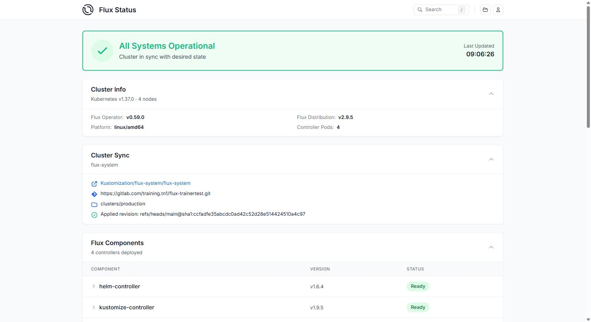

# Flux-Operator Web-UI mit Ingress und HTTPS absichern

## Hintergrund

Der Flux Operator bringt seit Version 0.59 eine eingebaute Web-UI mit
("Flux Status Page") - sie ist per Default aktiv (`web.enabled: true`),
laeuft im selben Pod wie der Operator und ist ueber den Service
`flux-operator` auf Port `9080` (Name `http-web`) erreichbar. Ohne Ingress
ist das nur clusterintern nutzbar.

Wir machen die UI von aussen erreichbar - genau wie bei
[Prometheus/Grafana](../../prometheus-grafana/prometheus-grafana/install-with-helm-traefik-letsencrypt-basic-auth.md):
Traefik als Ingress-Controller, TLS von Letsencrypt, Zugriff per basic-auth.

**Der Punkt dabei:** Fuer die Zertifikats-Ausstellung braucht es keinen
neuen `ClusterIssuer` - das Objekt aus der Prometheus/Grafana-Uebung
(`letsencrypt-prod`) ist nicht an einen Host gebunden, sondern gilt
clusterweit fuer jeden Ingress mit `ingressClassName: traefik`. Derselbe
"Handler" validiert also auch dieses Zertifikat per HTTP01-Challenge.

**Nebeneffekt:** Was die UI anzeigt, ist keine eigene Datensammlung,
sondern die `FluxReport`-Custom-Resource des Operators - dieselbe, die man
auch per `kubectl` abfragen kann. Die UI ist im Kern also nur eine
Visualisierung von Schritt 5 dieser Uebung.

## Voraussetzungen

- Flux Operator + Git-Sync laufen ([02-installation.md](02-installation.md)),
  inklusive Schritt 7 (Operator verwaltet sich selbst per `HelmRelease`)
- Traefik laeuft ueber die `HelmRelease` aus
  [04-helmrelease.md](04-helmrelease.md)
- cert-manager + `ClusterIssuer` `letsencrypt-prod` aus der
  Prometheus/Grafana-Uebung sind noch vorhanden:

```
kubectl get clusterissuer letsencrypt-prod
```

  Falls nicht mehr da (z.B. schon aufgeraeumt): dort Schritt 5+6
  nachholen, bevor es hier weitergeht.

- Wildcard-DNS `*.<du>.do.t3isp.de` aus derselben Uebung zeigt schon auf
  die Traefik-IP - deckt automatisch auch `flux.<du>.do.t3isp.de` ab, kein
  neuer DNS-Eintrag noetig
- `htpasswd` ist installiert (`apt install apache2-utils`, siehe
  Prometheus/Grafana-Uebung)

## Schritt 1: basic-auth-Secret anlegen

Das Secret legen wir bewusst per `kubectl` an, nicht per Git-Commit -
Passwoerter gehoeren nicht im Klartext ins Git-Repo, auch nicht in ein
privates.

```
htpasswd -c auth admin  # Wunsch-Passwort eingeben
kubectl create secret generic flux-web-basic-auth --from-file=users=auth -n flux-system
```

## Schritt 2: Middleware fuer Traefik committen

Anders als das Secret enthaelt die `Middleware` keine Geheimnisse, nur
eine Referenz auf den Secret-Namen - die kann ganz normal ueber Git
laufen, wie alles andere in diesem Kapitel.

```
cd
cd flux-<dein-kuerzel>/clusters/production/flux-system
```

```
# vi flux-web-middleware.yml
apiVersion: traefik.io/v1alpha1
kind: Middleware
metadata:
  name: flux-web-auth
  namespace: flux-system
spec:
  basicAuth:
    secret: flux-web-basic-auth
```

```
cd
cd flux-<dein-kuerzel>
git add -A
git commit -m "Added basic-auth middleware for flux-operator web UI"
git push
```

```
flux reconcile kustomization flux-system --with-source
```

## Schritt 3: Ingress fuer die Web-UI ueber das bestehende HelmRelease aktivieren

Wir tragen die Ingress-Konfiguration im `values`-Feld genau der
`HelmRelease` ein, die den Flux-Operator-Chart schon selbst verwaltet
(aus [02-installation.md](02-installation.md), Schritt 7) - bisher hatte
sie noch kein `values`-Feld.

```
cd flux-<dein-kuerzel>/clusters/production/flux-system
```

```
# vi flux-operator-release.yml
apiVersion: helm.toolkit.fluxcd.io/v2
kind: HelmRelease
metadata:
  name: flux-operator
  namespace: flux-system
spec:
  interval: 30m
  releaseName: flux-operator
  chartRef:
    kind: OCIRepository
    name: flux-operator
    namespace: flux-system
  values:
    web:
      ingress:
        enabled: true
        className: traefik
        annotations:
          cert-manager.io/cluster-issuer: letsencrypt-prod
          traefik.ingress.kubernetes.io/router.middlewares: flux-system-flux-web-auth@kubernetescrd
        hosts:
          - host: flux.<du>.do.t3isp.de
            paths:
              - path: /
                pathType: Prefix
        tls:
          - hosts:
              - flux.<du>.do.t3isp.de
            secretName: flux-web-tls
```

**Achtung, Stolperstein:** Das Feld heisst hier `className`, nicht
`ingressClassName` wie bei jedem anderen Chart in diesem Training
(Prometheus, Grafana, Alertmanager, Traefik selbst). Jedes Helm Chart
definiert sein eigenes values-Schema - es gibt dafuer keine
Kubernetes-weite Konvention. Im Zweifel im Chart selbst nachsehen:
[fluxoperator.dev/docs/charts/flux-operator](https://fluxoperator.dev/docs/charts/flux-operator/)
bzw. [artifacthub.io](https://artifacthub.io/packages/helm/flux-operator/flux-operator).

```
cd
cd flux-<dein-kuerzel>
git add -A
git commit -m "Added ingress for flux-operator web UI"
git push
```

```
flux reconcile kustomization flux-system --with-source
```

## Schritt 4: Status pruefen

```
kubectl -n flux-system get helmrelease flux-operator
kubectl -n flux-system get ingress
kubectl -n flux-system get certificate flux-web-tls
```

Der `Ingress` steht sofort. Das Zertifikat bleibt aber haengen:

```
NAME           READY   SECRET         AGE
flux-web-tls   False   flux-web-tls   3m
```

## Schritt 5: Erwarteter Fehler - Challenge haengt fest

```
kubectl -n flux-system get challenges
kubectl -n flux-system describe challenge <name-aus-get-challenges>
```

Erwarteter Auszug:

```
Status:
  Reason:  Waiting for HTTP-01 challenge propagation: failed to perform
           self check GET request '.../.well-known/acme-challenge/...':
           context deadline exceeded (Client.Timeout exceeded while
           awaiting headers)
  State:   pending
```

**Ursache:** Der Flux Operator legt (weil die `FluxInstance` aus
[02-installation.md](02-installation.md) `spec.cluster.networkPolicy: true`
setzt) automatisch mehrere `NetworkPolicy`-Objekte im Namespace
`flux-system` an - unter anderem `allow-egress`, die per
`podSelector: {}` fuer JEDEN Pod im Namespace gilt und eingehenden
Traffic nur noch von Pods **im selben Namespace** erlaubt.

Genau das trifft den temporaeren `cm-acme-http-solver-...`-Pod, den
cert-manager fuer die Challenge in `flux-system` anlegt: Traefik sitzt im
Namespace `traefik` und darf ihn deshalb nicht mehr erreichen - anders
als bei Prometheus/Alertmanager, wo bisher keine NetworkPolicy im Weg
stand.

```
kubectl -n flux-system get networkpolicy
```

```
NAME                POD-SELECTOR                                                                    AGE
allow-egress        <none>                                                                          ...
allow-scraping      <none>                                                                          ...
allow-webhooks      app=notification-controller                                                     ...
flux-operator-web   app.kubernetes.io/instance=flux-operator,app.kubernetes.io/name=flux-operator   ...
```

`flux-operator-web` erlaubt die Web-UI selbst zwar schon von ueberall auf
Port `9080` - aber der ACME-Solver-Pod ist ein voellig anderer Pod ohne
passende Labels und faellt deshalb unter die restriktive
`allow-egress`-Regel.

## Schritt 6: Fix - gezielte NetworkPolicy fuer den ACME-Solver

Statt die vorhandenen Policies aufzuweichen, erlauben wir gezielt nur den
Solver-Pods (erkennbar am Label `acme.cert-manager.io/http01-solver`)
Traffic auf ihrem Port von ueberall:

```
cd flux-<dein-kuerzel>/clusters/production/flux-system
```

```
# vi 03-allow-acme-http01-solver.yml
apiVersion: networking.k8s.io/v1
kind: NetworkPolicy
metadata:
  name: allow-acme-http01-solver
  namespace: flux-system
spec:
  podSelector:
    matchLabels:
      acme.cert-manager.io/http01-solver: "true"
  policyTypes:
    - Ingress
  ingress:
    - from:
        - namespaceSelector: {}
      ports:
        - protocol: TCP
          port: 8089
```

```
cd
cd flux-<dein-kuerzel>
git add -A
git commit -m "Allow ACME HTTP01 solver ingress from other namespaces"
git push
```

```
flux reconcile kustomization flux-system --with-source
```

```
kubectl -n flux-system get certificate flux-web-tls
```

Nach spaetestens 1-2 Minuten:

```
NAME           READY   SECRET         AGE
flux-web-tls   True    flux-web-tls   ...
```

## Schritt 7: Reports-Feature kennenlernen (FluxReport)

Der Operator legt automatisch genau eine `FluxReport`-Ressource namens
`flux` an und aktualisiert sie alle 5 Minuten - sie fasst den kompletten
Zustand der Flux-Installation zusammen und ist die Datenquelle der
Web-UI, die wir gleich im Browser oeffnen.

| Abschnitt (`spec.`) | Inhalt |
|----------------------|--------|
| `cluster` | Kubernetes-Version, Plattform, Node-Anzahl |
| `distribution` | Flux-Version, Installationsstatus |
| `components` | Status je Flux-Controller (helm-controller, source-controller, ...) |
| `operator` | Version des Flux Operators selbst |
| `reconcilers` | Statistik je Ressourcentyp: wie viele failing/running/suspended |
| `sync` | Kustomization-ID, Quelle, ausgerollte Revision, Sync-Status |

```
kubectl get fluxreport -n flux-system
kubectl -n flux-system get fluxreport flux -o yaml
```

Manuelles Neu-Erstellen (statt auf die naechsten 5 Minuten zu warten):

```
kubectl -n flux-system annotate --overwrite fluxreport/flux \
  reconcile.fluxcd.io/requestedAt="$(date +%s)"
```

## Schritt 8: Von aussen testen

Gleiche curl-Pruefung wie bei Prometheus/Alertmanager - derselbe Handler,
dieselbe Erwartung:

```
curl -s -o /dev/null -w "%{http_code}\n" https://flux.<du>.do.t3isp.de/
# 401 (ohne Auth - gut so!)

curl -s -o /dev/null -w "%{http_code}\n" -u admin:<dein-passwort> https://flux.<du>.do.t3isp.de/
# 200 (mit Auth)
```

Im Browser: `https://flux.<du>.do.t3isp.de` -> Login-Popup (basic-auth),
danach das Flux-Status-Dashboard - dieselben Infos wie eben im
`FluxReport`, nur grafisch aufbereitet: `FluxInstance`, `GitRepository`
und alle `Kustomization`/`HelmRelease`-Objekte in Echtzeit.



## Aufraeumen

```
cd flux-<dein-kuerzel>/clusters/production/flux-system
rm flux-web-middleware.yml 03-allow-acme-http01-solver.yml
# in flux-operator-release.yml das values:-Feld (web:) wieder entfernen
git add -A
git commit -m "Removed ingress, basic-auth middleware and ACME solver policy for flux-operator web UI"
git push
```

```
flux reconcile kustomization flux-system --with-source
kubectl delete secret flux-web-basic-auth flux-web-tls -n flux-system
```

Das Certificate-Objekt selbst entfernt cert-manager automatisch mit (per
`ownerReference` an den Ingress gebunden) - nur das TLS-Secret bleibt
stehen und muss von Hand weg.

## Referenzen

- https://fluxoperator.dev/docs/web-ui/ingress/
- https://fluxoperator.dev/docs/charts/flux-operator/
- https://artifacthub.io/packages/helm/flux-operator/flux-operator
