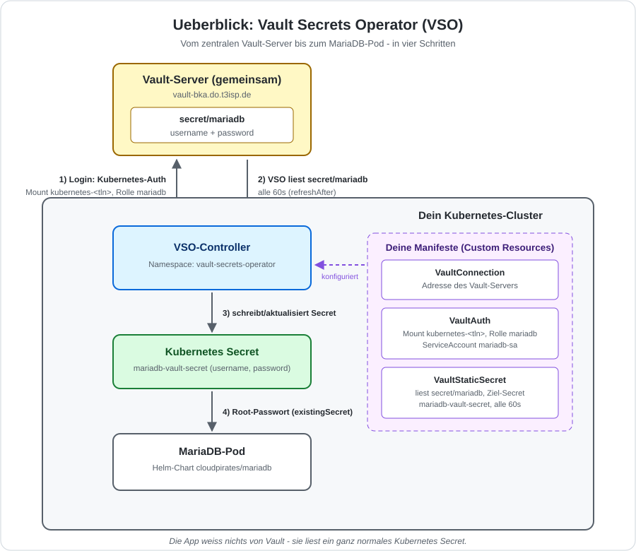
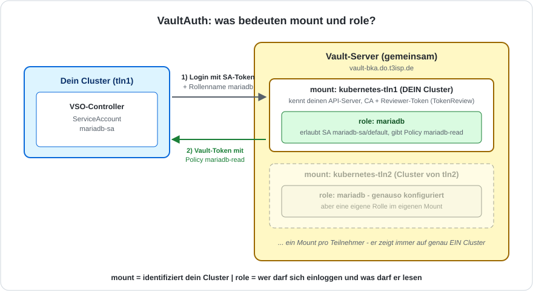

# MariaDB-Deployment mit dem Vault Secrets Operator (VSO)

## Hintergrund

Der Vault Secrets Operator (VSO) synchronisiert Secrets aus HashiCorp Vault
als native Kubernetes Secrets in dein Cluster. Ein Controller im Cluster
loggt sich bei Vault ein, liest das Secret periodisch neu und legt es als
`Secret`-Ressource ab - Anwendungen greifen ganz normal per `secretKeyRef`
darauf zu, ohne selbst etwas von Vault zu wissen.



> **Setup:** Alle Teilnehmer nutzen den **gleichen Vault-Server**
> (`https://vault-bka.do.t3isp.de`), aber jeder arbeitet mit seinem
> **eigenen Kubernetes-Cluster**. Das MariaDB-Credential
> (`username`/`password` unter `secret/mariadb`) ist bei allen Teilnehmern
> **identisch** - es ist ein Trainings-Demo-Wert, kein echtes Secret. Der
> Kubernetes-Auth-Mount (`kubernetes-<dein-tln>`) ist dagegen pro Teilnehmer
> eigenstaendig, weil er auf dein Cluster zeigt.

## Voraussetzungen

- Eigenes kubeadm-Cluster (`kubectl get nodes` funktioniert)
- Helm v3 installiert
- Dein Cluster muss `vault-bka.do.t3isp.de` per HTTPS erreichen koennen
- Der Trainer hat fuer dein `<tln>` bereits einen Kubernetes-Auth-Mount in
  Vault eingerichtet (Rolle `mariadb`, gebunden an ServiceAccount
  `mariadb-sa` im Namespace `default`) - siehe Hintergrund unten

### Hintergrund: Was der Trainer fuer dich schon eingerichtet hat

Vault muss deinem Cluster vertrauen koennen, bevor irgendein Pod sich dort
einloggen darf. Das ist zweistufig aufgebaut - beide Stufen hat der Trainer
per Skript (`training-vault-server`) bereits fuer dich erledigt, du musst
sie nicht selbst anlegen, solltest aber verstehen, was da steht:

1. **In deinem Cluster:** Ein ServiceAccount `vault-auth` mit einem
   `ClusterRoleBinding` auf `system:auth-delegator`. Vault validiert jeden
   eingehenden Login-Versuch ueber die Kubernetes-TokenReview-API - dafuer
   braucht Vault selbst einen Token mit genau dieser Berechtigung. Dieser
   ServiceAccount ist NICHT der, mit dem sich MariaDB spaeter einloggt
   (das macht `mariadb-sa`, siehe Schritt 4) - er ist reine
   Vault-Infrastruktur, einmalig pro Cluster.
2. **Auf dem Vault-Server:** Ein eigener Kubernetes-Auth-Mount
   `kubernetes-<dein-tln>` (jeder Teilnehmer bekommt einen eigenen, weil ein
   Mount fest an EINEN API-Server + dessen CA-Zertifikat + den
   Reviewer-Token aus Schritt 1 gebunden ist - ein gemeinsamer Mount fuer
   alle Cluster ist technisch nicht moeglich). Darin ist eine Rolle
   `mariadb` konfiguriert, die zwei Bedingungen prueft: Der einloggende Pod
   muss den ServiceAccount `mariadb-sa` im Namespace `default` benutzen -
   und wenn das stimmt, bekommt er ein Vault-Token mit der Policy
   `mariadb-read` (liest ausschliesslich `secret/data/mariadb`, sonst
   nichts).

Kurz: Schritt 1 sagt Vault "ich kann Tokens aus diesem Cluster pruefen",
Schritt 2 sagt Vault "und genau dieser ServiceAccount-Name in diesem
Cluster darf dann das MariaDB-Secret lesen". Deine Aufgabe in dieser
Uebung ist nur noch, den passenden ServiceAccount (`mariadb-sa`) anzulegen
und die K8s-seitigen Ressourcen (VaultConnection/VaultAuth/
VaultStaticSecret) zu erstellen, die diesen Mount tatsaechlich benutzen.

---

## Schritt 1: Vorschau - was steht ueberhaupt in Vault?

Bevor wir irgendetwas automatisieren, schauen wir uns das Secret einmal
direkt per CLI an - auf `client-bka` ist `vault` bereits installiert.

Die Demo-Passwoerter des Trainings liegen auf `client-bka` zentral in
`/etc/training-vault.env` - einmal sourcen, dann stehen sie als Variablen
bereit und muessen nirgends im Klartext getippt werden:

```
source /etc/training-vault.env
export VAULT_ADDR=https://vault-bka.do.t3isp.de
vault login -method=userpass username=training password="$VAULT_TRAINING_PASSWORD"
```

Erwartete Ausgabe (Auszug):

```
Success! You are now authenticated.
...
policies               ["default" "mariadb-read"]
```

Das Secret lesen:

```
vault kv get secret/mariadb
```

Erwartete Ausgabe (Auszug):

```
====== Data ======
Key         Value
---         -----
password    <das-mariadb-demo-passwort>
username    root
```

Genau dieses `username`/`password`-Paar liefern wir jetzt automatisiert an
einen MariaDB-Pod aus - einmal per VSO (diese Uebung), einmal per Vault
Agent Injector (naechste Uebung).

---

## Schritt 2: Arbeitsverzeichnisse anlegen

```
mkdir -p ~/manifests/vault-vso ~/helm-values/vault-vso
cd ~/manifests/vault-vso
```

---

## Schritt 3: Vault Secrets Operator installieren

```
helm repo add hashicorp https://helm.releases.hashicorp.com
helm repo update hashicorp
```

```
nano ~/helm-values/vault-vso/vault-secrets-operator-values.yml
```

```
defaultVaultConnection:
  enabled: false
controller:
  manager:
    clientCache:
      persistenceModel: none
```

```
helm install vault-secrets-operator hashicorp/vault-secrets-operator \
  -n vault-secrets-operator --create-namespace \
  -f ~/helm-values/vault-vso/vault-secrets-operator-values.yml
```

Pruefen, ob der Operator laeuft:

```
kubectl -n vault-secrets-operator rollout status deploy/vault-secrets-operator-controller-manager
```

Erwartete Ausgabe:

```
deployment "vault-secrets-operator-controller-manager" successfully rolled out
```

---

## Schritt 4: ServiceAccount fuer MariaDB anlegen

```
nano 00-mariadb-sa.yml
```

```
apiVersion: v1
kind: ServiceAccount
metadata:
  name: mariadb-sa
```

```
kubectl apply -f 00-mariadb-sa.yml -n default
```

---

## Schritt 5: VaultConnection erstellen

Die VaultConnection sagt dem Operator, mit welchem Vault-Server er reden
soll.

```
nano 01-vault-connection.yml
```

```
apiVersion: secrets.hashicorp.com/v1beta1
kind: VaultConnection
metadata:
  name: vault-connection
spec:
  address: https://vault-bka.do.t3isp.de
```

```
kubectl apply -f 01-vault-connection.yml -n default
```

---

## Schritt 6: VaultAuth erstellen

Die VaultAuth sagt dem Operator, WIE er sich bei Vault einloggen soll -
die beiden Felder `mount` und `role` bedeuten dabei:



```
nano 02-vault-auth.yml
```

```
apiVersion: secrets.hashicorp.com/v1beta1
kind: VaultAuth
metadata:
  name: vault-auth
spec:
  vaultConnectionRef: vault-connection
  method: kubernetes
  mount: kubernetes-tln1
  kubernetes:
    role: mariadb
    serviceAccount: mariadb-sa
```

> **Wichtig:** `mount: kubernetes-tln1` auf deinen eigenen Teilnehmernamen
> anpassen (z.B. `kubernetes-tln4`)!

```
kubectl apply -f 02-vault-auth.yml -n default
```

---

## Schritt 7: VaultStaticSecret erstellen

Das VaultStaticSecret definiert, welcher Pfad in Vault gelesen wird und wie
das resultierende Kubernetes Secret heissen soll.

```
nano 03-vault-static-secret.yml
```

```
apiVersion: secrets.hashicorp.com/v1beta1
kind: VaultStaticSecret
metadata:
  name: mariadb-secret
spec:
  vaultAuthRef: vault-auth
  mount: secret
  type: kv-v2
  path: mariadb
  refreshAfter: 60s
  destination:
    name: mariadb-vault-secret
    create: true
```

```
kubectl apply -f 03-vault-static-secret.yml -n default
```

Pruefen, ob das Secret synchronisiert wurde:

```
kubectl get vaultstaticsecret mariadb-secret -n default
```

Erwartete Ausgabe:

```
NAME             SYNCED   HEALTHY   READY   AGE
mariadb-secret   True     True      True    14s
```

Die entstandenen Keys im Kubernetes Secret pruefen (ohne Werte auszugeben):

```
kubectl describe secret mariadb-vault-secret -n default
```

Erwartete Ausgabe (Auszug):

```
Data
====
_raw:      197 bytes
password:  22 bytes
username:  4 bytes
```

> **Hinweis:** `_raw` enthaelt das komplette Secret als JSON, `password` und
> `username` sind die einzelnen Felder aus Vault.

---

## Schritt 8: MariaDB per Helm ausrollen

Wir nutzen den `cloudpirates/mariadb` Chart und referenzieren das eben
erstellte Kubernetes Secret als Root-Passwort-Quelle.

```
nano ~/helm-values/vault-vso/mariadb-values.yml
```

```
auth:
  existingSecret: mariadb-vault-secret
  secretKeys:
    rootPasswordKey: password
persistence:
  enabled: false
```

> `persistence.enabled: false` - dieses Training hat (noch) keine
> StorageClass fuer die kubeadm-Cluster eingerichtet, siehe README.

```
helm install mariadb-vso oci://registry-1.docker.io/cloudpirates/mariadb \
  -n default \
  -f ~/helm-values/vault-vso/mariadb-values.yml
```

```
kubectl -n default rollout status statefulset/mariadb-vso
```

---

## Schritt 9: Verifikation - Login-Test

```
source /etc/training-vault.env
kubectl exec -n default mariadb-vso-0 -- mariadb -uroot -p"$MARIADB_ROOT_PASSWORD" -e "SELECT 1 AS login_test;"
```

Erwartete Ausgabe:

```
login_test
1
```

Das Passwort kam nicht aus einem `kubectl apply`-Manifest, sondern wurde
vom Operator live aus Vault gezogen - `refreshAfter: 60s` sorgt dafuer,
dass eine Aenderung in Vault spaetestens nach 60 Sekunden im Kubernetes
Secret ankommt.

> **Aber: MariaDB merkt davon nichts.** Der Container liest das Passwort
> nur einmal beim Start als Umgebungsvariable - eine Rotation erreicht
> die App erst mit einem Neustart (siehe Bonus in Schritt 10).

---

## Schritt 10 (Bonus): Rotation automatisch bis in den Pod

VSO hat fuer den fehlenden Neustart ein Bordmittel eingebaut (das
uebernimmt hier die Aufgabe, fuer die man sonst Tools wie Stakater
Reloader installiert): `rolloutRestartTargets`. Damit sagst du dem
Operator: "Immer wenn du dieses Secret neu schreibst, starte auch das
StatefulSet neu durch."

Ergaenze in `03-vault-static-secret.yml` unter `spec:` drei Zeilen:

```
# vi 03-vault-static-secret.yml
apiVersion: secrets.hashicorp.com/v1beta1
kind: VaultStaticSecret
metadata:
  name: mariadb-secret
spec:
  vaultAuthRef: vault-auth
  mount: secret
  type: kv-v2
  path: mariadb
  refreshAfter: 60s
  destination:
    name: mariadb-vault-secret
    create: true
  rolloutRestartTargets:
    - kind: StatefulSet
      name: mariadb-vso
```

```
kubectl apply -f 03-vault-static-secret.yml -n default
```

Die Kette laeuft ab jetzt automatisch durch:

1. Passwort in Vault aendern (macht der Trainer zentral - das Secret ist
   fuer alle Teilnehmer dasselbe, und eure Policy `mariadb-read` darf nur
   lesen)
2. VSO schreibt das Kubernetes Secret neu (spaetestens nach 60s)
3. VSO macht einen Rolling Restart des StatefulSets - erkennbar an der
   Annotation `vso.secrets.hashicorp.com/restartedAt` und einem frischen
   Pod
4. Der neue Pod liest die Umgebungsvariable frisch und kennt das neue
   Passwort

> **Trainer-Hinweis - so wird zentral rotiert:** Auf dem Vault-Server mit
> Admin-Token anmelden und
> `vault kv put secret/mariadb username=root password='<neuer-wert>'`
> ausfuehren - bei allen Teilnehmern folgen Secret-Update und
> Auto-Restart. Danach auf demselben Weg den Demo-Wert aus
> `/etc/training-vault.env` wiederherstellen.

Beobachten, waehrend der Trainer rotiert:

```
kubectl get pods -n default -w
```

Erwartete Ausgabe (nach ca. einer Minute):

```
mariadb-vso-0   1/1     Running       0          25m
mariadb-vso-0   1/1     Terminating   0          26m
mariadb-vso-0   0/1     Pending       0          0s
mariadb-vso-0   1/1     Running       0          31s
```

> **Wichtig: Das loest das eigentliche Problem noch nicht.** Der Neustart
> bringt das neue Passwort nur bis zur App - in den Systemtabellen der
> Datenbank rotiert dabei nichts (hier klappt es nur, weil die DB ohne
> Persistenz leer neu startet). Echte Rotation - Datenbank und Vault im
> Gleichschritt - macht die Vault **Database Secrets Engine**.

---

## Troubleshooting

| Problem | Loesung |
|---------|---------|
| `VaultAuth` Status nicht `Accepted` | `kubectl describe vaultauth vault-auth -n default` - meist falscher `mount`-Name |
| `VaultStaticSecret` zeigt `SYNCED: False` | `kubectl describe vaultstaticsecret mariadb-secret -n default` - Events pruefen |
| `permission denied` beim Sync | Policy-Pfad in Vault pruefen: `secret/data/mariadb` (nicht `secret/mariadb`) - bei KV-v2 immer mit `data/` |
| MariaDB-Pod startet nicht, `CrashLoopBackOff` | `kubectl logs mariadb-vso-0 -n default` - haeufig falscher `rootPasswordKey` (muss exakt der Key im Secret sein, siehe `kubectl describe secret`) |
| `VaultConnection`/`VaultAuth` gefunden, aber Login schlaegt fehl | Dein `kubernetes-<tln>`-Mount existiert noch nicht - beim Trainer nachfragen, ob `setup-participant.sh` fuer dich gelaufen ist |

---

## Aufraeumen

```
helm uninstall mariadb-vso -n default
kubectl delete -f ~/manifests/vault-vso/ -n default
helm uninstall vault-secrets-operator -n vault-secrets-operator
kubectl delete namespace vault-secrets-operator
```

---

## Zusammenfassung: Datenfluss

```
Gemeinsamer Vault-Server (vault-bka.do.t3isp.de)
  └── secret/mariadb (username + password, fuer alle TN identisch)
        │
        ▼  (K8s-Auth ueber kubernetes-<tln>, Rolle mariadb)
   VSO-Controller im eigenen Cluster synct alle 60s
        │
        ▼
K8s Secret (mariadb-vault-secret)
        │
        ▼
MariaDB-Pod (Helm-Chart cloudpirates/mariadb, auth.existingSecret)
```
