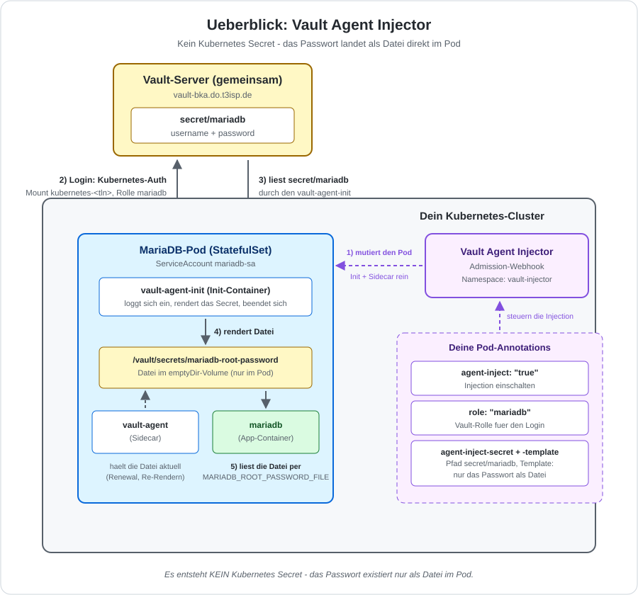

# MariaDB-Deployment mit dem Vault Agent Injector

## Hintergrund

Der Vault Agent Injector arbeitet grundlegend anders als der Vault Secrets
Operator aus der letzten Uebung: Er erzeugt **kein** Kubernetes Secret.
Stattdessen mutiert ein Admission-Webhook jeden Pod mit der passenden
Annotation und haengt ihm einen `vault-agent`-Init-Container plus
`vault-agent`-Sidecar an. Der Init-Container loggt sich bei Vault ein,
rendert das Secret als Datei in ein `emptyDir`-Volume (`/vault/secrets/...`)
und beendet sich - der Sidecar haelt das Secret danach aktuell (Renewal,
periodisches Re-Rendern). Die Anwendung selbst liest ganz normal eine
lokale Datei, ohne dass ein Kubernetes Secret jemals existiert.



| Aspekt | VSO (letzte Uebung) | Agent Injector (diese Uebung) |
|---|---|---|
| Kubernetes Secret? | Ja (`mariadb-vault-secret`) | **Nein** - nie |
| Wo landet das Secret? | K8s-Secret-Objekt (etcd) | Datei in `emptyDir` im Pod |
| Wie kommt es in den Container? | `secretKeyRef` (Chart-Feature) | Datei + `_FILE`-Env-Var (App-Feature) |
| Zusaetzliche Container im Pod | Keiner | `vault-agent-init` (Init) + `vault-agent` (Sidecar) |
| Wo laeuft die Vault-Authentifizierung? | Operator-Pod (clusterweit) | Jeder App-Pod einzeln |

> **Setup:** Gleicher Vault-Server, gleiches Secret (`secret/mariadb`) wie in
> der VSO-Uebung. Wenn du die VSO-Uebung schon durchgespielt hast, ist die
> Vorschau (`vault kv get secret/mariadb`) bereits bekannt - dieser Schritt
> kann dann uebersprungen werden.

## Voraussetzungen

- Eigenes kubeadm-Cluster, Helm v3
- Dein `kubernetes-<tln>`-Auth-Mount in Vault existiert bereits, inkl. der
  Rolle `mariadb` (gebunden an ServiceAccount `mariadb-sa`/Namespace
  `default`, Policy `mariadb-read`) - der Trainer hat das fuer dich
  eingerichtet, siehe "Hintergrund: Was der Trainer fuer dich schon
  eingerichtet hat" in der VSO-Uebung (`01-mariadb-vault-secrets-operator.md`)
  fuer die Details. Diese Uebung nutzt exakt denselben Mount und dieselbe
  Rolle wie die VSO-Uebung - der Unterschied liegt nur darin, WIE der Pod
  sich damit einloggt (siehe Vergleichstabelle oben), nicht in der
  Auth-Konfiguration selbst.
- ServiceAccount `mariadb-sa` im Namespace `default` existiert (aus der
  VSO-Uebung, sonst siehe Schritt 3 unten)

```
export TLN=tln1   # Anpassen auf deinen Teilnehmernamen!
```

---

## Schritt 1: Arbeitsverzeichnisse anlegen

```
mkdir -p ~/manifests/vault-agent ~/helm-values/vault-agent
cd ~/manifests/vault-agent
```

---

## Schritt 2: Vault Agent Injector installieren

Anders als bei VSO installieren wir hier den **offiziellen HashiCorp
Vault-Chart** - aber nur mit `injector.enabled`, ohne eigenen Vault-Server
(`server.enabled: false`), da wir den bereits laufenden Server extern
ansprechen.

```
helm repo add hashicorp https://helm.releases.hashicorp.com
helm repo update hashicorp
```

```
nano ~/helm-values/vault-agent/vault-injector-values.yml
```

```
global:
  externalVaultAddr: https://vault-bka.do.t3isp.de
injector:
  enabled: true
  authPath: "auth/kubernetes-tln1"
server:
  enabled: false
csi:
  enabled: false
```

> **Wichtig:** `authPath` auf deinen eigenen Teilnehmernamen anpassen (z.B.
> `auth/kubernetes-tln4`)! Der Injector nutzt diesen Pfad als Default fuer
> alle Pods, die er mutiert - eine Pod-Annotation kann ihn zwar pro Pod
> ueberschreiben, wir setzen ihn hier aber gleich global richtig.

```
helm install vault hashicorp/vault \
  -n vault-injector --create-namespace \
  -f ~/helm-values/vault-agent/vault-injector-values.yml
```

```
kubectl -n vault-injector rollout status deploy/vault-agent-injector
```

Erwartete Ausgabe:

```
deployment "vault-agent-injector" successfully rolled out
```

---

## Schritt 3: ServiceAccount fuer MariaDB (falls noch nicht vorhanden)

```
nano 00-mariadb-sa.yml
```

```
apiVersion: v1
kind: ServiceAccount
metadata:
  name: mariadb-sa
```

```
kubectl apply -f 00-mariadb-sa.yml -n default
```

---

## Schritt 4: MariaDB mit Agent-Injector-Annotations ausrollen

Die Injection wird komplett ueber Pod-Annotations gesteuert - der
`cloudpirates/mariadb`-Chart kennt Vault gar nicht, wir reichen die
Annotations einfach ueber `podAnnotations` durch.

```
nano ~/helm-values/vault-agent/mariadb-values.yml
```

```
auth:
  enabled: false
persistence:
  enabled: false
podAnnotations:
  vault.hashicorp.com/agent-inject: "true"
  vault.hashicorp.com/role: "mariadb"
  vault.hashicorp.com/agent-inject-secret-mariadb-root-password: "secret/data/mariadb"
  vault.hashicorp.com/agent-inject-template-mariadb-root-password: |
    {{- with secret "secret/data/mariadb" -}}
    {{ .Data.data.password }}
    {{- end -}}
extraEnvVars:
  - name: MARIADB_ROOT_PASSWORD_FILE
    value: /vault/secrets/mariadb-root-password
serviceAccount:
  create: false
  name: mariadb-sa
  automountServiceAccountToken: true
```

> **Drei Stolpersteine, die hier schon geloest sind:**
> 1. `auth.enabled: false` - sonst setzt der Chart selbst ein
>    `MARIADB_ROOT_PASSWORD` (aus einem auto-generierten Secret), das sich
>    mit `MARIADB_ROOT_PASSWORD_FILE` beisst (`Both ... are set (but are
>    exclusive)`, Container crasht).
> 2. `serviceAccount.automountServiceAccountToken: true` - der Chart
>    deaktiviert das Automounten standardmaessig aus Sicherheitsgruenden.
>    Der Vault-Agent im Pod braucht aber genau dieses Token, um sich bei
>    Vault einzuloggen (`failed to find service account volume mount`,
>    Pod-Erstellung wird vom Webhook abgelehnt).
> 3. Das Template rendert **nur** das rohe Passwort (kein `key: value`,
>    kein JSON) - passend zum `_FILE`-Konsum durch das offizielle
>    MariaDB-Image (Docker-Secrets-Konvention).

```
helm install mariadb-agent oci://registry-1.docker.io/cloudpirates/mariadb \
  -n default \
  -f ~/helm-values/vault-agent/mariadb-values.yml
```

```
kubectl -n default rollout status statefulset/mariadb-agent
```

---

## Schritt 5: Verifikation

Pod-Status - zwei zusaetzliche Container gegenueber der VSO-Uebung:

```
kubectl get pod mariadb-agent-0 -n default -o jsonpath='{.spec.initContainers[*].name}{"\n"}{.spec.containers[*].name}{"\n"}'
```

Erwartete Ausgabe:

```
vault-agent-init
mariadb vault-agent
```

Die vom Agent gerenderte Datei ansehen (Existenz + Groesse, nicht den Inhalt):

```
kubectl exec mariadb-agent-0 -n default -c mariadb -- ls -la /vault/secrets/
```

Erwartete Ausgabe:

```
-rw-r--r-- 1 100 mysql 22 ... mariadb-root-password
```

Login-Test:

```
source /etc/training-vault.env
kubectl exec -n default mariadb-agent-0 -c mariadb -- mariadb -uroot -p"$MARIADB_ROOT_PASSWORD" -e "SELECT 2 AS agent_login_test;"
```

Erwartete Ausgabe:

```
agent_login_test
2
```

Zum Vergleich - es existiert wirklich kein Kubernetes Secret mit dem
Passwort darin (nur das Helm-Release-Bookkeeping, kein `Opaque`-Secret):

```
kubectl get secrets -n default --field-selector type=Opaque
```

Erwartete Ausgabe:

```
No resources found in default namespace.
```

> **Hinweis:** `kubectl get secrets -n default` zeigt trotzdem einen
> Treffer namens `sh.helm.release.v1.mariadb-agent.v1` - das ist Helms
> eigenes Release-Bookkeeping (Typ `helm.sh/release.v1`), kein
> Anwendungs-Secret und enthaelt keine MariaDB-Zugangsdaten.

---

## Troubleshooting

| Problem | Loesung |
|---------|---------|
| Pod-Erstellung schlaegt fehl: `failed to find service account volume mount` | `serviceAccount.automountServiceAccountToken: true` fehlt in den Values |
| Container `mariadb` crasht: `Both MARIADB_ROOT_PASSWORD and ..._FILE are set` | `auth.enabled: false` fehlt - der Chart setzt sonst selbst ein Passwort |
| `vault-agent-init` haengt / Timeout | `authPath` in den Injector-Values falsch (nicht dein `kubernetes-<tln>`-Mount) - `kubectl logs <pod> -c vault-agent-init` pruefen |
| Datei `/vault/secrets/mariadb-root-password` fehlt oder leer | Annotation-Name der Template-Annotation muss exakt zum `agent-inject-secret-<name>` passen (`<name>` identisch in beiden Annotation-Keys) |
| `permission denied` im Agent-Log | Policy/Rolle pruefen - dieselbe Rolle `mariadb` wie in der VSO-Uebung, Pfad `secret/data/mariadb` |

---

## Aufraeumen

```
helm uninstall mariadb-agent -n default
kubectl delete -f ~/manifests/vault-agent/ -n default
helm uninstall vault -n vault-injector
kubectl delete namespace vault-injector
```

---

## Zusammenfassung: Datenfluss

```
Gemeinsamer Vault-Server (vault-bka.do.t3isp.de)
  └── secret/mariadb (username + password, fuer alle TN identisch)
        │
        ▼  (K8s-Auth ueber kubernetes-<tln>, Rolle mariadb - Login IM Pod)
   vault-agent-init (Init-Container) rendert Datei, beendet sich
        │
        ▼
/vault/secrets/mariadb-root-password (emptyDir, nur im Pod sichtbar)
        │
        ▼  (MARIADB_ROOT_PASSWORD_FILE)
MariaDB-Container liest die Datei beim Start
```
