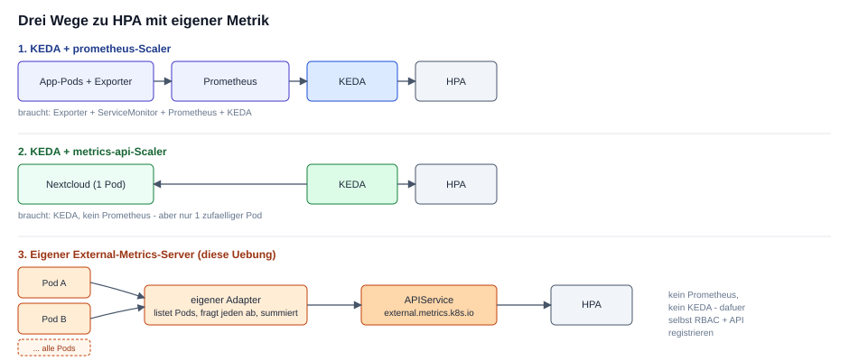

# HPA ueber einen selbst gebauten External-Metrics-Server (Nextcloud, ohne Prometheus/KEDA) - Konzept-Skizze

> **Hinweis:** Wie die [Nextcloud/serverinfo-Uebung](hpa-keda-metrics-api-nextcloud.md) ist
> das hier eine ungetestete Konzept-Skizze (siehe TEST-PFLICHT im Skill
> `workshop-training`). Sie zeigt, wie der Mechanismus hinter KEDA/Prometheus-Adapter
> selbst funktioniert - vor Praxiseinsatz unbedingt selbst durchtesten.

## Hintergrund

  * Die beiden anderen KEDA-Uebungen ([mit Prometheus](hpa-keda-custom-metric.md),
    [mit `serverinfo`](hpa-keda-metrics-api-nextcloud.md)) nutzen KEDA als fertige
    Middleware, die fuer euch eine Kubernetes-Metrics-API implementiert und daraus ein
    HPA baut. Diese Uebung zeigt, was KEDA (und der Prometheus Adapter) da eigentlich
    tun: Sie implementieren die **Aggregation Layer** von Kubernetes selbst - einen
    eigenen kleinen API-Server, der sich beim Haupt-API-Server unter einer Metrics-
    GroupVersion registriert (`APIService`). Das bauen wir hier von Hand nach, mit einem
    ganz normalen, KEDA-losen `HorizontalPodAutoscaler`.
  * Zusaetzlicher Unterschied: unser Adapter fragt **jeden Nextcloud-Pod einzeln** direkt
    per Pod-IP ab (Kubernetes-API zum Pods-Auflisten) und **summiert** die Werte selbst -
    statt wie `metrics-api` nur einen zufaelligen Pod ueber den Service zu treffen. Als
    Metrik nehmen wir Apaches `BusyWorkers` (aktive Worker-Threads) - eine echte
    Pod-lokale Groesse, bei der Aufsummieren ueber alle Pods auch inhaltlich Sinn ergibt
    (im Gegensatz zu `activeUsers` aus `serverinfo`, das schon global aus der DB kommt).



## Wichtige Einschraenkung: nur EIN Adapter pro Metrics-GroupVersion

  * Pro Cluster kann sich immer nur EIN Backend fuer eine gegebene `APIService`
    (GroupVersion, z.B. `v1beta1.external.metrics.k8s.io`) registrieren. KEDAs
    `keda-operator-metrics-apiserver` beansprucht diese GroupVersion bereits fuer sich.
  * Diese Uebung ist deshalb eine **Alternative** zu KEDA, nicht zusaetzlich dazu - in
    einem Cluster, in dem KEDA schon laeuft (z.B. aus den beiden anderen Uebungen),
    wuerde unsere eigene `APIService`-Registrierung mit KEDAs kollidieren. Fuer einen
    echten Test also KEDA vorher deinstallieren oder einen frischen Cluster nehmen.

## Voraussetzung

  * Nextcloud + MariaDB wie in der [serverinfo-Uebung](hpa-keda-metrics-api-nextcloud.md#skizze-mariadb-als-externe-geteilte-db)
    beschrieben (Namespace `nextcloud-demo`) - hier zusaetzlich mit `replicas: 2`, damit
    das "Summieren ueber mehrere Pods" ueberhaupt sichtbar wird.
  * KEDA NICHT installiert (siehe Einschraenkung oben)

## Schritt 1: Apaches mod_status aktivieren

  * Der Trick: eine eigene Conf-Datei nach `/etc/apache2/conf-enabled/` mounten - das
    laedt Apache beim Start automatisch mit, kein `a2enmod` im laufenden Container noetig.
  * **Sicherheits-Hinweis:** Kein IP-Filter hier (im Gegensatz zu typischen
    `server-status`-Anleitungen, die auf `127.0.0.1` einschraenken) - unser Adapter laeuft
    in einem ANDEREN Pod und muss die Pod-IP direkt erreichen. In der Praxis wuerdet ihr
    das per `NetworkPolicy` einschraenken (nur der Adapter-Namespace darf `/server-status`
    erreichen) - siehe [NetworkPolicy-Uebung](../kubernetes-networkpolicy/00-simple-exercises-group.md)
    von Tag 1. Genau dasselbe Problem wie beim PHP-FPM-Status in der anderen Uebung.

```
# vi 05-nextcloud-modstatus-configmap.yaml
apiVersion: v1
kind: ConfigMap
metadata:
  name: nextcloud-modstatus
  namespace: nextcloud-demo
data:
  status.conf: |
    LoadModule status_module modules/mod_status.so
    ExtendedStatus On
    <Location "/server-status">
      SetHandler server-status
    </Location>
```

```
# Ergaenzung im Nextcloud-Deployment aus der serverinfo-Uebung:
#   volumeMounts:
#   - name: modstatus
#     mountPath: /etc/apache2/conf-enabled/status.conf
#     subPath: status.conf
#   volumes:
#   - name: modstatus
#     configMap:
#       name: nextcloud-modstatus
# und "replicas: 2" statt "replicas: 1"
```

```
kubectl apply -f 05-nextcloud-modstatus-configmap.yaml
kubectl -n nextcloud-demo rollout restart deployment/nextcloud
```

```
# Testen (aus einem Debug-Pod, Pod-IP statt Service-Name!):
kubectl -n nextcloud-demo get pods -o wide
kubectl -n nextcloud-demo run test-status --image=curlimages/curl --restart=Never --rm -i --command -- \
  curl -s http://<Pod-IP>/server-status?auto
```

```
# Erwartete Ausgabe (Ausschnitt):
Total Accesses: 12
Total kBytes: 340
BusyWorkers: 1
IdleWorkers: 9
```

## Schritt 2: RBAC-Fundament fuer den Adapter

  * Drei Teile: (a) unser Adapter darf Pods in `nextcloud-demo` auflisten - bewusst per
    `Role`/`RoleBinding` statt `ClusterRole` (Least-Privilege-Prinzip aus der
    [RBAC-Uebung](../kubernetes/rbac/00-rbac-and-least-privileges.md) von Tag 1), (b)+(c)
    zwei feste Kubernetes-Bordmittel-Bindings, die JEDER aggregierte API-Server braucht,
    um eingehende Anfragen beim Haupt-API-Server authentifizieren zu lassen.

```
# vi 01-namespace.yaml
apiVersion: v1
kind: Namespace
metadata:
  name: nextcloud-metrics-adapter
```

```
# vi 02-serviceaccount.yaml
apiVersion: v1
kind: ServiceAccount
metadata:
  name: nextcloud-metrics-adapter
  namespace: nextcloud-metrics-adapter
```

```
# vi 03-rbac-pods-lesen.yaml
# (a) Pods in nextcloud-demo auflisten duerfen - NUR das, nichts weiter
apiVersion: rbac.authorization.k8s.io/v1
kind: Role
metadata:
  name: pod-reader
  namespace: nextcloud-demo
rules:
- apiGroups: [""]
  resources: ["pods"]
  verbs: ["list", "get", "watch"]
---
apiVersion: rbac.authorization.k8s.io/v1
kind: RoleBinding
metadata:
  name: nextcloud-metrics-adapter-pod-reader
  namespace: nextcloud-demo
subjects:
- kind: ServiceAccount
  name: nextcloud-metrics-adapter
  namespace: nextcloud-metrics-adapter
roleRef:
  kind: Role
  name: pod-reader
  apiGroup: rbac.authorization.k8s.io
```

```
# vi 04-rbac-aggregation-layer.yaml
# (b) auth-delegator: der Adapter darf beim Haupt-API-Server nachfragen,
#     ob ein eingehender Request-Token gueltig ist (Standard-Voraussetzung
#     fuer JEDEN aggregierten API-Server, nicht spezifisch fuer uns)
apiVersion: rbac.authorization.k8s.io/v1
kind: ClusterRoleBinding
metadata:
  name: nextcloud-metrics-adapter-auth-delegator
subjects:
- kind: ServiceAccount
  name: nextcloud-metrics-adapter
  namespace: nextcloud-metrics-adapter
roleRef:
  kind: ClusterRole
  name: system:auth-delegator
  apiGroup: rbac.authorization.k8s.io
---
# (c) darf die "extension-apiserver-authentication" ConfigMap in kube-system
#     lesen (enthaelt das CA-Bundle des Haupt-API-Servers) - ebenfalls
#     Standard-Voraussetzung, fest vorgegebener Name
apiVersion: rbac.authorization.k8s.io/v1
kind: RoleBinding
metadata:
  name: nextcloud-metrics-adapter-auth-reader
  namespace: kube-system
subjects:
- kind: ServiceAccount
  name: nextcloud-metrics-adapter
  namespace: nextcloud-metrics-adapter
roleRef:
  kind: Role
  name: extension-apiserver-authentication-reader
  apiGroup: rbac.authorization.k8s.io
```

```
kubectl apply -f 01-namespace.yaml
kubectl apply -f 02-serviceaccount.yaml
kubectl apply -f 03-rbac-pods-lesen.yaml
kubectl apply -f 04-rbac-aggregation-layer.yaml
```

## Schritt 3: Der Adapter selbst (Python/Flask)

  * Macht drei Dinge: (1) Pods mit `app=nextcloud` in `nextcloud-demo` auflisten, (2)
    jede Pod-IP einzeln per `/server-status?auto` abfragen und `BusyWorkers` summieren,
    (3) das Ergebnis im JSON-Format ausliefern, das die External-Metrics-API erwartet.
  * Der Einfachheit halber (Konzept-Skizze!) installieren wir die Python-Abhaengigkeiten
    beim Pod-Start per `pip install` statt ein eigenes Image zu bauen und zu pushen - in
    echt wuerdet ihr ein Image bauen.

```
# vi 06-adapter-code-configmap.yaml
apiVersion: v1
kind: ConfigMap
metadata:
  name: adapter-code
  namespace: nextcloud-metrics-adapter
data:
  app.py: |
    import os
    import time
    from flask import Flask, jsonify
    import requests
    from kubernetes import client, config

    config.load_incluster_config()
    v1 = client.CoreV1Api()

    app = Flask(__name__)

    NAMESPACE = os.environ.get("TARGET_NAMESPACE", "nextcloud-demo")
    LABEL_SELECTOR = os.environ.get("TARGET_LABEL_SELECTOR", "app=nextcloud")
    METRIC_NAME = "nextcloud_apache_busyworkers_total"

    def sum_busy_workers():
        pods = v1.list_namespaced_pod(NAMESPACE, label_selector=LABEL_SELECTOR)
        total = 0
        for pod in pods.items:
            if pod.status.phase != "Running" or not pod.status.pod_ip:
                continue
            try:
                r = requests.get(f"http://{pod.status.pod_ip}/server-status?auto", timeout=2)
                for line in r.text.splitlines():
                    if line.startswith("BusyWorkers:"):
                        total += int(line.split(":")[1].strip())
            except requests.RequestException:
                continue  # einzelner Pod nicht erreichbar - einfach ueberspringen
        return total

    # Discovery-Endpunkt: sagt Kubernetes, welche Metrik(en) wir anbieten
    @app.route("/apis/external.metrics.k8s.io/v1beta1")
    def discovery():
        return jsonify({
            "kind": "APIResourceList",
            "apiVersion": "v1",
            "groupVersion": "external.metrics.k8s.io/v1beta1",
            "resources": [{
                "name": METRIC_NAME,
                "singularName": "",
                "namespaced": True,
                "kind": "ExternalMetricValueList",
                "verbs": ["get"],
            }],
        })

    # Der eigentliche Endpunkt, den der HPA-Controller aufruft
    @app.route(f"/apis/external.metrics.k8s.io/v1beta1/namespaces/<namespace>/{METRIC_NAME}")
    def get_metric(namespace):
        value = sum_busy_workers()
        return jsonify({
            "kind": "ExternalMetricValueList",
            "apiVersion": "external.metrics.k8s.io/v1beta1",
            "metadata": {},
            "items": [{
                "metricName": METRIC_NAME,
                "metricLabels": {},
                "timestamp": time.strftime("%Y-%m-%dT%H:%M:%SZ", time.gmtime()),
                "value": str(value),
            }],
        })

    @app.route("/healthz")
    def healthz():
        return "ok"

    if __name__ == "__main__":
        app.run(host="0.0.0.0", port=8443, ssl_context=("/certs/tls.crt", "/certs/tls.key"))
```

```
kubectl apply -f 06-adapter-code-configmap.yaml
```

## Schritt 4: Selbstsigniertes TLS-Zertifikat

  * Die Aggregation Layer von Kubernetes verlangt HTTPS zum Backend (auch mit
    `insecureSkipTLSVerify: true` in Schritt 6 - das ueberspringt nur die
    Zertifikatspruefung, nicht TLS selbst). Fuer die Skizze reicht ein selbstsigniertes
    Zertifikat statt cert-manager.

```
openssl req -x509 -newkey rsa:2048 -nodes -days 365 \
  -keyout tls.key -out tls.crt \
  -subj "/CN=nextcloud-metrics-adapter.nextcloud-metrics-adapter.svc"

kubectl -n nextcloud-metrics-adapter create secret tls adapter-tls \
  --cert=tls.crt --key=tls.key
```

## Schritt 5: Deployment + Service des Adapters

```
# vi 07-adapter-deployment.yaml
apiVersion: apps/v1
kind: Deployment
metadata:
  name: nextcloud-metrics-adapter
  namespace: nextcloud-metrics-adapter
spec:
  replicas: 1
  selector:
    matchLabels:
      app: nextcloud-metrics-adapter
  template:
    metadata:
      labels:
        app: nextcloud-metrics-adapter
    spec:
      serviceAccountName: nextcloud-metrics-adapter
      containers:
      - name: adapter
        image: python:3.12-slim
        command: ["/bin/sh", "-c"]
        args:
        - |
          pip install --quiet flask requests kubernetes &&
          python /app/app.py
        volumeMounts:
        - name: code
          mountPath: /app
        - name: certs
          mountPath: /certs
      volumes:
      - name: code
        configMap:
          name: adapter-code
      - name: certs
        secret:
          secretName: adapter-tls
---
apiVersion: v1
kind: Service
metadata:
  name: nextcloud-metrics-adapter
  namespace: nextcloud-metrics-adapter
spec:
  selector:
    app: nextcloud-metrics-adapter
  ports:
  - port: 443
    targetPort: 8443
```

```
kubectl apply -f 07-adapter-deployment.yaml
kubectl -n nextcloud-metrics-adapter rollout status deployment/nextcloud-metrics-adapter
```

## Schritt 6: APIService registrieren

  * Das ist der Schritt, der Kubernetes sagt: "Anfragen an
    `external.metrics.k8s.io/v1beta1` bitte an unseren Service weiterleiten." Ab hier
    kennt der Haupt-API-Server unsere Metrik.

```
# vi 08-apiservice.yaml
apiVersion: apiregistration.k8s.io/v1
kind: APIService
metadata:
  name: v1beta1.external.metrics.k8s.io
spec:
  service:
    name: nextcloud-metrics-adapter
    namespace: nextcloud-metrics-adapter
    port: 443
  group: external.metrics.k8s.io
  version: v1beta1
  insecureSkipTLSVerify: true
  groupPriorityMinimum: 100
  versionPriority: 100
```

```
kubectl apply -f 08-apiservice.yaml
kubectl get apiservice v1beta1.external.metrics.k8s.io
# AVAILABLE sollte True werden
```

## Schritt 7: Pruefen

```
kubectl get --raw "/apis/external.metrics.k8s.io/v1beta1/namespaces/nextcloud-demo/nextcloud_apache_busyworkers_total"
```

```
# Erwartete Ausgabe (Beispiel bei 2 Pods, je 1 busy Worker):
{
  "kind": "ExternalMetricValueList",
  "apiVersion": "external.metrics.k8s.io/v1beta1",
  "metadata": {},
  "items": [{
    "metricName": "nextcloud_apache_busyworkers_total",
    "metricLabels": {},
    "timestamp": "2026-...",
    "value": "2"
  }]
}
```

## Schritt 8: Der eigentliche HPA - kein KEDA noetig!

  * `type: Value` statt `type: AverageValue`, weil unser Adapter bereits die FERTIGE
    Summe ueber alle Pods liefert - HPA soll sie nicht nochmal durch die Pod-Zahl teilen
    oder mit ihr multiplizieren, sondern direkt als Ziel-Gesamtwert nehmen.
  * Formel wie bei KEDAs `targetValue` (siehe die andere Uebung):
    `gewuenschte Replicas = ceil(aktuelle Replicas * Metrikwert / value)`

```
# vi 09-hpa.yaml
apiVersion: autoscaling/v2
kind: HorizontalPodAutoscaler
metadata:
  name: nextcloud
  namespace: nextcloud-demo
spec:
  scaleTargetRef:
    apiVersion: apps/v1
    kind: Deployment
    name: nextcloud
  minReplicas: 2
  maxReplicas: 6
  metrics:
  - type: External
    external:
      metric:
        name: nextcloud_apache_busyworkers_total
      target:
        type: Value
        value: "10"
```

```
kubectl apply -f 09-hpa.yaml
kubectl -n nextcloud-demo get hpa nextcloud
```

## Wie man die Skalierung testen wuerde

  * Last auf ALLE Pods verteilen (z.B. mehrere parallele `curl`-Schleifen gegen den
    Nextcloud-Service, aehnlich Schritt 10 in der Prometheus-Uebung), bis die Summe der
    `BusyWorkers` ueber 10 (unser `value`) steigt - dann sollte der HPA hochskalieren.
  * Aufwendiger zu verifizieren als die beiden anderen Uebungen (mehr bewegliche Teile:
    RBAC, TLS, APIService) - einer der Gruende, warum diese Skizze bewusst ungetestet
    bleibt.

## Aufraeumen

```
kubectl delete apiservice v1beta1.external.metrics.k8s.io
kubectl delete ns nextcloud-metrics-adapter
kubectl delete ns nextcloud-demo
kubectl delete clusterrolebinding nextcloud-metrics-adapter-auth-delegator
```

## Ref

  * https://kubernetes.io/docs/tasks/extend-kubernetes/setup-extension-api-server/
  * https://kubernetes.io/docs/tasks/run-application/horizontal-pod-autoscale-walkthrough/#autoscaling-on-multiple-metrics-and-custom-metrics
  * https://github.com/kubernetes-sigs/custom-metrics-apiserver
  * https://httpd.apache.org/docs/2.4/mod/mod_status.html
