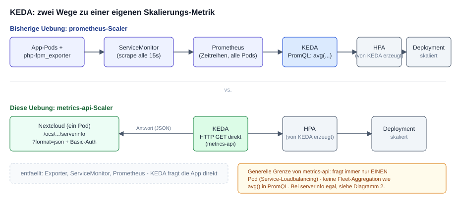
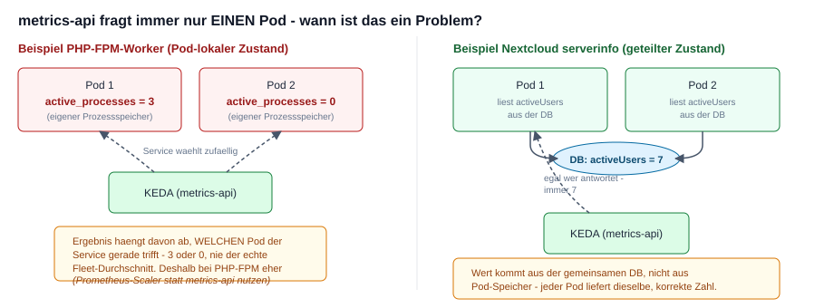

# HPA ueber KEDAs metrics-api-Scaler (Nextcloud serverinfo) - Konzept-Skizze

> **Hinweis:** Im Unterschied zu den anderen Uebungen in diesem Repo wurde diese
> Skizze NICHT auf einem echten Cluster getestet (siehe TEST-PFLICHT im
> Skill `workshop-training`). Sie zeigt Architektur und Konfiguration fuer den
> `metrics-api`-Scaler - vor dem Einsatz in der Praxis pruefen (Nextcloud-Version,
> Feldnamen im JSON, Auth-Mechanismus koennen sich aendern).

## Hintergrund

  * Die [Uebung mit dem prometheus-Scaler](hpa-keda-custom-metric.md) (Tag 2, nach der
    Prometheus-Installation) nutzt KEDAs `prometheus`-Scaler: Prometheus sammelt die
    Metrik von allen Pods ein, PromQL (`avg(...)`) aggregiert darueber - KEDA fragt am
    Ende Prometheus, nicht die App.
  * KEDAs **`metrics-api`-Scaler** geht einen anderen Weg: er ruft eine HTTP/JSON-URL
    **direkt** auf und liest per JSONPath (`valueLocation`) EINEN einzelnen Wert heraus.
    Kein Prometheus, kein Exporter, kein ServiceMonitor noetig - aber auch kein PromQL,
    also keine berechneten Ausdruecke wie `active/total*100`, nur ein Rohwert mit festem
    Schwellwert.



  * Als Beispiel nehmen wir Nextclouds eingebauten **`serverinfo`**-Endpoint
    (`/ocs/v2.php/apps/serverinfo/api/v1/info?format=json`) - offizielle, in Nextcloud
    eingebaute OCS-API (kein Fremd-Patch, nur die App `serverinfo` aktivieren). Er liefert
    u.a. aktive Nutzer der letzten 5 Minuten/Stunde/24h, PHP-OPcache-Auslastung,
    Storage-Stats.
  * Skalierungs-Metrik hier: `activeUsers.last5minutes` (Anzahl User, die in den letzten
    5 Minuten aktiv waren) - ein Business-Signal statt einer Infra-Metrik wie CPU.

## Wichtige Einschraenkung: nur EIN Pod pro Abfrage

  * `metrics-api` ruft eine URL auf - zeigt die URL auf einen Kubernetes-Service mit
    mehreren Pods dahinter, waehlt Kubernetes bei jeder Anfrage einen zufaelligen Pod aus
    (normales Service-Loadbalancing). Es gibt KEIN `avg()` ueber alle Pods wie beim
    `prometheus`-Scaler.
  * Bei Pod-lokalem Zustand (z.B. PHP-FPM-Worker-Auslastung, siehe die andere Uebung)
    waere das ein echtes Problem: je nachdem, welcher Pod antwortet, kommt ein anderer
    Wert zurueck.
  * Bei `activeUsers` aus `serverinfo` ist das egal: die Zahl kommt aus der **gemeinsamen
    Datenbank** (nicht aus Pod-lokalem Prozessspeicher) - jeder Nextcloud-Pod, der
    antwortet, liefert denselben, global korrekten Wert.



## Voraussetzung

  * KEDA installiert - kein Prometheus-Stack noetig fuer diesen Weg (im Unterschied zur
    [Uebung mit dem prometheus-Scaler](hpa-keda-custom-metric.md), die erst nach der
    Prometheus-Installation an Tag 2 drankommt)

```
helm repo add kedacore https://kedacore.github.io/charts
helm repo update
helm upgrade --install keda kedacore/keda --namespace keda --create-namespace
```

```
kubectl -n keda get pods
# 3 Pods sollten Running sein (operator, operator-metrics-apiserver, admission-webhooks)
```

## Skizze: warum es hier ueberhaupt eine externe DB braucht

  * Diagramm 2 oben behauptet "beide Pods lesen `activeUsers` aus derselben DB". Das
    stimmt nur, wenn die DB wirklich **extern und geteilt** ist. Mit `SQLITE_DATABASE`
    (SQLite-Datei) + `emptyDir` haette JEDER Pod seine EIGENE, unabhaengige Datenbank in
    seiner eigenen `emptyDir` - bei 2 Replicas zwei komplett getrennte, leere
    Nextcloud-Installationen statt einer geteilten. Deshalb kommt hier eine echte,
    externe MariaDB dazu.
  * **Bewusst ausgeklammert bleibt trotzdem:** `/var/www/html` (Code + `config.php` +
    `data/`-Verzeichnis) liegt weiterhin in einer Pod-lokalen `emptyDir`. Fuer echten
    Multi-Replica-Betrieb braucht es zusaetzlich einen RWX-Shared-Storage (NFS/S3) dafuer
    - und man laesst NICHT jeden Pod unabhaengig per Auto-Install-Env-Vars installieren
    (das wuerde beim zweiten Pod gegen die bereits von Pod 1 befuellte DB fehlschlagen),
    sondern installiert einmal und haengt weitere Pods an dieselbe, fertige Installation.
    Das ist ein groesseres Thema (Nextcloud-HA-Setup) und hier bewusst nicht geloest - der
    Fokus dieser Skizze bleibt auf dem `metrics-api`-Scaler.

## Skizze: MariaDB als externe, geteilte DB

```
# vi 01-namespace.yaml
apiVersion: v1
kind: Namespace
metadata:
  name: nextcloud-demo
```

```
# vi 02-mariadb-secret.yaml
apiVersion: v1
kind: Secret
metadata:
  name: mariadb-nextcloud
  namespace: nextcloud-demo
type: Opaque
stringData:
  MARIADB_ROOT_PASSWORD: "<starkes-root-Passwort>"
  MARIADB_DATABASE: nextcloud
  MARIADB_USER: nextcloud
  MARIADB_PASSWORD: "<starkes-DB-Passwort>"
```

```
# vi 03-mariadb-deployment.yaml
apiVersion: apps/v1
kind: Deployment
metadata:
  name: mariadb
  namespace: nextcloud-demo
spec:
  replicas: 1
  selector:
    matchLabels:
      app: mariadb
  template:
    metadata:
      labels:
        app: mariadb
    spec:
      containers:
      - name: mariadb
        image: mariadb:11
        envFrom:
        - secretRef:
            name: mariadb-nextcloud
        volumeMounts:
        - name: data
          mountPath: /var/lib/mysql
      volumes:
      - name: data
        emptyDir: {}
        # Achtung: emptyDir, weil unsere Trainingscluster aktuell keine
        # StorageClass haben (siehe Prometheus-Uebung) - Daten sind weg,
        # wenn der Pod neu startet. Fuer die Skizze ok, fuer echten Betrieb PVC!
---
apiVersion: v1
kind: Service
metadata:
  name: mariadb
  namespace: nextcloud-demo
spec:
  selector:
    app: mariadb
  ports:
  - port: 3306
    targetPort: 3306
```

```
kubectl apply -f 01-namespace.yaml
kubectl apply -f 02-mariadb-secret.yaml
kubectl apply -f 03-mariadb-deployment.yaml
```

## Skizze: Nextcloud deployen

  * Fuer die Konzept-Skizze reicht die einfache `apache`-Variante des offiziellen
    Nextcloud-Images (ein Container, kein separates nginx/php-fpm-Gespann wie im PHP-FPM-
    Beispiel der prometheus-Scaler-Uebung - `serverinfo` braucht das nicht).
  * Die `NEXTCLOUD_ADMIN_*`- und `MYSQL_*`-Env-Vars lassen das Image beim ersten Start
    automatisch installieren und dabei gleich gegen die MariaDB von oben verbinden
    (offizielles Verhalten des Images, kein manueller `occ`-Schritt noetig).

```
# vi 04-nextcloud-deployment.yaml
apiVersion: apps/v1
kind: Deployment
metadata:
  name: nextcloud
  namespace: nextcloud-demo
spec:
  replicas: 1
  selector:
    matchLabels:
      app: nextcloud
  template:
    metadata:
      labels:
        app: nextcloud
    spec:
      containers:
      - name: nextcloud
        image: nextcloud:29-apache
        ports:
        - containerPort: 80
        env:
        - name: MYSQL_HOST
          value: mariadb
        - name: MYSQL_DATABASE
          value: nextcloud
        - name: MYSQL_USER
          value: nextcloud
        - name: MYSQL_PASSWORD
          valueFrom:
            secretKeyRef:
              name: mariadb-nextcloud
              key: MARIADB_PASSWORD
        - name: NEXTCLOUD_ADMIN_USER
          value: admin
        - name: NEXTCLOUD_ADMIN_PASSWORD
          valueFrom:
            secretKeyRef:
              name: nextcloud-admin
              key: password
        - name: NEXTCLOUD_TRUSTED_DOMAINS
          value: "nextcloud.nextcloud-demo"
        volumeMounts:
        - name: html
          mountPath: /var/www/html
      volumes:
      - name: html
        emptyDir: {}
---
apiVersion: v1
kind: Service
metadata:
  name: nextcloud
  namespace: nextcloud-demo
spec:
  selector:
    app: nextcloud
  ports:
  - port: 80
    targetPort: 80
```

```
kubectl -n nextcloud-demo create secret generic nextcloud-admin --from-literal=password='<starkes-Passwort>'
kubectl apply -f 04-nextcloud-deployment.yaml
```

## Skizze: serverinfo-App aktivieren + testen

```
# occ-Befehle im laufenden Container ausfuehren
kubectl -n nextcloud-demo exec deploy/nextcloud -- su -s /bin/sh www-data -c "php occ app:enable serverinfo"
```

  * `serverinfo` ist per Basic-Auth (Admin-User oder besser ein dediziertes App-Passwort)
    UND dem Header `OCS-APIRequest: true` geschuetzt. So saehe ein manueller Test aus:

```
kubectl -n nextcloud-demo run test-serverinfo --image=curlimages/curl --restart=Never --rm -i --command -- \
  curl -s -u admin:<passwort> -H "OCS-APIRequest: true" \
  "http://nextcloud.nextcloud-demo/ocs/v2.php/apps/serverinfo/api/v1/info?format=json"
```

```
# Erwartete Struktur (Ausschnitt, laut Nextcloud-Doku):
{
  "ocs": {
    "meta": { "status": "ok", "statuscode": 200 },
    "data": {
      "nextcloud": { ... },
      "server": { ... },
      "activeUsers": {
        "last5minutes": 3,
        "last1hour": 10,
        "last24hours": 42
      }
    }
  }
}
```

## Skizze: TriggerAuthentication (Zugangsdaten fuer KEDA)

```
# vi 03-trigger-auth-secret.yaml
apiVersion: v1
kind: Secret
metadata:
  name: nextcloud-serverinfo-auth
  namespace: nextcloud-demo
type: Opaque
stringData:
  username: admin
  password: "<dasselbe-passwort-wie-oben>"
```

```
# vi 04-trigger-authentication.yaml
apiVersion: keda.sh/v1alpha1
kind: TriggerAuthentication
metadata:
  name: nextcloud-serverinfo-auth
  namespace: nextcloud-demo
spec:
  secretTargetRef:
  - parameter: username
    name: nextcloud-serverinfo-auth
    key: username
  - parameter: password
    name: nextcloud-serverinfo-auth
    key: password
```

```
kubectl apply -f 03-trigger-auth-secret.yaml
kubectl apply -f 04-trigger-authentication.yaml
```

## Skizze: ScaledObject mit metrics-api-Trigger

```
# vi 05-scaledobject.yaml
apiVersion: keda.sh/v1alpha1
kind: ScaledObject
metadata:
  name: nextcloud
  namespace: nextcloud-demo
spec:
  scaleTargetRef:
    name: nextcloud
  minReplicaCount: 1
  maxReplicaCount: 5
  triggers:
  - type: metrics-api
    authenticationRef:
      name: nextcloud-serverinfo-auth
    metadata:
      # targetValue statt threshold (anderer Feldname als beim prometheus-Scaler!)
      # Rechenregel (wie bei KEDAs Queue-Lag-Scalern):
      #   gewuenschte Replicas = ceil(aktuelle Replicas * Metrikwert / targetValue)
      # targetValue=5 heisst: "ein Replica soll ~5 aktive User bedienen koennen".
      # Bei 1 Replica und activeUsers=12 -> ceil(1*12/5) = 3 Replicas.
      # Eine grobe Heuristik - activeUsers ist eigentlich keine Pro-Pod-Groesse
      # (jeder Pod kann potenziell alle User bedienen), aber fuer einen rohen
      # Einzelwert ohne PromQL kennt KEDA kein anderes Muster.
      targetValue: "5"
      url: "http://nextcloud.nextcloud-demo/ocs/v2.php/apps/serverinfo/api/v1/info?format=json"
      # GJSON-Pfad zum Wert - keine Leerzeichen im Feldnamen, kein Escaping noetig
      # (im Gegensatz zu php-fpms "active processes" in der anderen Uebung)
      valueLocation: "ocs.data.activeUsers.last5minutes"
      method: "GET"
      authMode: "basic"
      customHeaders: "OCS-APIRequest=true"
```

```
kubectl apply -f 05-scaledobject.yaml
```

```
# So wuerde man den entstandenen HPA pruefen:
kubectl -n nextcloud-demo get scaledobject
kubectl -n nextcloud-demo get hpa
```

## Wie man die Skalierung testen wuerde

  * Last erzeugen heisst hier NICHT "viele parallele Requests" (wie bei PHP-FPM-Workern),
    sondern "mehrere verschiedene, tatsaechlich eingeloggte Nutzer innerhalb von
    5 Minuten" - z.B. mehrere Test-User per `occ user:add` anlegen und sich damit
    (WebDAV oder Login) anmelden lassen, dann `activeUsers.last5minutes` beobachten.
  * Das ist deutlich aufwaendiger als der Lastgenerator-Pod aus der vorherigen Uebung -
    einer der Gruende, warum diese Skizze bewusst ungetestet bleibt und die andere
    Uebung (PHP-FPM + Prometheus) die verlaesslich live vorfuehrbare ist.

## Aufraeumen (falls doch mal ausprobiert)

```
kubectl delete ns nextcloud-demo
```

## Ref

  * https://keda.sh/docs/latest/scalers/metrics-api/
  * https://docs.nextcloud.com/server/latest/admin_manual/configuration_server/instance_monitoring.html
  * https://github.com/nextcloud/docker
