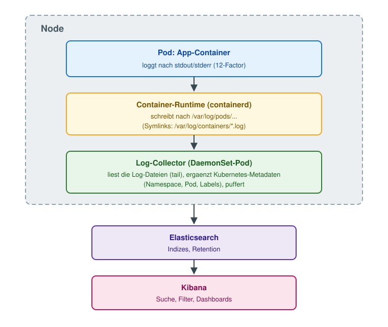

# Logging-Stack EFK - Aufbau und Architektur

Kein Walkthrough - hier geht es um den Aufbau eines zentralen
Logging-Stacks in Kubernetes und die Architektur-Entscheidungen dahinter:
Welche Komponenten braucht man, ist Fluentd noch zeitgemaess, und laeuft
der Log-Collector als DaemonSet oder als Sidecar?

## Warum ueberhaupt zentrales Logging?

  * `kubectl logs` liest nur, was die Container-Runtime lokal auf dem Node
    vorhaelt - stirbt der Pod oder der Node, sind die Logs weg.
  * Bei vielen Nodes und Pods will niemand Logs pro Pod einsammeln -
    man braucht eine zentrale, durchsuchbare Ablage mit Retention.
  * Debugging ueber mehrere Services hinweg (wer hat wann welchen Request
    gesehen?) geht nur mit einer gemeinsamen Sicht.

## Die Komponenten (E-F-K)

| Buchstabe | Komponente | Aufgabe |
|-----------|------------|---------|
| E | Elasticsearch | Speichert und indiziert die Logs, macht sie durchsuchbar |
| F | Fluentd (bzw. heute meist Fluent Bit) | Sammelt die Logs auf den Nodes ein, reichert sie an, leitet sie weiter |
| K | Kibana | Web-Frontend fuer Suche, Filter und Dashboards auf den Elasticsearch-Indizes |

## Aufbau: Wie fliesst ein Log durch den Cluster?

Die wichtigsten Punkte daran:

  1. Die App loggt einfach nach **stdout/stderr** (12-Factor-Prinzip) -
     sie weiss nichts von Elasticsearch.
  2. Die Container-Runtime persistiert das pro Node unter
     `/var/log/pods/`, mit sprechenden Symlinks unter `/var/log/containers/`.
  3. Der Collector laeuft **einmal pro Node**, mountet diese Verzeichnisse
     vom Host und liest alle Container-Logs des Nodes.
  4. Er reichert jede Zeile ueber die Kubernetes-API mit Metadaten an
     (Namespace, Pod-Name, Labels) - dadurch kann man in Kibana z.B. nach
     `kubernetes.namespace_name` filtern.
  5. Er puffert (Backpressure!) und schickt die Daten an Elasticsearch.

## Ist Fluentd noch zeitgemaess?

Kurze Antwort: **Deprecated ist Fluentd nicht - aber als Node-Collector
fuer einen Neuaufbau meist nicht mehr erste Wahl. Der Nachfolger im
eigenen Haus heisst Fluent Bit.**

  * **Fluentd** (seit 2011, Ruby + C, CNCF graduated) wird aktiv gepflegt
    (fluent-package v6 LTS mit Support bis mindestens Ende 2027) und hat
    ein riesiges Plugin-Oekosystem (1000+). Aber: relativ schwergewichtig
    (typisch einige hundert MB RAM pro Instanz) - als DaemonSet auf jedem
    Node zahlt man das mal Anzahl Nodes.
  * **Fluent Bit** (gleiches Projekt-Umfeld, in C geschrieben, wenige MB
    RAM) ist heute der De-facto-Standard als Node-Collector. Wer heute
    "EFK" aufbaut, meint praktisch immer Elasticsearch + **Fluent Bit** +
    Kibana.
  * Verbreitetes Muster in grossen Umgebungen: Fluent Bit als leichter
    Collector auf jedem Node, optional ein zentrales Fluentd als
    **Aggregator** (Routing, aufwendige Filter, viele Ziele) - dort spielt
    das Plugin-Oekosystem seine Staerke aus, ohne jeden Node zu belasten.
    Fluent Bit kann inzwischen auch selbst als Aggregator dienen - die
    zweistufige Architektur ist optional, nicht Pflicht.
  * Bestehende Fluentd-Setups laufen zu lassen ist voellig legitim -
    es gibt keinen Migrationszwang.

Alternativen ausserhalb der Fluent-Familie:

| Tool | Einordnung |
|------|------------|
| OpenTelemetry Collector | Sinnvoll, wenn man OTel sowieso fuer Traces/Metriken einsetzt - ein Agent fuer alle drei Signale |
| Vector | Moderner Collector in Rust (Datadog), sehr performant, eigene Transformationssprache |
| Filebeat / Elastic Agent | Die Elastic-eigene Variante, eng mit dem Elastic-Stack verzahnt (dann "ELK" statt "EFK") |
| Promtail / Grafana Alloy | Collector fuer Grafana Loki - anderes Backend-Konzept (Label-Index statt Volltext), guenstiger im Betrieb als Elasticsearch |

Mit den "drei Signalen" der Observability sind gemeint:

  1. **Logs** - Textereignisse mit Zeitstempel ("was ist passiert?") -
     darum geht es in diesem Kapitel.
  2. **Metriken** - numerische Zeitreihen ("wie viel / wie schnell?"),
     z.B. CPU, RAM, Requests/s - siehe Prometheus/Grafana-Kapitel.
  3. **Traces** - der Weg eines einzelnen Requests durch mehrere Services
     ("wo haengt's?"), jeder Service steuert einen Span bei.

Klassisch braucht man dafuer drei verschiedene Agenten auf dem Node
(z.B. Fluent Bit + Node Exporter + Tracing-Agent) - der OpenTelemetry
Collector kann alle drei Signale mit einem einzigen Agenten einsammeln.

## DaemonSet oder Sidecar?

**Der Standard ist das DaemonSet.** Ein Collector pro Node liest die Logs
aller Container dieses Nodes:

  * Ressourcen: 1 Collector pro **Node** statt 1 pro **Pod** - bei 30 Pods
    pro Node ist das Faktor 30.
  * Zentrale Konfiguration: ein Ort fuer Parsing, Filter, Ziele.
  * Die Anwendungen bleiben unangetastet - loggen nach stdout reicht,
    keine Aenderung an Pod-Specs noetig.

**Der Sidecar ist die Ausnahme fuer Sonderfaelle.** Dabei laeuft ein
zusaetzlicher Container im selben Pod, der ueber ein geteiltes
`emptyDir`-Volume an die Logs der App kommt. Zwei Varianten:

  1. **Streaming-Sidecar**: Die App schreibt in Dateien im Container
     (Legacy-Software, laesst sich nicht auf stdout umbiegen, oder mehrere
     getrennte Logdateien wie `access.log` / `error.log` / `audit.log`).
     Der Sidecar macht `tail -f` auf die Datei und schreibt sie auf sein
     eigenes stdout - ab da greift wieder der normale DaemonSet-Weg.
     Pro Logdatei ein Sidecar, und man kann die Streams in Kibana getrennt
     filtern.
  2. **Sidecar mit eigenem Agent**: Der Sidecar ist selbst ein
     Fluent-Bit/Fluentd und schickt direkt an ein Backend - z.B. wenn ein
     Team seine Logs an ein **anderes Ziel** schicken muss als der Rest des
     Clusters, mit eigenem Parsing, ohne die clusterweite
     Collector-Konfiguration anzufassen. Oder wenn man gar keine
     DaemonSets ausrollen darf (stark eingeschraenkte Multi-Tenant- oder
     Managed-Umgebung ohne Zugriff auf Node-Ebene).

Warum man den Sidecar nicht als Default nimmt:

  * RAM/CPU-Overhead in **jedem** Pod, nicht einmal pro Node.
  * Konfiguration verteilt sich ueber viele Pod-Specs statt an einer Stelle.
  * Beim Streaming-Sidecar liegen die Logs doppelt auf der Platte
    (Datei im Volume + stdout-Kopie der Runtime), und um die Log-Rotation
    im `emptyDir` muss man sich selbst kuemmern.
  * Logs des Sidecar-Agent-Musters (Variante 2) tauchen nicht in
    `kubectl logs` auf.

| Kriterium | DaemonSet | Sidecar |
|-----------|-----------|---------|
| Ressourcenverbrauch | 1x pro Node | 1x pro Pod |
| Konfiguration | zentral | pro Pod/Team |
| App loggt nach stdout | perfekt | unnoetig |
| App loggt in Dateien | geht nicht direkt | genau dafuer (Streaming-Sidecar) |
| Abweichendes Log-Ziel pro Team | aufwendig (Routing-Regeln) | einfach (Variante 2) |
| Kein Node-Zugriff erlaubt | geht nicht | einzige Option |

**Faustregel:** DaemonSet als Default. Sidecar nur gezielt dort, wo eine
App nicht nach stdout loggen kann oder Logs ein abweichendes Ziel bzw.
eigenes Handling brauchen.

## Zusammenfassung

  * Aufbau: App -> stdout -> Node-Dateisystem -> Collector (DaemonSet) ->
    Elasticsearch -> Kibana.
  * Merksatz: "EFK" heisst heute praktisch **Elasticsearch + Fluent Bit +
    Kibana** - Fluentd lebt weiter als optionaler Aggregator und in
    Bestandsumgebungen.
  * Fuer Neuaufbauten auch OpenTelemetry Collector (ein Agent fuer Logs,
    Metriken und Traces) oder Vector pruefen.
  * DaemonSet ist der Normalfall, Sidecar das Werkzeug fuer Ausnahmen -
    und man sollte begruenden koennen, warum man es einsetzt.

## Referenzen

  * https://kubernetes.io/docs/concepts/cluster-administration/logging/
    (offizielle Doku zu genau diesen Mustern: Node-Agent, Streaming-Sidecar,
    Sidecar mit Agent)
  * https://www.fluentd.org/architecture
  * https://docs.fluentbit.io/manual/about/fluentd-and-fluent-bit
