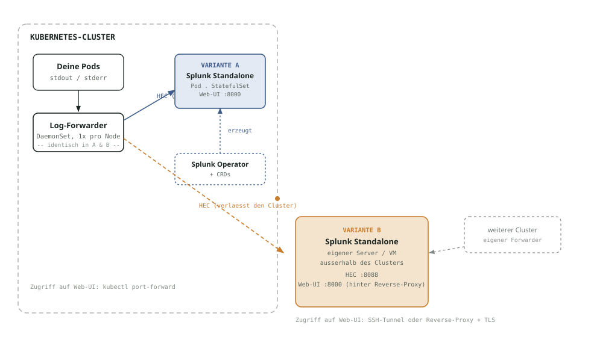

# Splunk mit Kubernetes verbinden

Architekturüberblick: was eine Splunk-Instanz braucht, um Daten aus einem
Kubernetes-Cluster zu bekommen. Im Mittelpunkt steht hier die Anbindung an einen
**externen** Splunk-Server — das ist der in der Praxis übliche Weg. Der Betrieb von Splunk
**innerhalb** des Clusters wird am Ende als optionale Variante beschrieben.

## Was ist Splunk

Eine Plattform zum Einsammeln, Durchsuchen und Korrelieren von Maschinendaten — Logs,
Metriken, Events. Schema-on-read: Rohdaten werden zuerst indexiert, die Struktur wird erst
bei der Suche extrahiert.

| | |
|---|---|
| **Gegründet** | 2003, San Francisco — der Name kommt von „spelunking“, dem Erforschen von Höhlen |
| **Lizenz** | Proprietär. Trial 60 Tage, danach automatisch Free License (500 MB/Tag, Single-User) |
| **Typische Daten** | App-Logs, Syslog, Security-Events, Kubernetes-Events, Metriken via HEC |
| **Abfragesprache** | SPL (Search Processing Language) — mächtiger als reine Volltextsuche |

## Was „Standalone“ bedeutet

Splunk lässt sich als verteiltes System betreiben — separate Indexer-Cluster,
Search-Head-Cluster, Lizenz-Manager, jeweils eigene Instanzen. Für eine Teststellung reicht
das nicht nur nicht, es würde den Bogen überspannen: **Standalone** heißt, eine einzige
Instanz übernimmt alle drei Rollen gleichzeitig:

- **Indexer** — nimmt Daten per HEC entgegen, schreibt sie in den Index
- **Search Head** — wertet SPL-Suchen gegen den lokalen Index aus
- **Web-UI** — Login, Suche, Dashboards, alles auf Port 8000

## Die Anbindung: Splunk extern, Kubernetes liefert nur zu

Der Kernpunkt dieser Anbindung: Splunk läuft **außerhalb** des Kubernetes-Clusters, auf
eigener Infrastruktur (dediziertem Server oder, wie hier zum Üben, einer einzelnen VM). Der
Cluster selbst enthält nur einen leichten Log-Forwarder (DaemonSet), der Container-Logs und
Kubernetes-Events einsammelt und per HEC (HTTP Event Collector, Port 8088) an die externe
Splunk-Instanz überträgt.

Das hat drei praktische Vorteile gegenüber Splunk im Cluster:

- **Skaliert auf mehrere Cluster** — eine externe Splunk-Instanz kann Daten aus beliebig
  vielen Clustern gleichzeitig einsammeln, statt 1:1 an einen Cluster gebunden zu sein
- **Entkoppelter Lifecycle** — Node-Upgrades, Drains oder ein kompletter Cluster-Ausfall
  betreffen die bereits gesendeten Logs nicht, sie liegen sicher außerhalb
- **Kein Operator, keine PVCs im Cluster** — der Cluster selbst bleibt schlank, die
  Splunk-spezifische Komplexität (Storage, Lifecycle, Lizenz) liegt vollständig auf der
  externen Seite

Die technischen Bausteine der externen Anbindung im Detail:

- **HEC aktiviert + Token** — HTTP Event Collector auf Port `8088`, Token wird bei der
  externen VM selbst gewählt (per Terraform-Variable), nicht von Splunk generiert
- **Log-Forwarder als DaemonSet** — Splunk OpenTelemetry Collector, 1 Pod pro Node, liest
  `/var/log/pods/*/*.log` und schickt sie über HEC nach außen
- **Netzwerkpfad Forwarder → HEC** — Firewall/VPC-Routing der externen VM muss den
  Pod-Traffic aus dem Cluster durchlassen; Pod-Traffic wird beim Verlassen des Clusters auf
  die Node-IP maskiert, das VPC-CIDR muss das beruecksichtigen
- **Reverse-Proxy + TLS-Zertifikat** — Web-UI selbst bleibt intern (Port 8000 gesperrt),
  nginx terminiert HTTPS mit Let's-Encrypt-Zertifikat auf 80/443
- **Eigene Server-Infrastruktur** — VM per Terraform/Cloud-Init, natives
  Splunk-Enterprise-Paket (.deb), kein Docker, kein Kubernetes-Operator nötig

## Hands-on: externe Anbindung

Schritt-für-Schritt-Übungen zur externen Variante:

1. [Zugang zum bestehenden Cluster](uebungen/01-cluster-zugang.md)
2. [Externe Splunk-VM per Terraform aufsetzen](uebungen/02-externe-splunk-vm.md)
3. [Log-Forwarder an die externe Splunk-VM anbinden](uebungen/03-forwarder-an-externe-splunk.md)
4. [Log-Suche und CrashLoopBackOff-Debugging](uebungen/04-log-suche-crashloop-debugging.md)
5. [Aufräumen](uebungen/05-aufraeumen.md)

## Optional: Splunk im Cluster betreiben

Splunk lässt sich alternativ auch **im Cluster** selbst betreiben, über den offiziellen
Splunk Operator und eigene Custom Resources. Das ist der seltenere Weg (an einen Cluster
gebunden, zusätzlicher Operator- und Storage-Overhead), aber lehrreich, weil sichtbar wird,
was der Operator im Hintergrund automatisiert. Der Log-Forwarder ist in beiden Varianten
identisch — der einzige strukturelle Unterschied ist, ob der HEC-Aufruf die Cluster-Grenze
verlässt oder nicht.

| Aspekt | 🟠 Extern (Hauptpfad) | 🔵 Im Cluster (optional) |
|---|---|---|
| Splunk läuft auf | eigenem Server / VM, unabhängig vom Cluster | Pod im selben Cluster wie die Workloads |
| Zusätzlich nötig | eigene Infrastruktur (VM, Terraform, Reverse-Proxy für TLS) | Splunk-Operator, CRDs, PVCs (Block-Storage) |
| Skaliert auf mehrere Cluster | ja — mehrere Cluster, ein Sammelbecken | nein — 1:1 an den Cluster gebunden |
| Lifecycle-Kopplung | entkoppelt — Cluster-Wartung stört Splunk nicht | Node-Upgrades/Drains im Cluster betreffen auch Splunk |
| Typisch für | Produktions-Logging, mehrere Teams/Cluster | Test-/Dev-Umgebungen, Kubernetes-native Teams |

Zusätzlich für die In-Cluster-Variante nötig:

- [ ] Splunk-Operator-CRDs — per `kubectl apply --server-side`, zu groß für Helm (>1 MB)
- [ ] Splunk Operator + Standalone-Chart — Helm-Repo `splunk.github.io/splunk-operator`, Lizenz per `SPLUNK_GENERAL_TERMS` akzeptieren
- [ ] Persistenter Storage — StorageClass mit Block-Storage, Standalone braucht getrennte Volumes für `/etc` und `/var`

Hands-on zur optionalen In-Cluster-Variante: [uebungen/10](uebungen/10-optional-splunk-operator-installieren.md)
bis [uebungen/14](uebungen/14-optional-aufraeumen-in-cluster.md).

Infrastruktur-Aufbau und Kosten: siehe [README](README.md).
