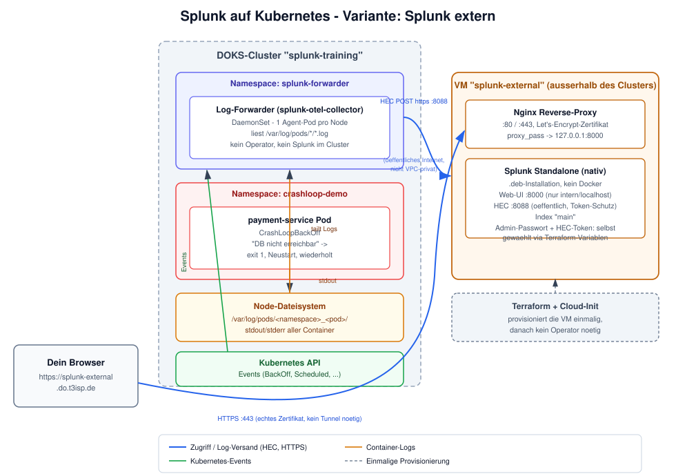

# Theorie: Kubernetes mit Splunk verbinden

## Was ist Splunk

Eine Plattform zum Einsammeln, Durchsuchen und Korrelieren von Maschinendaten — Logs,
Metriken, Events. Schema-on-read: Rohdaten werden zuerst indexiert, die Struktur wird erst
bei der Suche extrahiert.

| | |
|---|---|
| **Gegründet** | 2003, San Francisco — der Name kommt von „spelunking“, dem Erforschen von Höhlen |
| **Lizenz** | Proprietär. Trial 60 Tage, danach automatisch Free License (500 MB/Tag, Single-User) |
| **Typische Daten** | App-Logs, Syslog, Security-Events, Kubernetes-Events, Metriken via HEC (HTTP Event Collector) |
| **Abfragesprache** | SPL (Search Processing Language) — mächtiger als reine Volltextsuche |

## Wie kann ich Splunk betreiben (Architektur)

Splunk laesst sich als **Standalone**-Instanz (eine Instanz uebernimmt Indexer, Search Head
und Web-UI gleichzeitig), als **verteiltes System** (separate Indexer-Cluster,
Search-Head-Cluster, Lizenz-Manager), als **Cloud-Service** (Splunk Cloud Platform, gehostet
von Splunk) oder **in Kubernetes** (via Splunk Operator) betreiben.

Fuer das Training arbeiten wir mit Splunk Standalone. Der Server ist bereits eingerichtet
und erreichbar unter https://splunk-external.do.t3isp.de.

## Die Anbindung: Splunk extern, Kubernetes liefert nur zu

Der Kernpunkt dieser Anbindung: Splunk läuft **außerhalb** des Kubernetes-Clusters, auf
eigener Infrastruktur (dediziertem Server oder, wie hier zum Üben, einer einzelnen VM). Der
Cluster selbst enthält nur einen leichten Log-Forwarder (DaemonSet), der Container-Logs und
Kubernetes-Events einsammelt und per HEC (HTTP Event Collector, Port 8088) an die externe
Splunk-Instanz überträgt.

Unser Setup:

- **Kubernetes-Cluster** — Logs werden per DaemonSet (ein Pod auf jedem Node) geforwarded
- **Splunk-VM** — bereits ausgerollt (per Terraform/Cloud-Init)

## Hands-on: externe Anbindung

Schritt-für-Schritt-Übungen zur externen Variante:

1. (Optional) [Externe Splunk-VM per Terraform aufsetzen](uebungen/02-externe-splunk-vm.md)
2. [Log-Forwarder an die externe Splunk-VM anbinden](uebungen/03-forwarder-an-externe-splunk.md)
3. [Log-Suche und CrashLoopBackOff-Debugging](uebungen/04-log-suche-crashloop-debugging.md)
4. [CrashLoopBackOff-Alert einrichten (optional)](uebungen/05-alert-crashloop-backoff.md)
5. [Aufräumen](uebungen/06-aufraeumen.md)

Welche Splunk-Menuepunkte davon in der Uebung tatsaechlich vorkommen (und welche bewusst
aussen vor bleiben, weil sie den Betrieb von Splunk selbst statt die Kubernetes-Anbindung
betreffen): [menues-und-ihre-funktion.md](menues-und-ihre-funktion.md).
