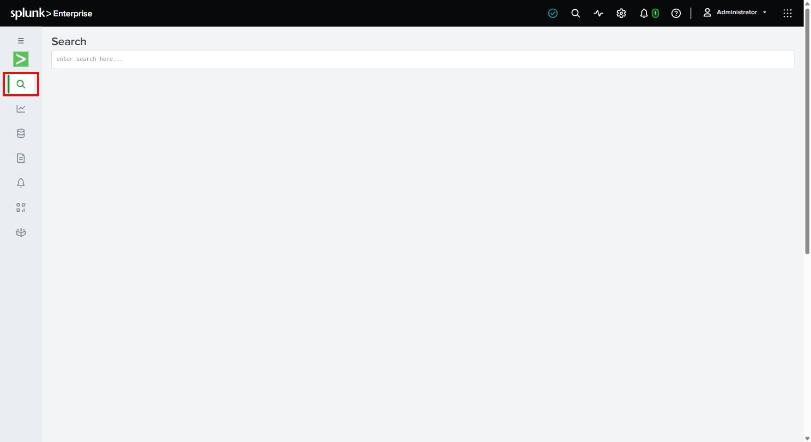
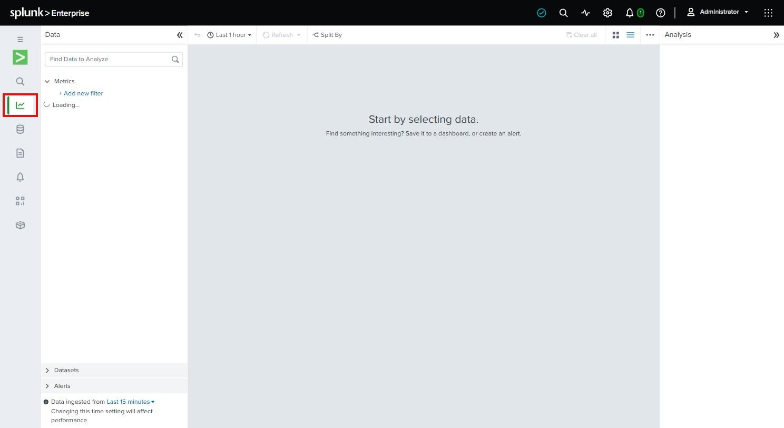
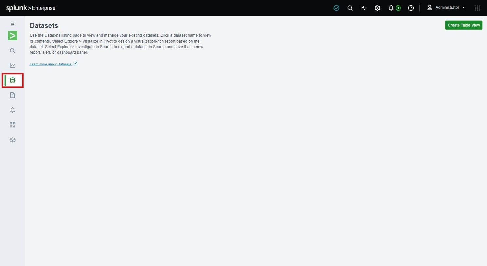
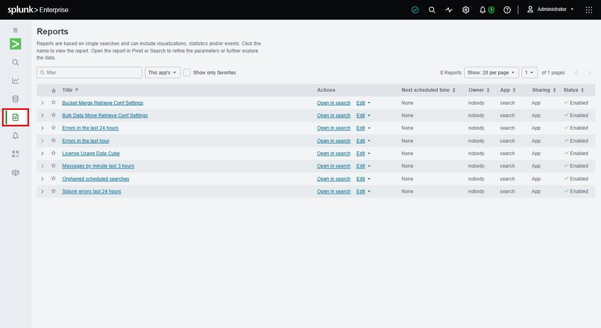
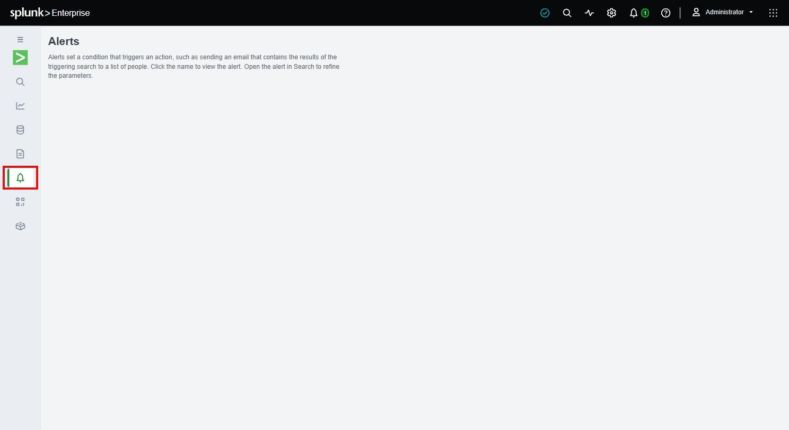
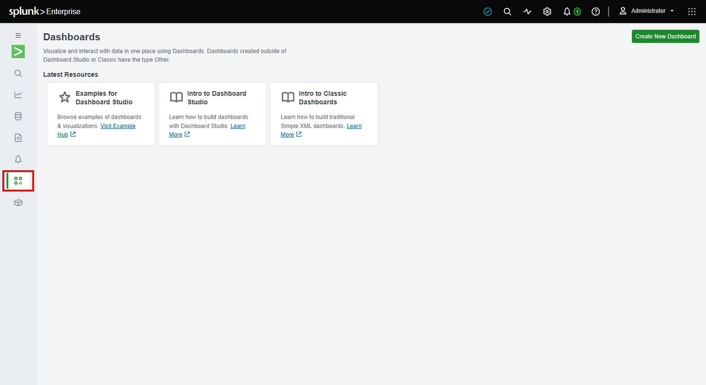
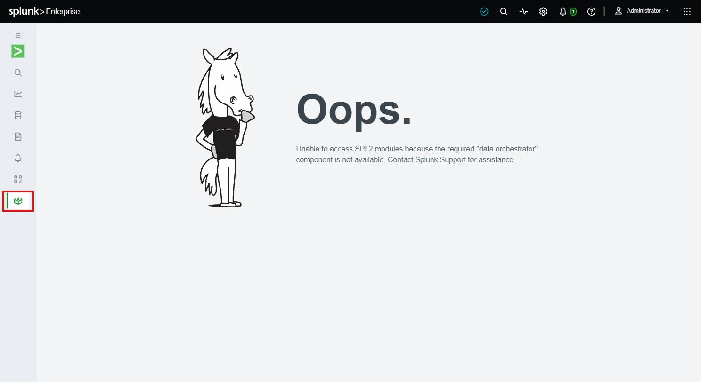

# Splunk-Funktionsuebersicht: Menuepunkte und Kubernetes-Relevanz

Was Splunk Enterprise alles kann, zugeordnet zu den echten Menuepunkten der Web-UI - und
die Einschaetzung, ob das jeweilige Feature fuer *dieses* Kubernetes-Training gebraucht wird.

Verifiziert an der laufenden externen Instanz aus [UEBERSICHT.md](UEBERSICHT.md) /
[uebungen/02-externe-splunk-vm.md](uebungen/02-externe-splunk-vm.md):
`https://splunk-external.do.t3isp.de`, Splunk 10.4.2, Stand 31.08.2026. Grundlagen (was
Splunk ist, Standalone-Rolle, externe vs. In-Cluster-Anbindung) stehen in
[UEBERSICHT.md](UEBERSICHT.md) - hier geht es nur um die Menuestruktur.

## App-Auswahl (linke Seitenleiste)

| App | Was sie tut | Fuer K8s-Training gebraucht? |
|---|---|---|
| Search & Reporting | Kernanwendung: Suche, Dashboards, Alerts, Reports | Ja - das ist die App, in der die ganze Uebung 4 stattfindet |
| Audit Trail | Protokolliert Zugriffe/Aenderungen auf die Splunk-Instanz selbst | Nein - Audit der Splunk-Administration, nicht des Clusters |
| Data Management | Verwaltung von Splunk-Cloud-/Edge-Processor-Pipelines | Nein - zielt auf Splunk-eigene Cloud-Infrastruktur, nicht relevant fuer eine einzelne Standalone-VM |
| Discover Splunk Observability Cloud | Bewirbt das separate SaaS-Produkt Splunk Observability Cloud (APM/Infra-Monitoring) | Nein - anderes, kostenpflichtiges Produkt, kein Teil dieser Uebung |
| Splunk Secure Gateway | Koppelt die Splunk-Mobile-App per QR-Code an die Instanz | Nein - Mobile-Zugriff ist fuer eine Trainingsumgebung ohne Mehrwert |
| Upgrade Readiness App | Prueft Apps/Konfiguration vor einem Splunk-Versions-Upgrade | Nein - Instanz wird nach der Uebung wieder abgebaut, kein Upgrade-Pfad noetig |

## Search & Reporting App (linke Symbolleiste in der App)

| Menuepunkt | Was er tut | Fuer K8s-Training gebraucht? |
|---|---|---|
| Search | SPL-Suche gegen den Index, Kern-Feature | Ja - zentral in [Uebung 4](uebungen/04-log-suche-crashloop-debugging.md), Schritte 3+4 |
| Analytics Workspace | Klick-basierte Alternative zu SPL (Pivot-Nachfolger) fuer Nutzer ohne SPL-Kenntnisse | Nein - Trainingsziel ist SPL selbst zu ueben, nicht der Klick-Weg drumherum |
| Datasets | Verwaltung von Data Models/Table Datasets als wiederverwendbare Datenbasis fuer Pivot | Nein - Aufbauthema, ueberschneidet sich mit Analytics Workspace, nicht im Scope |
| Reports | Gespeicherte Suchen mit Zeitplan, Ergebnis-Export | Nein direkt - waere ein sinnvoller naechster Schritt nach Uebung 4, aber kein eigener Uebungsinhalt |
| Alerts | Bedingte Benachrichtigung aus einer Suche heraus (E-Mail, Webhook, Skript) | Ja - explizit in [Uebung 4, Schritt 5](uebungen/04-log-suche-crashloop-debugging.md) als optionaler Schritt angelegt (BackOff-Alert) |
| Dashboards | Visualisierungen/Panels aus gespeicherten Suchen | Optional - "Visualize your data" wird auf der Startseite beworben, ist aber keine eigene Uebung; waere naheliegende Erweiterung fuer ein Kubernetes-Log-Dashboard |
| Modules | SPL2-Suchmodule (mehrere Suchen kombinieren, neueres API-Konzept) | Nein - SPL2 ist ein Splunk-internes Nachfolgekonzept zu SPL, kein Kubernetes-Bezug |

### Screenshots: jeder Menuepunkt einzeln

Jeder Punkt der linken Symbolleiste angeklickt, mit rotem Rahmen um das jeweilige Icon
markiert (Screenshots aus der laufenden Instanz, Stand 31.08.2026):

**Search**

SPL-Eingabefeld plus Suchhistorie - der Standard-Einstiegspunkt der App. Sinnvoll fuer die
Kubernetes-Anbindung: ja, das ist der zentrale Arbeitsplatz aus [Uebung 4](uebungen/04-log-suche-crashloop-debugging.md).

**Analytics Workspace**

Klick-basiertes Analyse-Interface (Metriken/Datasets per Drag-and-Drop statt SPL zu tippen).
Sinnvoll fuer die Kubernetes-Anbindung: nein - das Training vermittelt bewusst SPL direkt,
dieser Weg drumherum ist kein Uebungsinhalt.

**Datasets**

Verwaltung wiederverwendbarer, strukturierter Datensichten (Basis fuer Analytics
Workspace/Pivot). Sinnvoll fuer die Kubernetes-Anbindung: nein - Aufbauthema ohne eigenen
Uebungsschritt.

**Reports**

Liste gespeicherter Suchen mit Zeitplan (hier bereits 8 vorinstallierte Splunk-Standardreports
zu sehen, z.B. "Errors in the last 24 hours" - keiner davon Kubernetes-spezifisch). Sinnvoll
fuer die Kubernetes-Anbindung: nein direkt - waere aber der naheliegende naechste Schritt, um
die BackOff-Suche aus Uebung 4 dauerhaft zu speichern.

**Alerts**

Liste aller konfigurierten Alerts (Bedingung -> Aktion). Sinnvoll fuer die
Kubernetes-Anbindung: ja - hier taucht der optionale BackOff-Alert aus
[Uebung 4, Schritt 5](uebungen/04-log-suche-crashloop-debugging.md) auf, falls angelegt.

**Dashboards**

Uebersicht/Neuanlage von Dashboards (Dashboard Studio oder Classic/Simple-XML). Sinnvoll fuer
die Kubernetes-Anbindung: optional - kein Pflichtschritt der Uebung, aber naheliegende
Erweiterung fuer ein CrashLoopBackOff-Uebersichts-Dashboard.

**Modules**

SPL2-Suchmodule. Auf dieser Instanz tatsaechlich nicht nutzbar - Splunk meldet "Unable to
access SPL2 modules because the required 'data orchestrator' component is not available."
Sinnvoll fuer die Kubernetes-Anbindung: nein - SPL2 ist ein separates, neueres
Splunk-Suchkonzept ohne Kubernetes-Bezug, und auf dieser Standalone-Instanz fehlt ohnehin die
dafuer noetige Zusatzkomponente.

## Activity-Menue (oben, Symbol neben der Suchlupe)

| Menuepunkt | Was er tut | Fuer K8s-Training gebraucht? |
|---|---|---|
| Jobs | Laufende/abgeschlossene Suchjobs verwalten (abbrechen, Ergebnisse nachladen) | Nein direkt - nuetzlich falls eine Suche in Uebung 4 haengt, aber kein eigener Uebungsinhalt |
| Triggered Alerts | Historie ausgeloester Alerts | Nein direkt - haengt am optionalen Alert aus Uebung 4, Schritt 5 |

## Settings > Featured

| Menuepunkt | Was er tut | Fuer K8s-Training gebraucht? |
|---|---|---|
| Add Data | GUI-Assistent zum Anbinden neuer Datenquellen (Dateien, Netzwerk-Ports, Apps) | Nein - unser Weg ist der Log-Forwarder/DaemonSet per Terraform/Helm ([Uebung 3](uebungen/03-forwarder-an-externe-splunk.md)), nicht der manuelle GUI-Wizard |
| Monitoring Console | Ueberwacht Health/Performance der Splunk-Instanz(en) selbst (Indexer, Search Heads) | Nein - beobachtet Splunk, nicht den Kubernetes-Cluster; fuer eine einzelne Standalone-VM ohnehin wenig Mehrwert |
| Federation | Suche ueber mehrere, verbundene Splunk-Instanzen hinweg | Nein - Enterprise-Feature fuer Multi-Instanz-Setups, hier gibt es nur eine Instanz |

## Settings > Knowledge

| Menuepunkt | Was er tut | Fuer K8s-Training gebraucht? |
|---|---|---|
| Catalog | Datenkatalog (CIM-Mapping, welche Sourcetypes/Felder es gibt) | Nein - Vorstufe zu Data Models, nicht im Scope |
| Searches, reports, and alerts | Verwaltungsansicht aller gespeicherten Suchen/Alerts (GUI-Pendant zu Alerts/Reports oben) | Nein direkt - reine Verwaltungsansicht, Inhalt deckt sich mit Alerts |
| Data models | Strukturierte, hierarchische Sicht auf Rohdaten fuer Pivot/Datasets | Nein - Aufbauthema, kein Bestandteil der Uebung |
| Event types | Klassifiziert wiederkehrende Suchmuster mit einem Namen | Nein - Komfortfeature fuer groessere/laengerfristige Splunk-Deployments |
| Tags | Vergibt Schlagworte auf Feld-Wert-Kombinationen | Nein - gleiche Kategorie wie Event types |
| Fields | Verwaltung von Feldextraktionen/-berechnungen (die Basis von `k8s.container.name` etc.) | Teilweise - die Felder aus dem OTel-Collector nutzen wir in Uebung 4 direkt in der Suche, die GUI-Verwaltung dahinter ist aber kein Uebungsinhalt |
| Lookups | Externe Tabellen zur Anreicherung von Suchergebnissen | Nein - kein Anwendungsfall in dieser Uebung |
| User interface | Eigene Navigationsmenues/Views pro App bauen | Nein - reines Splunk-App-Customizing |
| Alert actions | Verfuegbare Alert-Aktionstypen konfigurieren (E-Mail-Server, Skripte, Webhooks) | Nein direkt - waere Voraussetzung, falls der optionale Alert aus Uebung 4 wirklich eine E-Mail verschicken soll |
| Advanced search | Verwaltung von Suchmakros und Sperrlisten fuer Suchbefehle | Nein - Admin-Feintuning, nicht Teil des Trainings |
| Modules | Verwaltung von SPL2-Modulen (Pendant zu Modules oben) | Nein - siehe Modules oben |
| All configurations | Rohansicht aller `.conf`-Stanzas ueber alle Apps | Nein - Experten-/Debug-Werkzeug fuer Splunk-Administratoren, kein Trainingsinhalt |

## Settings > System

| Menuepunkt | Was er tut | Fuer K8s-Training gebraucht? |
|---|---|---|
| Server settings | Splunk-eigene Serverkonfiguration (Ports, E-Mail, Ausgabefelder) | Nein - betrifft die Splunk-VM, nicht den Kubernetes-Cluster |
| Server controls | Splunk-Dienst neu starten | Nein - kein Uebungsschritt erfordert einen Splunk-Neustart |
| Health report manager | Interne Selbstdiagnose-Regeln von Splunk | Nein - Splunk-Administrationsthema |
| RapidDiag | Sammelt Diagnosedaten fuer den Splunk-Support | Nein - Support-Tooling, nicht didaktisch relevant |
| Instrumentation | Sendet anonymisierte Nutzungsdaten an Splunk Inc. | Nein - Splunk-Telemetrie, kein Kubernetes-Bezug |
| Licensing | Zeigt aktuelle Lizenz (hier: Free License nach Trial-Ablauf, 500 MB/Tag) | Teilweise - relevant nur als Hintergrundwissen zur 500-MB-Tageslimite aus [README](README.md#kosten), kein eigener Klick-Schritt in der Uebung |
| Workload management | Priorisiert/limitiert Ressourcen fuer Suchen/Ingestion auf der Splunk-Instanz | Nein - Kapazitaetsplanung fuer Produktions-Splunk, nicht fuer eine Testinstanz |
| Mobile settings | Konfiguration der Splunk-Secure-Gateway-Kopplung | Nein - siehe Splunk Secure Gateway oben |

## Settings > Data

| Menuepunkt | Was er tut | Fuer K8s-Training gebraucht? |
|---|---|---|
| Data inputs | Uebersicht/Verwaltung aller Eingangskanaele, inkl. HEC-Token | Ja (Hintergrund) - der HEC-Token, den [Uebung 2](uebungen/02-externe-splunk-vm.md) per Terraform setzt, landet genau hier; die Uebung nutzt aber die IaC-Variable statt den GUI-Weg |
| Forwarding and receiving | Konfiguration der Empfangsseite fuer Forwarder (HEC, Forwarder-Ports) | Ja - genau das Prinzip, das den Cluster (per DaemonSet/OTel-Collector) mit der externen Splunk-Instanz verbindet |
| Indexes | Verwaltung der Indizes, in die Daten geschrieben werden (`index=main` aus Uebung 4) | Ja - `index=main` ist die Suchbasis in [Uebung 4](uebungen/04-log-suche-crashloop-debugging.md) |
| Report acceleration summaries | Vorberechnete Zusammenfassungen fuer schnellere Reports | Nein - Performance-Feature fuer grosse, wiederkehrende Reports |
| Source types | Verwaltung der Sourcetypes, z.B. `kube:events`, `kube:container:<name>` | Ja - genau diese Sourcetypes werden in [Uebung 4](uebungen/04-log-suche-crashloop-debugging.md) zur Unterscheidung von K8s-Events und Container-Logs genutzt |
| Ingest actions | Filtert/maskiert/routet Daten schon beim Einlesen (vor dem Indexieren) | Nein - fortgeschrittenes Feature (z.B. Secrets aus Logs maskieren), kein Teil dieser Uebung |

## Settings > Distributed environment

| Menuepunkt | Was er tut | Fuer K8s-Training gebraucht? |
|---|---|---|
| Agent management | Zentrale Verwaltung von Splunk-eigenen Forwarder-/Agent-Flotten | Nein - unser Log-Forwarder (Splunk OTel Collector als DaemonSet) wird per Helm/Terraform ausgerollt, nicht ueber dieses Splunk-eigene Fleet-Management |
| Indexer clustering | Baut ein Indexer-Cluster fuer Hochverfuegbarkeit/Replikation auf | Nein - die Uebung nutzt bewusst eine Standalone-Instanz (siehe [UEBERSICHT.md](UEBERSICHT.md)), kein HA-Thema |
| Distributed search | Verteilt Suchen ueber mehrere Search Heads/Indexer | Nein - gleiche Begruendung, Standalone deckt alle Rollen selbst ab |

## Settings > Users and authentication

| Menuepunkt | Was er tut | Fuer K8s-Training gebraucht? |
|---|---|---|
| Roles | Rollenbasierte Berechtigungen innerhalb von Splunk (welche Indizes/Capabilities) | Optional als Cross-Reference - konzeptionell die gleiche Idee wie Kubernetes-RBAC ([kubernetes/rbac/](../kubernetes/rbac/00-rbac-and-least-privileges.md)), aber kein eigener Uebungsschritt hier |
| Users | Verwaltung von Splunk-Benutzerkonten | Nein - die Uebung laeuft komplett mit dem einen `admin`-Konto |
| Field filters | Blendet einzelne Feldwerte rollenspezifisch aus Suchergebnissen aus | Nein - Feinsteuerung fuer Multi-Tenant-Betrieb, nicht im Scope |
| Tokens | Verwaltung von Auth-Tokens fuer die REST-API (nicht zu verwechseln mit dem HEC-Token) | Nein - die Uebung nutzt keine Splunk-REST-API-Aufrufe |
| Password management | Passwortrichtlinien fuer Splunk-Benutzerkonten | Nein - ein einzelnes Trainings-Passwort reicht |
| Authentication methods | Externe Auth-Anbindung (LDAP, SAML/SSO) | Nein - lokale Authentifizierung genuegt fuer die Trainingsinstanz |

## Fazit

Fuer dieses Training zaehlen im Kern nur wenige Menuepunkte wirklich: **Search**, **Alerts**,
**Forwarding and receiving**, **Indexes** und **Source types** - das deckt exakt den Weg
"Kubernetes-Log entsteht -> Forwarder schickt per HEC -> landet im Index -> wird per SPL
gefunden -> loest optional einen Alert aus" ab, der [Uebung 3](uebungen/03-forwarder-an-externe-splunk.md)
und [Uebung 4](uebungen/04-log-suche-crashloop-debugging.md) traegt. Der weit ueberwiegende
Teil der Menuepunkte (Clustering, Federation, Workload/Lizenz-Verwaltung, Mobile, Audit,
Data Management, Observability Cloud) betrifft den Betrieb von Splunk selbst als verteiltes
Produkt - nicht die Anbindung eines einzelnen Kubernetes-Clusters, und bleibt deshalb
bewusst ausserhalb des Trainings-Scopes.
