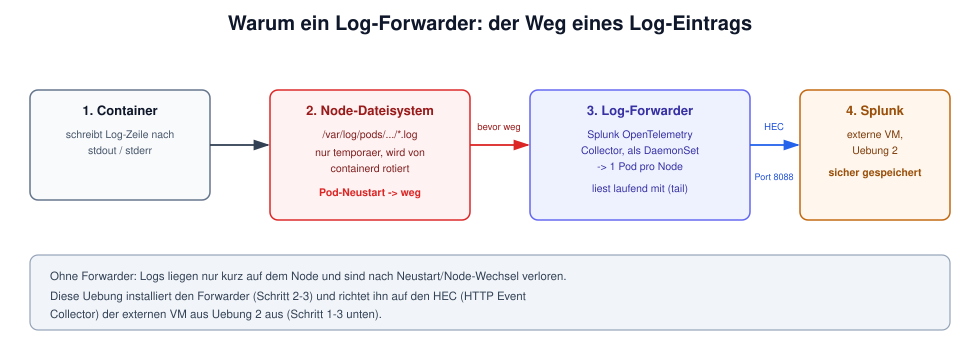

# Uebung 3: Log-Forwarder an die externe Splunk-VM anbinden

## Hintergrund



Diese Uebung installiert den **Splunk OpenTelemetry Collector** als DaemonSet und richtet
ihn auf den HEC-Endpoint der externen VM aus Uebung 2 aus.

<details>
<summary>Ausfuehrlicher Text (optional)</summary>

Container-Logs landen standardmaessig nur temporaer auf dem Node (stdout/stderr, von
containerd rotiert). Nach einem Pod-Neustart oder Node-Wechsel sind sie weg. Ein Forwarder
liest sie laufend ein und schickt sie ueber HEC (HTTP Event Collector) an Splunk, bevor sie
verloren gehen.

Da der HEC-Token in Uebung 2 selbst gewaehlt wurde (nicht von Splunk generiert), muss er
hier nicht erst aus einem Kubernetes-Secret extrahiert werden - er steht bereits in der
eigenen `.env`.

</details>

## Schritt 1: Token in eine Secret-Values-Datei eintragen

Den Token **nicht** per `--set` auf der Kommandozeile uebergeben (landet sonst in der
Bash-History und ggf. in `helm history`), sondern in eine eigene, kleine YAML-Datei
schreiben. Diese Datei bleibt nur lokal auf dem Bastion, wird nicht committed und ist die
einzige Stelle, an der der Token im Klartext steht:

```
nano /tmp/hec-token-values.yml
```

Inhalt:

```
splunkPlatform:
  token: <TF_VAR_splunk_hec_token aus deiner .env, Uebung 2 Schritt 1>
```

## Schritt 2: Helm-Repo hinzufuegen

```
helm repo add splunk-otel https://signalfx.github.io/splunk-otel-collector-chart
helm repo update
```

## Schritt 3: Forwarder installieren

```
kubectl create namespace splunk-forwarder
helm install splunk-log-forwarder \
  -f splunk-manifests/04-splunk-otel-collector-external-values.yml \
  -f /tmp/hec-token-values.yml \
  splunk-otel/splunk-otel-collector \
  -n splunk-forwarder
```

Der Cluster enthaelt damit **nur** den Forwarder - kein Splunk-Operator, keine
Splunk-Instanz. Der HEC-Endpoint in
`splunk-manifests/04-splunk-otel-collector-external-values.yml` zeigt auf die IP/den
Hostnamen der externen VM aus Uebung 2.

## Schritt 4: Status pruefen

```
kubectl get pods -n splunk-forwarder
kubectl logs -n splunk-forwarder -l app=splunk-otel-collector --tail=20
```

Erwartete Ausgabe: DaemonSet-Pods `Running`, keine `Exporting failed`-Meldungen. Falls doch:

- Endpoint in `splunk-manifests/04-splunk-otel-collector-external-values.yml` gegen
  `terraform -chdir=terraform-external-splunk output` pruefen
- HEC (Port 8088) verlangt HTTPS, auch wenn andere Ports auf der VM ggf. nur HTTP sprechen
- `401`/`403` deutet auf einen falschen Token hin (Schritt 1 gegen die `.env` gegenpruefen)

## Schritt 5: Aufraeumen der Secret-Datei (optional, aber empfohlen)

Sobald der Forwarder laeuft, kann die lokale Token-Datei geloescht werden - der Token steckt
danach nur noch im Kubernetes-Secret, das der Helm-Release selbst angelegt hat:

```
rm /tmp/hec-token-values.yml
```

Fuer eine spaetere Aenderung (`helm upgrade`) einfach Schritt 1 wiederholen.

Weiter mit [Uebung 4: Log-Suche und CrashLoopBackOff-Debugging](04-log-suche-crashloop-debugging.md),
um den Forwarder mit echten Daten zu fuellen und in der Splunk-Web-UI zu suchen.
