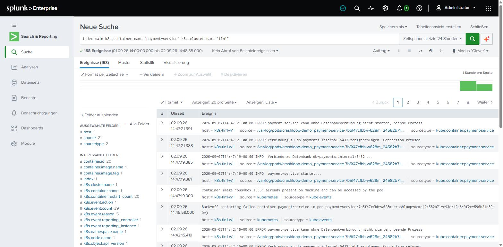
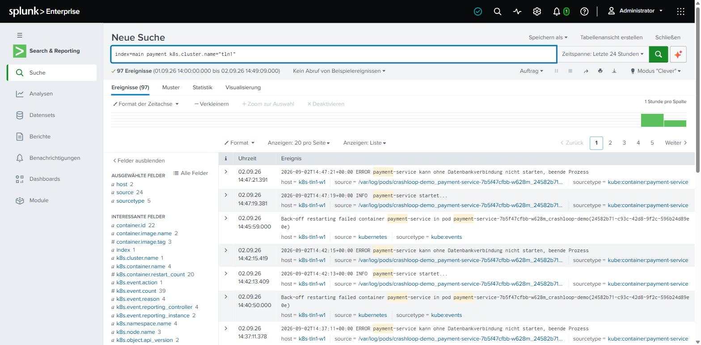

# Uebung 4: Abstuerzenden Pod ueber die externe Splunk-Instanz debuggen (CrashLoopBackOff)

## Hintergrund

Wenn ein Pod wiederholt abstuerzt und neu gestartet wird (`CrashLoopBackOff`), sind seine
Logs mit reinem `kubectl` schwer nachzuvollziehen: `kubectl logs` zeigt nur den aktuellen und
den letzten Container-Versuch, alle aelteren Restarts sind verloren. Mit dem zentralen
Log-Forwarder aus Uebung 3 landet dagegen **jeder** Neustart dauerhaft auf der externen
Splunk-Instanz - inklusive der Kubernetes-Events, die den Grund fuer den Neustart
dokumentieren. Faellt der Cluster spaeter komplett aus, bleiben die bereits gesendeten Logs
dort erhalten - genau das Sammelbecken-Prinzip aus der [Architektur-Uebersicht](../UEBERSICHT.md).

Szenario: ein Service `payment-service` kann seine Datenbank nicht erreichen und beendet sich
deshalb beim Start immer wieder selbst.

## Schritt 1: Demo-Deployment ausrollen

```
kubectl create namespace crashloop-demo
kubectl apply -f splunk-manifests/02-crashloop-demo.yml -n crashloop-demo
```

## Schritt 2: CrashLoopBackOff beobachten

```
kubectl get pods -n crashloop-demo -w
```

Erwartete Ausgabe nach ca. 30-60 Sekunden:

```
NAME                                READY   STATUS             RESTARTS   AGE
payment-service-f94fcbf65-d8gpz    0/1     CrashLoopBackOff   2 (17s ago)   26s
```

```
kubectl get events -n crashloop-demo --sort-by=.lastTimestamp | tail -5
```

Zeigt u.a. `Warning BackOff ... Back-off restarting failed container payment-service`.

## Schritt 3: In der Splunk-Web-UI nach den Kubernetes-Events suchen

Login unter `https://splunk-external.do.t3isp.de` - die Zugangsdaten (`admin` + Passwort)
gibt der Trainer bekannt (Details zur VM: [Uebung 2, Schritt 5](02-externe-splunk-vm.md)).

Suche in Splunk Web (Suche > Neue Suche):

```
index=main k8s.container.name="payment-service"
```

**Laeuft die Uebung mit mehreren Clustern gleichzeitig gegen dieselbe externe Splunk-Instanz**
(z.B. viele Teilnehmer parallel, jeder mit eigenem Cluster): obige Suche liefert dann die
Events **aller** Cluster gemischt zurueck. Auf die eigenen Daten eingrenzen mit der
Cluster-Kennung aus [Uebung 3, Schritt 2](03-forwarder-an-externe-splunk.md). Dabei
`<dein-username>` durch den eigenen Bastion-Usernamen ersetzen (zeigt `whoami` auf dem
Bastion, z.B. `tln5`) - die Splunk-Suche ersetzt hier nichts automatisch:

```
index=main k8s.container.name="payment-service" k8s.cluster.name="<dein-username>"
```

Alternativ ueber den Node-Hostnamen im `host`-Feld - die Node-Namen enthalten den eigenen
Username (`k8s-tln5-cp`, `k8s-tln5-w1`, ...). Der Bindestrich vor dem `*` gehoert dazu,
sonst wuerde z.B. die Suche von `tln1` auch die Nodes von `tln10`-`tln17` treffen:

```
index=main k8s.container.name="payment-service" host="k8s-<dein-username>-*"
```



Das Event `Back-off restarting failed container payment-service in pod ...` ist der
`kube:events`-Sourcetype - stammt direkt von der Kubernetes-API, nicht aus den
Container-Logs selbst. Das allein sagt aber noch nicht, *warum* der Container abstuerzt.

## Schritt 4: Die eigentliche Fehlerursache in den Container-Logs finden

Breitere Suche (auch aeltere, laengst rotierte Container-Log-Dateien sind hier noch
vorhanden, weil sie zentral in Splunk liegen statt nur auf dem Node):

```
index=main payment
```

(auch hier bei mehreren gleichzeitigen Clustern mit `k8s.cluster.name="<dein-username>"`
eingrenzen, siehe oben)



Sourcetype `kube:container:payment-service` zeigt die eigentlichen stdout-Zeilen:

```
INFO  payment-service startet...
INFO  Verbinde zu Datenbank db-payments.internal:5432 ...
ERROR Verbindung zu db-payments.internal:5432 fehlgeschlagen: Connection refused
ERROR payment-service kann ohne Datenbankverbindung nicht starten, beende Prozess
```

Damit ist die Ursache klar, ganz ohne dass `kubectl logs` nach dem naechsten Neustart noch
Zugriff auf genau diese Zeilen haette - in Splunk bleiben sie durchsuchbar, auch Tage spaeter
und ueber beliebig viele Neustarts hinweg. Und: der Cluster selbst muss dafuer nicht einmal
mehr laufen, da die Daten schon auf der externen VM liegen.

**Praxis-Hinweis:** Ein sehr kurzlebiger Container (hier: stirbt nach ~2 Sekunden) kann in der
Splunk-Suche kurzzeitig fehlen, wenn der Log-Forwarder die neue Log-Datei noch nicht entdeckt
hat (Poll-Intervall). Bei Bedarf 1-2 Neustarts abwarten und die Suche wiederholen.

## Schritt 5: Alert bauen (optional)

Aus der Event-Suche aus Schritt 3 liesse sich ein Alert bauen, der bei mehr als 3 BackOff-
Events pro Pod in 10 Minuten eine Benachrichtigung ausloest - in Splunk Web ueber
"Speichern als > Benachrichtigung" direkt aus dem Suchergebnis heraus.

## Aufraeumen des Demo-Namespace

```
kubectl delete namespace crashloop-demo
```

Fuer den vollstaendigen Abbau der Uebung (Forwarder, externe VM, Cluster) siehe
[Uebung 5: Aufraeumen](05-aufraeumen.md).
