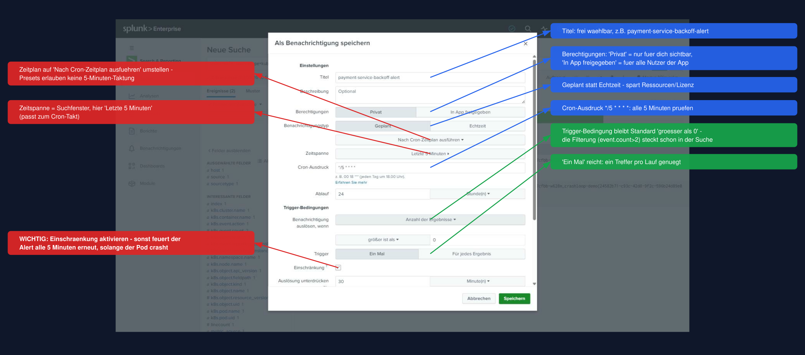
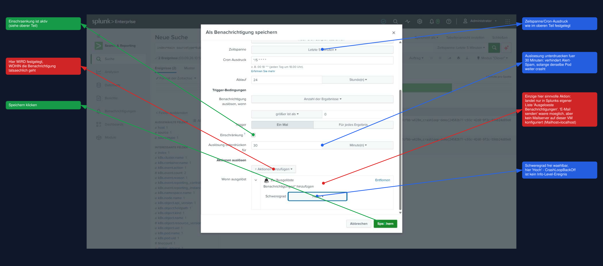

# Uebung 5: CrashLoopBackOff-Alert einrichten (optional)

## Hintergrund

Bisher habt ihr die BackOff-Events und die Fehlerursache selbst gesucht (Uebung 4). In der
Praxis will niemand rund um die Uhr Suchen von Hand wiederholen - Splunk soll von sich aus
Bescheid geben, wenn ein Pod ernsthaft Probleme hat.

Kubernetes zaehlt jeden BackOff selbst mit: `kubectl describe pod` zeigt bei einem
haengenden Container z.B. `Back-off restarting failed container ... (x1123 over 45m)`.
Genau dieser Zaehler kommt auch bei uns an - als Feld `k8s.event.count` auf jedem
`kube:events`-Event mit `k8s.event.reason=BackOff`. Ein einzelner oder ein paar wenige
BackOffs sind normal (kurzer Netzwerk-Hickser, Pod-Neustart beim Deployment) - **viele**
wiederholte BackOffs deuten dagegen auf ein andauerndes, echtes Problem hin. Darauf baut
dieser Alert auf: er ueberwacht `k8s.event.count`, nicht die Anzahl der Log-Zeilen in
einem Zeitfenster (das waere z.B. bei einem einzigen sehr langlebigen BackOff-Event, das
Splunk nur einmal empfaengt, unzuverlaessig).

**Schwellwert:** In der Uebung nutzen wir `k8s.event.count > 2`, damit der Alert
innerhalb von unter einer Minute ausloest (der Demo-Container crasht sehr schnell). Fuer
echten Produktionsbetrieb waere ein deutlich hoeherer Wert sinnvoller, z.B. `> 20` - sonst
alarmiert der Alert schon bei ganz normalen, kurzen Startproblemen.

**Sprache der Splunk-Web-UI:** Sie verhandelt sich ueber den `Accept-Language`-Header
des Browsers - bei deutsch eingestelltem Browser (der Regelfall auf dem Bastion-Client)
erscheint sie auf Deutsch, so auch hier beschrieben. Alle folgenden Schritte, Label und
Screenshots wurden live gegen die Trainings-VM (Splunk Enterprise 10.4.2) verifiziert.

**Wichtig:** Diese Splunk-Instanz laeuft auf einer Trial-Lizenz. Splunk zeigt beim
Speichern eines geplanten Alerts die Warnung *"This scheduled search will not run
after the Splunk Enterprise Trial License expires."* - fuer die Dauer des Trainings
unproblematisch, aber kein Alert, der laenger als die Trial-Laufzeit ueberleben soll.

## Schritt 1: Die Suche fuer den Alert bauen

Ausgangspunkt ist eine eigene, praezise Suche - nicht die aus Uebung 4, denn dort ging es
nur um Anzeigen, hier soll konkret **gezaehlt** und **gefiltert** werden. In Splunk Web
(Suche > Neue Suche):

```
index=main sourcetype=kube:events k8s.event.reason=BackOff k8s.container.name="payment-service" k8s.cluster.name="<dein-username>" k8s.event.count>2
```

`<dein-username>` wieder durch den eigenen Bastion-Usernamen ersetzen (z.B. `tln5`) - wie
in Uebung 3/4 begrenzt das die Suche auf den eigenen Cluster, wenn mehrere Teilnehmer
gleichzeitig gegen dieselbe externe Splunk-Instanz arbeiten. Ohne dieses Feld wuerde der
Alert spaeter auf Neustarts **irgendeines** Teilnehmer-Clusters reagieren, nicht nur auf
den eigenen.

Was die einzelnen Teile der Suche tun:

| Teil | Zweck |
|---|---|
| `sourcetype=kube:events` | nur Kubernetes-Events, keine Container-Log-Zeilen |
| `k8s.event.reason=BackOff` | nur echte Neustart-Ereignisse, nicht z.B. `Pulled`/`Created` |
| `k8s.container.name="payment-service"` | nur dieser eine Container |
| `k8s.cluster.name="<dein-username>"` | nur der eigene Cluster |
| `k8s.event.count>2` | der eigentliche Schwellwert - Kubernetes' eigener Wiederholungszaehler |

Oben rechts den Zeitraum auf **Letzte 5 Minuten** stellen. Ausfuehren - solltet ihr noch
im Anschluss an Uebung 4 sein, liefert die Suche sofort mindestens ein Ergebnis (der
Demo-Container crasht dort bereits laenger als eine Minute).

## Schritt 2: Als Benachrichtigung speichern

Nach dem Ausfuehren oben rechts ueber der Ergebnisliste auf **Speichern als** klicken und
**Benachrichtigung** waehlen.

## Schritt 3: Einstellungen im Dialog "Als Benachrichtigung speichern"



- **Titel**: z.B. `payment-service-backoff-alert`
- **Berechtigungen**: `Privat` reicht fuer die Uebung
- **Benachrichtigungstyp**: `Geplant` (nicht `Echtzeit` - braucht mehr Ressourcen/Lizenz)
- Zeitplan-Dropdown (Standard "Jede Woche ausfuehren") auf **Nach Cron-Zeitplan
  ausfuehren** umstellen - die Presets bieten nur Stunde/Tag/Woche/Monat, fuer den
  gewuenschten 5-Minuten-Takt braucht es einen eigenen Cron-Ausdruck
- **Zeitspanne**: `Letzte 5 Minuten` (aus Schritt 1 uebernommen)
- **Cron-Ausdruck**: `*/5 * * * *` (alle 5 Minuten pruefen)
- **Trigger-Bedingungen** > "Benachrichtigung ausloesen, wenn": Standardwert
  `Anzahl der Ergebnisse` **groesser ist als** `0` **unveraendert lassen** - die
  eigentliche Filterung (`k8s.event.count>2`) steckt schon in der Suche selbst
- **Trigger**: `Ein Mal` reicht (ein Treffer pro Lauf genuegt zum Ausloesen)
- **Einschraenkung aktivieren** (Checkbox) - **wichtig**: ohne sie feuert der Alert
  sonst alle 5 Minuten erneut, solange derselbe Pod weiter crasht. Danach
  "Ausloesung unterdruecken fuer" auf `30` `Minute(n)` stellen

## Schritt 4: Aktion hinzufuegen - wohin geht die Benachrichtigung wirklich?



**Ohne diesen Schritt passiert beim Ausloesen des Alerts gar nichts sichtbar** - "Aktionen
ausloesen" legt erst fest, wohin die Benachrichtigung tatsaechlich geht.

Unter **Aktionen ausloesen** auf **+ Aktionen hinzufuegen** klicken und
**Zu "Ausgeloeste Benachrichtigungen" hinzufuegen** waehlen. Das ist die einzig
sinnvolle Aktion auf dieser Trainings-VM: `E-Mail senden` waere die naheliegende
Ergaenzung, wurde live geprueft und ist **nicht funktionsfaehig** - unter
Einstellungen > E-Mail-Einstellungen steht als Mailhost nur der unkonfigurierte
Standardwert `localhost`, es laeuft kein Mailserver auf der VM. Die Benachrichtigung
bleibt also bewusst **innerhalb von Splunk**: sichtbar nur, wer sich einloggt und
nachschaut.

Optional **Schweregrad** setzen (Info/Gering/Mittel/Hoch/Kritisch) - fuer einen
CrashLoopBackOff ist `Hoch` angemessen.

## Schritt 5: Speichern und Ergebnis pruefen

**Speichern** klicken (die Trial-Lizenz-Warnung von oben ignorieren).

Ergebnis pruefen: links in der Navigation von Search & Reporting auf
**Benachrichtigungen** - der neue Alert erscheint dort mit Status `Aktiviert` und dem
naechsten geplanten Zeitpunkt. Nach dem naechsten Lauf (max. 5 Minuten warten) taucht
er unter dem Aktivitaets-Symbol oben rechts (Pulslinie) **> Ausgeloeste
Benachrichtigungen** auf - Spalten Schweregrad, Typ (`Geplant`) und Modus (`Digest`).
Ueber **Ergebnisse anzeigen** in der Zeile laesst sich das genaue Event nachvollziehen,
das den Alert ausgeloest hat.

## Schritt 6: Aufraeumen nach der Uebung

Da alle Teilnehmer dieselbe externe Splunk-Instanz nutzen, den eigenen Alert danach
wieder loeschen - **Benachrichtigungen**, Zeile des Alerts > **Bearbeiten** >
**Loeschen**.

Anschliessend den Demo-Namespace aus Uebung 4 abbauen:

```
kubectl delete namespace crashloop-demo
```

Fuer den vollstaendigen Abbau der gesamten Uebungsreihe (Forwarder, externe VM,
Cluster) weiter mit [Uebung 6: Aufraeumen](06-aufraeumen.md).
