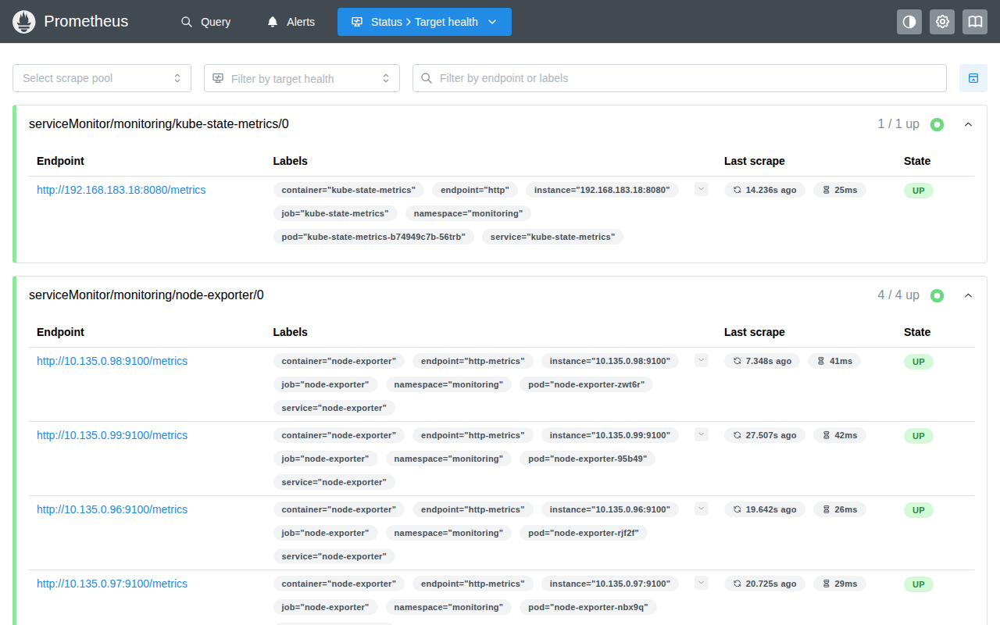
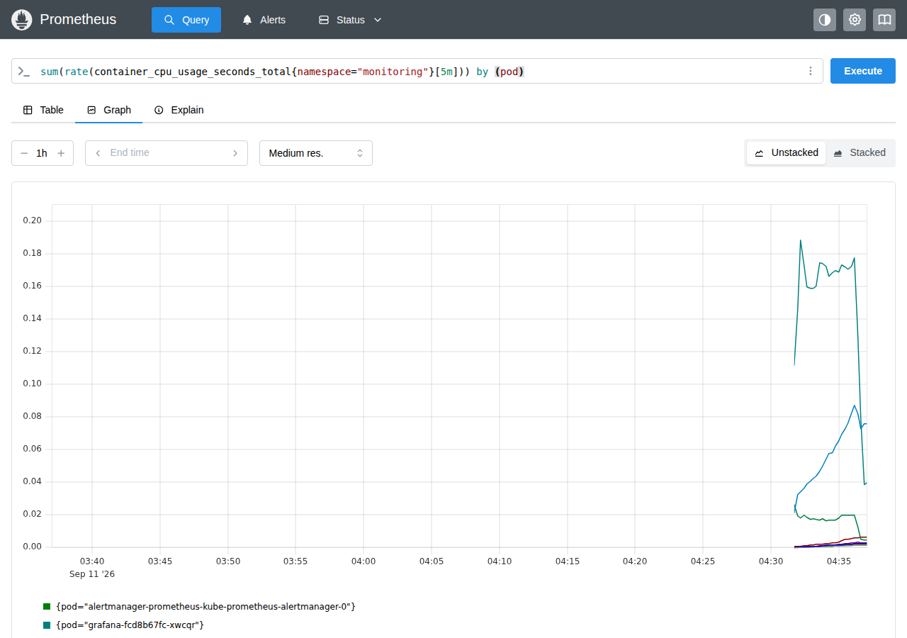
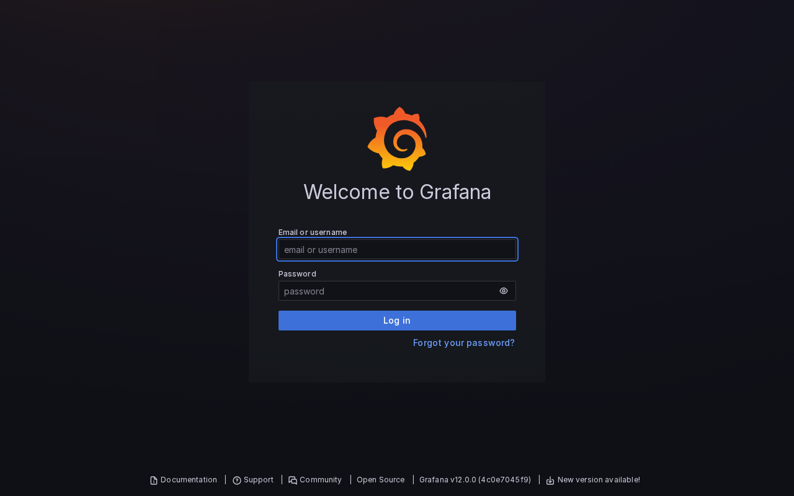
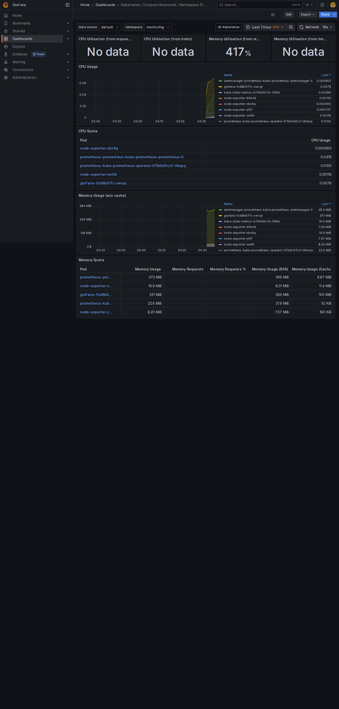
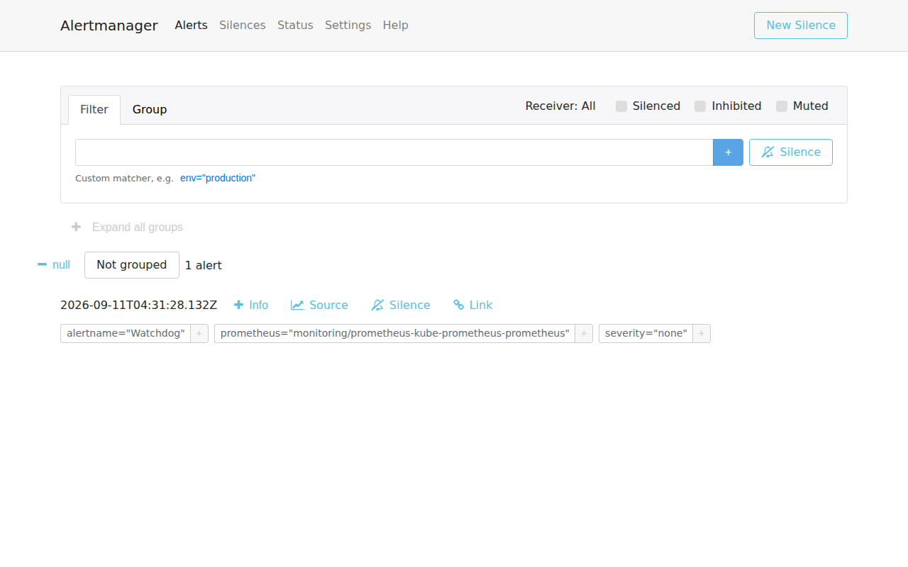

# Prometheus mit Grafana, Traefik, Letsencrypt und basic auth (Install mit helm)

  * Wir verwenden den kube-prometheus-stack (empfohlen! Bringt die wichtigen Metriken gleich mit)
  * Als Ingress-Controller nutzen wir Traefik, die externe IP kommt von MetalLB (Kapitel Tag 1)

## Achtung: Upgrades und Uninstall sind etwas tricky

  * CRDs muessen nach einem Uninstall manuell geloescht werden
  * Vor einem Upgrade erst die CRDs aktualisieren
  * https://github.com/prometheus-community/helm-charts/blob/main/charts/kube-prometheus-stack/UPGRADE.md

## Was wollen wir erreichen?

  * Prometheus und Alertmanager mit basic-auth schuetzen
  * Zertifikate von Letsencrypt (http01-Challenge)
  * Alles ueber Traefik als Ingress-Controller

## Hintergrund: Warum funktioniert Letsencrypt (http01) mit MetalLB?

  * Letsencrypt muss `http://<host>/.well-known/acme-challenge/...` auf Port 80 von aussen erreichen
  * Unser MetalLB-Pool enthaelt die oeffentlichen IPs der Worker-Nodes -
    der Traefik-LoadBalancer-Service bekommt also eine von aussen erreichbare IP
  * Zeigt der DNS-Eintrag auf diese IP, laeuft die Challenge ganz normal durch

## Voraussetzungen

  * MetalLB aus dem Tag-1-Kapitel ist installiert ([Kubernetes Load Balancer - metallb](../../metallb.md))
  * `htpasswd` ist auf dem Client vorhanden (`sudo apt install apache2-utils` - schon erledigt)
  * `/etc/training-dns.env` liegt auf dem Client (DNS-Token, stellt der Trainer
    bereit) - brauchen wir in Schritt 3 fuer den Wildcard-DNS-Eintrag

## Schritt 1: Projekt-Ordner anlegen (nur der Ordnung halber)

```
cd
mkdir -p manifests
cd manifests
mkdir -p monitoring
cd monitoring
```

## Schritt 2: Traefik installieren

```
helm repo add traefik https://traefik.github.io/charts
helm repo update
```

```
helm upgrade --install traefik traefik/traefik --namespace traefik --create-namespace --version 41.4.0
```

```
# Warten bis der Pod laeuft
kubectl -n traefik get pods

# WICHTIG: Die EXTERNAL-IP kommt von MetalLB - diese IP brauchen wir fuer die DNS-Eintraege
kubectl -n traefik get svc traefik

# Beispiel-Output:
# NAME      TYPE           CLUSTER-IP     EXTERNAL-IP    PORT(S)                      AGE
# traefik   LoadBalancer   10.96.196.15   165.22.73.43   80:30848/TCP,443:31534/TCP   17s
```

## Schritt 3: Wildcard-DNS auf deine Traefik-IP setzen

  * Wir legen EINEN Wildcard-Record `*.<du>.do.t3isp.de` an - der deckt
    prometheus, grafana, alertmanager und alle spaeteren Hostnamen ab
  * Das Script nutzt die DigitalOcean-DNS-API; das Token kommt aus
    `/etc/training-dns.env`
  * WICHTIG: Die Namen erst NACH dem Anlegen per dig abfragen - wer vorher
    abfragt, handelt sich Negative-Caching ein (bis zu 30 min Wartezeit)

```
curl -sO https://raw.githubusercontent.com/jmetzger/workshop-kubernetes-advanced-2026-Q3/main/scripts/create-wildcard-dns.sh
chmod +x create-wildcard-dns.sh

# Name wird automatisch aus deinem Login-User gesetzt (z.B. tln1)
# <traefik-ip> = EXTERNAL-IP aus Schritt 2
./create-wildcard-dns.sh <traefik-ip>
```

```
# Pruefen (Beispiel):
dig +short prometheus.<du>.do.t3isp.de
# -> muss deine Traefik-IP zeigen
```

## Schritt 4: basic-auth anlegen

  * Traefik erwartet die htpasswd-Daten in einem Secret unter dem Key `users`

```
kubectl create ns monitoring
htpasswd -c auth admin  # Wunsch-Passwort eingeben
kubectl create secret generic prometheus-basic-auth --from-file=users=auth -n monitoring
```

  * Bei Traefik wird basic-auth nicht per Annotation-Trio wie bei nginx konfiguriert,
    sondern ueber eine `Middleware`-Ressource (CRD von Traefik), die dann am Ingress
    referenziert wird

```
# vi 01-middleware.yml
apiVersion: traefik.io/v1alpha1
kind: Middleware
metadata:
  name: prometheus-basic-auth
spec:
  basicAuth:
    secret: prometheus-basic-auth
```

```
kubectl apply -f 01-middleware.yml -n monitoring
```

## Schritt 5: cert-manager installieren

```
helm repo add jetstack https://charts.jetstack.io
helm repo update
```

```
nano cert-manager-values.yml
```

```
crds:
  enabled: true
```

```
helm upgrade --install cert-manager jetstack/cert-manager \
  --namespace cert-manager --create-namespace --version 1.17.2 -f cert-manager-values.yml
```

## Schritt 6: ClusterIssuer anlegen

```
nano 02-clusterissuer.yml
```

```
apiVersion: cert-manager.io/v1
kind: ClusterIssuer
metadata:
  name: letsencrypt-prod
spec:
  acme:
    email: training.<du>@t3company.de
    server: https://acme-v02.api.letsencrypt.org/directory
    privateKeySecretRef:
      name: letsencrypt-prod
    solvers:
      - http01:
          ingress:
            ingressClassName: traefik
```

```
kubectl apply -f 02-clusterissuer.yml
kubectl get clusterissuer
```

## Schritt 7: Monitoring-Stack vorbereiten (values-Datei)

  * `<du>` ueberall durch deinen Teilnehmer-Namen ersetzen (z.B. tln5)
  * Das `adminPassword` fuer Grafana bitte durch ein eigenes ersetzen
  * basic-auth haengt als Traefik-Middleware am Prometheus- und Alertmanager-Ingress
    (Format der Referenz: `<namespace>-<middleware-name>@kubernetescrd`)

```
nano monitoring-values.yml
```

```
grafana:
  fullnameOverride: grafana
  enabled: true
  adminUser: admin
  adminPassword: "yourStrongPassword"
  ingress:
    enabled: true
    ingressClassName: traefik
    annotations:
      cert-manager.io/cluster-issuer: letsencrypt-prod
    hosts:
      - grafana.<du>.do.t3isp.de
    path: /
    pathType: Prefix
    tls:
      - hosts:
          - grafana.<du>.do.t3isp.de
        secretName: grafana-tls

prometheus:
  ingress:
    enabled: true
    ingressClassName: traefik
    annotations:
      cert-manager.io/cluster-issuer: letsencrypt-prod
      traefik.ingress.kubernetes.io/router.middlewares: monitoring-prometheus-basic-auth@kubernetescrd
    hosts:
      - prometheus.<du>.do.t3isp.de
    paths:
      - /
    pathType: Prefix
    tls:
      - hosts:
          - prometheus.<du>.do.t3isp.de
        secretName: prometheus-tls

prometheusOperator:
  admissionWebhooks:
    enabled: true

alertmanager:
  ingress:
    enabled: true
    ingressClassName: traefik
    annotations:
      cert-manager.io/cluster-issuer: letsencrypt-prod
      traefik.ingress.kubernetes.io/router.middlewares: monitoring-prometheus-basic-auth@kubernetescrd
    hosts:
      - alertmanager.<du>.do.t3isp.de
    paths:
      - /
    pathType: Prefix
    tls:
      - hosts:
          - alertmanager.<du>.do.t3isp.de
        secretName: alertmanager-tls

kube-state-metrics:
  fullnameOverride: kube-state-metrics

prometheus-node-exporter:
  fullnameOverride: node-exporter
```

## Schritt 8: Mit helm installieren

```
helm repo add prometheus-community https://prometheus-community.github.io/helm-charts
helm upgrade --install prometheus prometheus-community/kube-prometheus-stack \
  -f monitoring-values.yml --namespace monitoring --version 72.3.0
```

## Schritt 9: Pruefen, ob alles funktioniert

```
kubectl -n monitoring get pods
kubectl -n cert-manager get pods
```

```
# Neue Ressourcen von cert-manager anschauen
kubectl get clusterissuer
kubectl -n monitoring get certificaterequests
kubectl -n monitoring get certificates

# Waehrend die Challenge laeuft, sieht man temporaere cm-acme-http-solver-Ingresse:
kubectl -n monitoring get ingress
kubectl -n monitoring get challenges
```

```
# Nach 1-3 Minuten sollten alle drei Zertifikate READY=True sein:
# NAME               READY   SECRET             AGE
# alertmanager-tls   True    alertmanager-tls   2m
# grafana-tls        True    grafana-tls        2m
# prometheus-tls     True    prometheus-tls     2m

# Es ist normal, dass ein Zertifikat 1-2 Minuten spaeter fertig wird als die
# anderen (ACME-Backoff nach dem ersten Versuch) - einfach nochmal abfragen.

# Falls ein Zertifikat laenger haengt:
kubectl -n monitoring describe challenge <name-aus-get-challenges>
```

## Schritt 10: Prometheus von aussen erreichen

  * Browser: `https://prometheus.<du>.do.t3isp.de` -> Login-Popup (basic-auth)

```
# oder per curl testen:
curl -s -o /dev/null -w "%{http_code}\n" https://prometheus.<du>.do.t3isp.de
# 401 (ohne Auth - gut so!)

curl -s -o /dev/null -w "%{http_code}\n" -u admin:<dein-passwort> https://prometheus.<du>.do.t3isp.de/graph
# 302/200 (mit Auth)
```

  * Ohne Auth kommt ein sauberes 401 vom Traefik-Middleware (nicht von Prometheus selbst):


  * Mit Auth: unter `Status > Target health` siehst Du alle ServiceMonitor-Targets (hier
    `kube-state-metrics` und `node-exporter` auf allen Workern, alle `UP`):



  * Beispiel-Query (Reiter "Query" -> Feld oben, danach auf "Graph" wechseln): CPU-Rate
    pro Pod im eigenen `monitoring`-Namespace

```
sum(rate(container_cpu_usage_seconds_total{namespace="monitoring"}[5m])) by (pod)
```



## Schritt 11: Grafana von aussen erreichen

  * Browser: `https://grafana.<du>.do.t3isp.de` -> Login mit admin + deinem adminPassword



  * Der kube-prometheus-stack bringt fertige Dashboards mit (Ordner "Kubernetes" unter
    "Dashboards"). Fuer Pods interessant: **Kubernetes / Compute Resources / Namespace (Pods)**
    - Namespace-Variable oben auf `monitoring` stellen, dann siehst Du CPU- und
    Memory-Verbrauch je Pod (hier die eigenen Prometheus/Grafana/Alertmanager-Pods):



## Schritt 12: Alertmanager von aussen erreichen

  * Browser: `https://alertmanager.<du>.do.t3isp.de` -> Login-Popup (basic-auth)
  * Der kube-prometheus-stack legt eine `Watchdog`-Alert an, die dauerhaft feuert (Beweis,
    dass die Alerting-Pipeline lebt):



## Achtung: Kein persistenter Storage

  * Prometheus nutzt in diesem Chart per Default EmptyDir - Daten leben nur so lange wie der Pod
  * Retention: aktuell 10d

```
  prometheus-prometheus-kube-prometheus-prometheus-db:
    Type:       EmptyDir (a temporary directory that shares a pod's lifetime)
```

### Optional: StorageClass verwenden (nur wenn im Cluster vorhanden!)

```
# Erst pruefen - auf unseren Trainingsclustern gibt es aktuell KEINE StorageClass:
kubectl get storageclass
```

  * Falls eine StorageClass vorhanden ist, in `monitoring-values.yml` unter
    `prometheus:` ergaenzen (Name anpassen!) und erneut ausrollen:

```
prometheus:
  prometheusSpec:
    storageSpec:
      volumeClaimTemplate:
        spec:
          accessModes: ["ReadWriteOnce"]
          resources:
            requests:
              storage: 20Gi
          storageClassName: "<deine-storageclass>"
```

## Aufraeumen

  * ACHTUNG: Erst NACH der ServiceMonitor-Uebung aufraeumen - sie baut auf diesem Stack auf!

```
helm -n monitoring uninstall prometheus
kubectl delete ns monitoring
# CRDs bleiben nach dem Uninstall stehen - Liste zum manuellen Loeschen:
# https://github.com/prometheus-community/helm-charts/blob/main/charts/kube-prometheus-stack/UPGRADE.md
# cert-manager und traefik koennen stehen bleiben (werden ggf. weiterverwendet)
```

## Referenzen:

  * https://github.com/prometheus-community/helm-charts/blob/main/charts/kube-prometheus-stack/README.md
  * https://artifacthub.io/packages/helm/prometheus-community/kube-prometheus-stack
  * https://doc.traefik.io/traefik/middlewares/http/basicauth/
